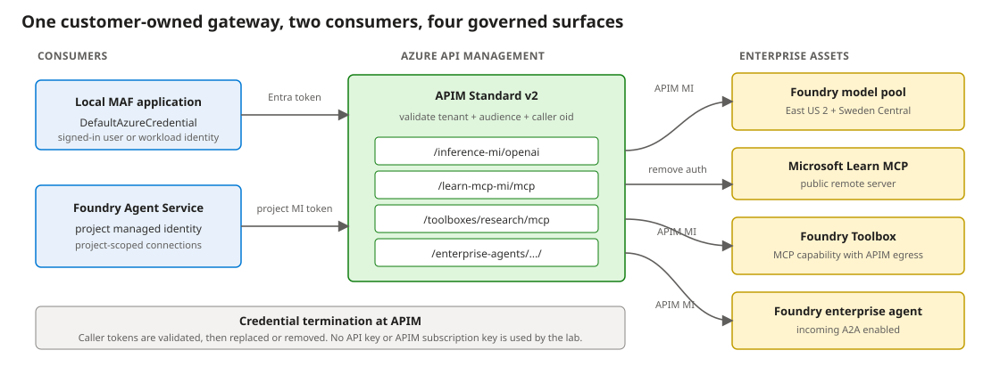

# Keyless Enterprise AI Gateway with APIM and Microsoft Foundry

[Launch the MOAW workshop](https://aka.ms/ws?src=gh:yelghali/foundry-ai-gateway/main/docs/) | [Read the workshop source](docs/workshop.md)

This repository implements a customer-owned Azure API Management gateway for four AI surfaces:

- An OpenAI-compatible model API backed by two Microsoft Foundry regions.
- The Microsoft Learn MCP server exposed through APIM.
- A versioned Foundry Toolbox exposed as MCP through APIM.
- A Foundry-hosted enterprise agent exposed as A2A through APIM.

Every surface is tested by two consumers: a local Microsoft Agent Framework application and a prompt agent hosted by Foundry Agent Service. An optional sixth scenario repeats model, MCP, and A2A access through a customer-operated LiteLLM gateway.



## Authentication model

The core APIM path is keyless:

1. The local application uses `DefaultAzureCredential`.
2. Foundry Agent Service uses project-scoped connections with `ProjectManagedIdentity`.
3. APIM validates tenant, audience, and an explicit caller `oid` allowlist.
4. APIM uses its system-assigned managed identity for Foundry backends.
5. APIM removes the caller token before forwarding to the public Microsoft Learn MCP server.

All four APIs have `subscriptionRequired: false`. The deployment does not create or distribute APIM subscription keys, model keys, or connection secrets.

Scenarios 1-5 use a Foundry **bring-your-own-model `ApiManagement` connection** to customer-owned APIM. Scenario 6 separately registers LiteLLM as a generic **`ModelGateway`**. Neither path uses Foundry's integrated AI Gateway attachment.

The optional LiteLLM edge requires a bearer credential because the current `ModelGateway` connection contract does not support project managed identity. LiteLLM uses managed identity downstream for its private Foundry model endpoints. See the workshop's Scenario 6 comparison before choosing between these connection types.

## Implemented scenarios

| Scenario | Local MAF | Foundry Agent Service | Primary implementation |
|---|---:|---:|---|
| 1. Model through APIM | Yes | Yes | `scenario1_maf_model_apim.py`, `scenario1_foundry_model_apim.py` |
| 2. Raw MCP through APIM | Yes | Yes | `scenario2_maf_mcp_apim.py`, `scenario2_foundry_mcp_apim.py` |
| 3. Foundry Toolbox through APIM | Yes | Yes | `scenario3_maf_toolbox_apim.py`, `scenario3_foundry_toolbox_apim.py` |
| 4. Foundry enterprise agent through APIM A2A | Yes | Yes | `scenario4_maf_enterprise_agent_apim.py`, `scenario4_foundry_agent_apim.py` |
| 5. Model + Toolbox + A2A capstone | Yes | Yes | `scenario5_maf_capstone.py`, `scenario5_foundry_capstone.py` |
| 6. LiteLLM model + MCP + A2A (optional) | Yes | Yes | `scenario6_maf_litellm.py`, `scenario6_foundry_litellm.py` |
| Security boundary | 8 denied requests | Anonymous and wrong audience | `scenario_security_boundaries.py` |

All scenario files are under `src/test/`.

## Quick start

Prerequisites: Azure CLI, Python 3.11+, PowerShell, permission to create role assignments, and `gpt-4o-mini` quota in `eastus2` and `swedencentral`.

```powershell
az login
az account set --subscription "<subscription-id>"

python -m venv .\src\test\.venv
& .\src\test\.venv\Scripts\python.exe -m pip install -r .\src\test\requirements.txt

.\infra\deploy.ps1
.\infra\deploy-foundry-consumers.ps1
.\infra\deploy-two-consumer-apim.ps1
.\infra\deploy-enterprise-foundry-agent-apim.ps1

.\src\test\run-two-consumer-scenarios.ps1
```

If Azure CLI is not on `PATH`, set `AZ_CMD` before deployment:

```powershell
$env:AZ_CMD = "C:\Program Files\Microsoft SDKs\Azure\CLI2\wbin\az.cmd"
```

A successful full run ends with:

```text
All two-consumer scenarios passed.
```

After deploying the standalone LiteLLM stack, add and run the optional BYOM comparison:

```powershell
.\infra\deploy-litellm-scenario.ps1
.\src\test\run-litellm-scenario.ps1
```

## Active infrastructure

| File | Responsibility |
|---|---|
| `infra/main.bicep` | APIM Standard v2, two enterprise Foundry regions, model deployments, backend pool, and keyless model API. |
| `infra/policy-mi.xml` | Entra validation, backend selection, APIM managed identity, and retry. |
| `infra/foundry-consumers.bicep` | Toolbox publisher project, Foundry app project, native driver, and `ApiManagement` model connection. |
| `infra/two-consumer-apim.bicep` | Explicit caller allowlist, raw MCP API, Toolbox API, and project-managed-identity tool connections. |
| `infra/enterprise-foundry-agent-apim.bicep` | Foundry A2A backend, APIM facade, card rewriting, least-privilege role, and `RemoteA2A` connection. |
| `infra/litellm-foundry-connections.bicep` | Optional `ModelGateway`, MCP, and authenticated A2A connections over the standalone LiteLLM stack. |
| `infra/scenario-outputs.json` | Generated secret-free endpoints and resource IDs used by the tests. |

The PowerShell files with matching `deploy-*.ps1` names are the supported deployment entry points.

## Live verification

The current implementation was deployed and rerun against Azure. The full suite passed:

- Both consumers reached the APIM model pool.
- Both consumers invoked raw MCP through APIM.
- Both consumers invoked the Foundry Toolbox through APIM; Toolbox egress also crossed APIM.
- Both consumers discovered and invoked the Foundry-hosted A2A agent through APIM.
- Both capstones returned combined research and governance answers.
- Anonymous and wrong-audience requests returned HTTP 401 on all four surfaces.
- The live APIM instance exposes only the four supported APIs, all with `subscriptionRequired: false`.
- The optional LiteLLM suite passed model, MCP, and A2A calls from both consumers; missing and invalid bearer credentials returned HTTP 401 on every LiteLLM edge.

## Known preview limitation

Foundry Agent Service currently returns HTTP 500 when the Toolbox in this lab is paired with the `ApiManagement` connected model. The Foundry Toolbox scenarios therefore use the app project's native `gpt-4o-mini` driver while Toolbox ingress and egress still cross APIM. The connected APIM model works with raw MCP in Scenario 2.

## Other repository areas

`litellm-gateway/litellm-azure-private-endpoints/` supplies the optional Scenario 6 gateway. `rag-demo/` and older scenario/deployment files remain separate experiments and are not part of the supported paths above.

## Cleanup

```powershell
.\infra\cleanup.ps1
```

The command deletes the lab resource group asynchronously.
