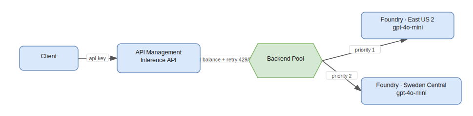
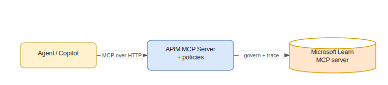

# APIM ❤️ Azure AI Foundry — Building an AI Gateway

As organizations adopt generative AI, a single model endpoint quickly becomes a bottleneck for **resilience**, **cost control**, and **governance**. An *AI gateway* sits between your applications and your AI models to add load balancing, retries, token limits, observability, and policy enforcement — without changing client code.

This lab is organized like its test suite: you **build the gateways once (Setup)**, then run **four client scenarios** that each reach the **same three targets** through a gateway and run them in order — **model → tool → A2A**:

- **model** — an enterprise `gpt-4o-mini` deployment, load balanced across two Foundry regions.
- **tool** — the public **Microsoft Learn MCP** server, governed by your gateway.
- **A2A** — a remote **Agent2Agent** "specialist" agent.

The only thing that changes between scenarios is **who calls** and **through which gateway** — not *what* is called. Here is what each scenario is and what passes today (all verified end to end):

| Scenario | Client | Gateway / connection | model · tool · A2A |
| --- | --- | --- | --- |
| **0** | local **Microsoft Agent Framework** app (no Foundry) | APIM passthrough APIs + subscription key | ✅ · ✅ · ✅ |
| **1** | **Foundry agent** (Azure AI Projects SDK) | APIM `ApiManagement` connection + **key** | ✅ · ✅ · ✅ |
| **2** | **Foundry agent** | APIM `ApiManagement` connection + **managed identity** | ⚠️ MI → key fallback · ✅ · ✅ |
| **3** | **Foundry agent** | **LiteLLM** `ModelGateway` connection + master key | ✅ · ✅ · ✅ |


The **Setup** section builds the gateway capabilities the scenarios rely on: APIM load balancing across two regions, MCP and A2A governance through APIM, an optional native Foundry AI Gateway, and a bring-your-own LiteLLM gateway registered into Foundry. By the end you will understand the trade-offs between **Azure-native** and **third-party** gateways, and you will have run all four scenarios against working infrastructure.

---

# Prerequisites

To complete the hands-on parts you need:

- An **Azure subscription** with **Owner** (or **Contributor** + **Role Based Access Control Administrator**) on a resource group. The lab creates role assignments, so plain Contributor is not enough.
- **Azure CLI** installed and signed in: `az login`.
- **Python 3.10+** for the test/scenario scripts (`pip install -r src/test/requirements.txt`).
- *(LiteLLM setup only)* Python to run the LiteLLM proxy (`pip install "litellm[proxy]"`). Docker is optional.
- Quota for the **`gpt-4o-mini`** model (GlobalStandard) in **two regions** — this lab uses `eastus2` and `swedencentral`. Check the [model availability by region](https://learn.microsoft.com/azure/ai-services/openai/concepts/models).
- The **Foundry User** role on each client project (required for any connection-backed model/tool/A2A call).

> **Cost & SKU:** this lab deploys **Azure API Management Standard v2**. v2 tiers provision in minutes (versus ~40 min for classic tiers) and are **required** for the native Foundry AI Gateway integration. APIM and the Foundry deployments incur charges — run the [clean-up](#clean-up) when finished.

The lab assets are organized as:

```
foundry-ai-gateway/
├── infra/
│   ├── main.bicep              # APIM v2 + 2 Foundry regions + backend pool + inference API + learn-mcp passthrough
│   ├── policy.xml              # load-balancing + retry policy
│   ├── deploy.ps1              # Setup step 1: APIM load balancer + MCP passthrough
│   ├── a2a-agent.bicep         # dummy A2A agent on Container Apps + APIM passthrough
│   ├── deploy-a2a.ps1          # Setup step 2: deploy the A2A agent + passthrough
│   ├── litellm-foundry.bicep   # LiteLLM (+ Postgres sidecar) on Container Apps + ModelGateway connection
│   ├── deploy-litellm-foundry.ps1   # Setup step 3: deploy the LiteLLM gateway
│   ├── apim-foundry.bicep      # (optional) register APIM as an ApiManagement connection
│   ├── client-foundry-sc1.bicep     # Scenario 1 client account (custom APIM, key)
│   ├── client-foundry-sc2.bicep     # Scenario 2 client account (native APIM, MI + key)
│   ├── client-foundry-sc3.bicep     # Scenario 3 client account (BYO LiteLLM)
│   ├── deploy-client-foundry.ps1    # Setup step 4: deploy the three client accounts + connections
│   └── cleanup.ps1             # tear down
└── src/
    ├── test/
    │   ├── scenario_lib.py          # shared helpers for the Foundry scenarios (1–3)
    │   ├── scenario_config.py       # reads infra/scenario-outputs.json (written by deploy-client-foundry.ps1)
    │   ├── scenario0_local_apim.py  # Scenario 0 — local MAF agent via APIM (no Foundry)
    │   ├── scenario1_custom_apim.py # Scenario 1 — Foundry agent via APIM (custom, key)
    │   ├── scenario2_aigateway_native.py  # Scenario 2 — Foundry agent via APIM (native, MI)
    │   ├── scenario3_aigateway_litellm.py # Scenario 3 — Foundry agent via LiteLLM
    │   ├── test_load_balancing.py   # Setup verify: shows the region serving each request
    │   ├── test_burst.py            # Setup verify: concurrent burst that forces failover
    │   └── register_a2a_agent.py    # registers the dummy agent in LiteLLM's A2A gateway
    ├── a2a/dummy_agent.py      # stdlib-only dummy A2A agent
    └── litellm/                # config.yaml, config.foundry.yaml, docker-compose.yml, .env.example
```

---

# Setup — build the gateways

The four scenarios all reach the same model, MCP tool, and A2A agent. This section deploys everything they need, in order. Run the four deploy commands once; each prints the values the next step (and the scenario scripts) consume.

```powershell
cd infra
az login
az account set --subscription "<your-subscription-id>"

./deploy.ps1                                   # 1. APIM load balancer + MCP passthrough
./deploy-a2a.ps1                               # 2. dummy A2A agent + APIM passthrough
./deploy-litellm-foundry.ps1                   # 3. LiteLLM gateway (for Scenario 3)
./deploy-client-foundry.ps1 `
  -LitellmMasterKey "sk-litellm-foundry-poc" `
  -DummyA2aUrl "<a2aAgentDirectUrl from step 2>"   # 4. the three client Foundry accounts
```

Step 4 writes **`infra/scenario-outputs.json`** (endpoints, connection IDs, gateway URLs — no secrets), which the scenario scripts read automatically through [scenario_config.py](src/test/scenario_config.py). The sections below explain what each step builds.

## 1. APIM load balancer across two regions

[deploy.ps1](infra/deploy.ps1) deploys [main.bicep](infra/main.bicep): an **APIM Standard v2** instance, **two Foundry accounts** (`eastus2` + `swedencentral`) each with a `gpt-4o-mini` deployment, an APIM **backend pool**, an **inference API** (`/inference/openai`), and the **MS Learn MCP passthrough** API. It prints the **APIM gateway URL**, a **subscription key**, and the two Foundry endpoints.



How it works (in [main.bicep](infra/main.bicep) + [policy.xml](infra/policy.xml)):

- **Backend pool** spreads traffic by `priority` (lower = higher) and `weight`; round-robin within equal priority/weight.
- **Circuit breaker** trips a backend for 1 minute after a 429, honoring `Retry-After`.
- **Retry policy** re-sends to the pool on 429/503 (`first-fast-retry`), so the caller never sees the throttle.
- **Managed-identity auth** — APIM calls Foundry with its system-assigned identity (**Cognitive Services User** role); no keys in policy.

> `modelsConfig.capacity` is set low (**8** = 8K tokens/min) so throttling and failover are easy to trigger. Raise it for real workloads.

**Verify (scripts).** APIM is a drop-in Azure OpenAI-compatible endpoint — real apps just use the OpenAI SDK; these scripts add a `requests` client only to read the `x-ms-region` header and *show* which region served each call:

```powershell
pip install -r ../src/test/requirements.txt
$env:APIM_GATEWAY_URL = "<apimResourceGatewayURL>"
$env:APIM_API_KEY     = "<subscription key>"

python ../src/test/test_load_balancing.py      # 20 spaced requests — routing + MI auth
$env:TOTAL = "60"; $env:CONCURRENCY = "15"
python ../src/test/test_burst.py               # concurrent burst — forces failover
```

> **Verified:** 60 concurrent requests returned **60 × HTTP 200** (zero visible 429s — the retry policy absorbed them), split **East US 2: 39 / Sweden Central: 21**: priority‑1 absorbed traffic until the 8K‑TPM cap, then the circuit breaker failed over to priority‑2.

**Test from the APIM portal (no code).** Open the APIM instance → **APIs → Inference API → Test → "Creates a completion for the chat message"**, then fill in:

| Field | Value |
| --- | --- |
| Template parameter `deployment-id` | `gpt-4o-mini` |
| Query parameter | **name** `api-version` (not `version`), **value** `2024-10-21` |
| Header | `Content-Type: application/json` |

Request body (Raw):

```json
{
  "messages": [
    { "role": "system", "content": "You are a concise assistant. Answer in one sentence." },
    { "role": "user", "content": "What does an AI gateway do?" }
  ],
  "max_tokens": 100,
  "temperature": 0.7
}
```

The Test console adds the `Ocp-Apim-Subscription-Key` for you; APIM injects the Foundry auth with its managed identity (no model key needed). The final URL is `…/inference/openai/deployments/gpt-4o-mini/chat/completions?api-version=2024-10-21`. **Send** returns `200` with `choices[0].message.content`, and the `x-ms-region` response header shows which region served the call.

## 2. Govern the MCP tool and A2A agent through APIM

Agents call **tools** (MCP) and **other agents** (A2A). In an enterprise you want both to flow **through your gateway** for auth, rate limiting, and tracing. Because MCP (streamable HTTP) and A2A (JSON-RPC 2.0 over HTTP) are just HTTP, APIM governs them with a simple **passthrough API** — no special feature required.



- **MCP** — `deploy.ps1` already created a `learn-mcp` passthrough API in front of `https://learn.microsoft.com/api/mcp`, exposed at `https://<apim>.azure-api.net/learn-mcp/mcp`. (Portal equivalent: **APIs → MCP Servers → Expose an existing MCP server**, then add `rate-limit-by-key` / `trace` policies. Use `forward-request buffer-response="false"` so the streaming transport isn't buffered.)
- **A2A** — [deploy-a2a.ps1](infra/deploy-a2a.ps1) deploys a tiny, dependency-free A2A agent ([src/a2a/dummy_agent.py](src/a2a/dummy_agent.py)) to **Azure Container Apps** (public HTTPS — APIM can't reach `localhost`) and wires a `dummy-a2a` passthrough API. It prints the agent's **direct URL** (used by `deploy-client-foundry.ps1 -DummyA2aUrl`) and its APIM URL.

> **Streaming gotcha:** if you enabled Application Insights at the **All APIs** scope, set **Frontend Response → payload bytes to log = 0** and never read `context.Response.Body` in MCP policies — buffering breaks the MCP transport.

## 3. Bring your own gateway (LiteLLM)

[deploy-litellm-foundry.ps1](infra/deploy-litellm-foundry.ps1) deploys [litellm-foundry.bicep](infra/litellm-foundry.bicep): the open-source **LiteLLM** proxy on **Container Apps** (managed identity → Entra ID auth, no keys), load balancing the same two Foundry regions, with a **Postgres sidecar** (enables LiteLLM's MCP + A2A gateways) and a **`ModelGateway` connection** registered on the Scenario 3 account. It prints the public gateway URL and the `<connection>/<model>` deployment name (`litellm-gateway/gpt-4o-mini`).

LiteLLM also re-exposes registered MCP servers at **`/mcp/`** (note the **trailing slash** — `/mcp` `307`-redirects and the MCP client won't follow it), so one proxy + key fronts model *and* MCP traffic. What a BYO gateway can do, validated:

| Capability | APIM (Setup 1–2) | LiteLLM (BYO) |
|---|---|---|
| Load balance / failover across regions | ✅ Backend pool + circuit breaker | ✅ Router + cooldown |
| Managed-identity auth to Foundry | ✅ | ⚠️ Entra ID token (client-managed) |
| Function-calling (tools) pass-through | ✅ | ✅ |
| Govern / proxy remote MCP servers | ✅ Passthrough API + policies | ⚠️ MCP gateway (`mcp_servers`, key auth) |
| Agent framework as a model backend | ✅ OpenAI-compatible | ✅ OpenAI-compatible |
| Per-project token limits / quotas | ✅ (native AI Gateway) | ⚠️ virtual-key budgets only |
| Registered in Foundry control plane | ✅ | ✅ as a `ModelGateway` connection |
| Multi-provider / portable | ⚠️ Azure-centric | ✅ |

> **Bottom line:** LiteLLM is a great **model + tool** gateway and is portable across providers. For **Foundry-native governance** (per-project quotas, control-plane registration), use **Azure API Management**. Both can be registered *into* Foundry as a connection — `ApiManagement` ([apim-foundry.bicep](infra/apim-foundry.bicep)) or `ModelGateway` — which is exactly how Scenarios 1–3 consume them.

> **(Optional) Foundry native AI Gateway.** Foundry also has a built-in, portal-driven gateway that attaches an APIM v2 instance to a Foundry resource for **per-project token limits** — **Operate → Admin console → AI Gateway → Add AI Gateway** (Create new, or Use existing Standard v2 APIM). It governs models, and (preview) MCP tools and registered agents. It's portal/control-plane driven (no Bicep), so this lab documents it; Setup 1–2 already prove the equivalent MCP + A2A through APIM. See [Configure AI Gateway](https://learn.microsoft.com/azure/foundry/configuration/enable-ai-api-management-gateway-portal).

## 4. The three client Foundry accounts

[deploy-client-foundry.ps1](infra/deploy-client-foundry.ps1) deploys **three independent client Foundry accounts**, one per gateway pattern, because the native AI Gateway integration is configured at the Foundry **resource** level — a separate account per pattern keeps each connection set small and clear:

| Account | Bicep | Connections it creates |
| --- | --- | --- |
| `client-foundry-sc1` | [client-foundry-sc1.bicep](infra/client-foundry-sc1.bicep) | `apim-custom-key` (`ApiManagement`, key) · `mslearn-mcp-apim` (`CustomKeys`) · `dummy-a2a-direct` (`RemoteA2A`) + a native driver model |
| `client-foundry-sc2` | [client-foundry-sc2.bicep](infra/client-foundry-sc2.bicep) | `apim-gateway-mi` (`ApiManagement`, AAD) · `apim-gateway` (`ApiManagement`, key) · `mslearn-mcp-apim` · `dummy-a2a-direct` + driver |
| `client-foundry-sc3` | [client-foundry-sc3.bicep](infra/client-foundry-sc3.bicep) | `litellm-gateway` (`ModelGateway`, key) · `mslearn-mcp-litellm` (`CustomKeys`) · `dummy-a2a-direct` + driver |

> **Where to see these in the portal:** the **model** connections are `ApiManagement` / `ModelGateway` category, so they appear under **Models + endpoints** (admin-connected deployments), *not* the generic **Connections** list. The **MCP tool** (`CustomKeys`) and **A2A** (`RemoteA2A`) connections appear under **Connections**. The agents each scenario creates appear under **Build → Agents** and persist by default (set `KEEP_AGENT=0` to clean up).

You're now ready to run the scenarios.

---

# Scenario 0 — Local app via APIM (Microsoft Agent Framework)

The baseline: a **client-orchestrated** agent. There is **no Foundry account and no connection** — an ordinary in-memory **Microsoft Agent Framework (MAF)** agent runs in your process and reaches all three targets straight through the **APIM passthrough APIs** on one subscription key. (Foundry SDK is not used here — this is the "plain app" comparison for Scenarios 1–3.)

**Setup.** Only the APIM gateway (Setup 1–2) is required — no client Foundry account. Provide the gateway URL and subscription key:

**Run.**

```powershell
$env:APIM_GATEWAY_URL = "https://apim-xxxx.azure-api.net"
$env:APIM_API_KEY     = "<subscription key>"
python ../src/test/scenario0_local_apim.py
```

**Result** ([scenario0_local_apim.py](src/test/scenario0_local_apim.py)):

| Leg | How it reaches the target | Result |
| --- | --- | --- |
| model | MAF chat client → APIM `/inference` (load balanced) | ✅ PASS |
| tool | `MCPStreamableHTTPTool` → `{apim}/learn-mcp/mcp` | ✅ PASS |
| A2A | local function tool → A2A JSON-RPC `{apim}/dummy-a2a` | ✅ PASS |

---

# Scenario 1 — Foundry agent via APIM (subscription key)

The same APIM gateway as Scenario 0, but now the agent runs **inside Foundry's Agent Service** on the `client-foundry-sc1` account, using the **Azure AI Projects SDK** (`AIProjectClient` + `PromptAgentDefinition`). Each leg rides a **Foundry connection**:

- **model** — `apim-custom-key/gpt-4o-mini`: an `ApiManagement` connection carrying the APIM subscription **key**. Foundry builds the Azure-OpenAI path and authenticates with the key. *(A model must be backed by an `ApiManagement`/`ModelGateway` connection — a raw `CustomKeys` connection returns `400 Category cannot be null`.)*
- **tool** — an `MCPTool` pointed at the APIM Learn-MCP URL, authenticated by the `mslearn-mcp-apim` `CustomKeys` connection (`project_connection_id`), driven by a small native `gpt-4o-mini` model.
- **A2A** — an `A2APreviewTool` pointed at the dummy specialist's **host root** via the `dummy-a2a-direct` `RemoteA2A` connection, also driven by the native model.

**Setup.** Already deployed by `deploy-client-foundry.ps1` (Setup 4); endpoints and connection IDs are in `infra/scenario-outputs.json` (auto-loaded).

**Run.**

```powershell
python ../src/test/scenario1_custom_apim.py
```

**Result** ([scenario1_custom_apim.py](src/test/scenario1_custom_apim.py)):

| Leg | Connection | Result |
| --- | --- | --- |
| model | `apim-custom-key` (`ApiManagement`, key) | ✅ PASS |
| tool | `mslearn-mcp-apim` (`CustomKeys`) | ✅ PASS |
| A2A | `dummy-a2a-direct` (`RemoteA2A`, native driver) | ✅ PASS |

---

# Scenario 2 — Foundry agent via APIM (managed identity)

The same APIM gateway and `ApiManagement` category as Scenario 1, on the `client-foundry-sc2` account, but the model connection authenticates with the project's **managed identity** (`authType: AAD`, no stored key), with an automatic **subscription-key fallback**. This validates the **native AI Gateway** auth path.

**Setup.** Already deployed by `deploy-client-foundry.ps1` — two model connections (`apim-gateway-mi` AAD, `apim-gateway` key) plus the shared MCP + A2A connections.

**Run.**

```powershell
python ../src/test/scenario2_aigateway_native.py
```

**Result** ([scenario2_aigateway_native.py](src/test/scenario2_aigateway_native.py)):

| Leg | Connection (auth) | Result |
| --- | --- | --- |
| model (MI) | `apim-gateway-mi` (`ApiManagement`, AAD) | ⛔ expected fail → falls back |
| model (key) | `apim-gateway` (`ApiManagement`, key) | ✅ PASS (fallback) |
| tool | `mslearn-mcp-apim` (`CustomKeys`) | ✅ PASS |
| A2A | `dummy-a2a-direct` (`RemoteA2A`, native driver) | ✅ PASS |

> The MI leg fails (`Connection 'apim-gateway-mi' not found`) because the **shared** enterprise APIM does not carry the `validate-azure-ad-token` inbound policy that accepts the project MI's Entra token (audience `https://cognitiveservices.azure.com/`). It falls back to the key. Foundry's **native AI Gateway** wires that policy up automatically, so an APIM provisioned by the native integration accepts the MI directly.

---

# Scenario 3 — Foundry agent via LiteLLM (bring your own)

Same Foundry agent shape as Scenario 2, on the `client-foundry-sc3` account, but the gateway is the self-hosted **LiteLLM** proxy registered as a **`ModelGateway`** connection (master key). The model **and** the MCP tool both ride LiteLLM; A2A uses the direct `RemoteA2A` connection (LiteLLM serves its agent card under a path, not the host root Foundry requires for the managed A2A tool — see [What works today](#what-works-today)).

**Setup.** Already deployed by `deploy-litellm-foundry.ps1` (Setup 3) + `deploy-client-foundry.ps1` (Setup 4).

**Run.**

```powershell
python ../src/test/scenario3_aigateway_litellm.py
```

**Result** ([scenario3_aigateway_litellm.py](src/test/scenario3_aigateway_litellm.py)):

| Leg | Connection | Result |
| --- | --- | --- |
| model | `litellm-gateway` (`ModelGateway`, key) | ✅ PASS |
| tool | `mslearn-mcp-litellm` (`CustomKeys`) | ✅ PASS |
| A2A | `dummy-a2a-direct` (`RemoteA2A`, native driver) | ✅ PASS |

---

# What works today

Every scenario runs **model → tool → A2A**. All four pass end to end; the only fallback is Scenario 2's managed-identity model leg.

| Scenario | Model | Tool (MCP) | A2A (agent) |
| --- | --- | --- | --- |
| **0 — Local app via APIM** | ✅ | ✅ | ✅ (A2A via APIM passthrough) |
| **1 — Foundry agent via APIM (key)** | ✅ | ✅ | ✅ (native driver) |
| **2 — Foundry agent via APIM (managed identity)** | ⚠️ MI → key fallback | ✅ | ✅ (native driver) |
| **3 — Foundry agent via LiteLLM (key)** | ✅ | ✅ | ✅ (native driver) |

Legend: ✅ works · ⚠️ works via fallback · ⛔ not supported.

**Not supported today (and the workaround used):**

- **A `CustomKeys` connection can't back a *model*.** Foundry serves models only through `ApiManagement` / `ModelGateway` connections (a `CustomKeys` model returns `400 — Category cannot be null`). `CustomKeys` is fine for **tool** auth.
- **Managed-identity model auth needs an APIM-side token policy.** An `AAD` `ApiManagement` connection only resolves if APIM validates the project MI's Entra token (`validate-azure-ad-token`, audience `https://cognitiveservices.azure.com/`). The shared APIM here lacks it, so Scenario 2 falls back to the key; the native AI Gateway configures it automatically.
- **Foundry's managed A2A tool can't be driven by a *gateway* model.** It returns `500` when the calling agent's model is an `ApiManagement` / `ModelGateway` connection, so every Foundry A2A leg (1/2/3) is driven by a small **native `gpt-4o-mini` driver** model. Plain model and MCP calls work fine over the gateway connections.
- **A2A can't be routed *through* a path-scoped gateway.** Foundry resolves the A2A card at the host root `/.well-known/agent-card.json`, which LiteLLM/APIM path-scoped routes can't serve — so A2A is reached **directly** via a `RemoteA2A` connection to the agent's host root.

The **Foundry User** role on the project is required for any connection-backed model/tool/A2A call.

**What you built:** an **APIM AI gateway** that load balances a Foundry model across regions (priority routing, circuit breakers, retries); **MCP and A2A governance** through APIM; a **bring-your-own LiteLLM** gateway registered into Foundry as a `ModelGateway` connection; and **four client scenarios** that consume the same model, tool, and agent through these gateways — contrasting a local app with Foundry agents over key, managed identity, and BYO connections.

---

# Reference — A2A and MCP tool behavior (per Microsoft docs)

This appendix describes how **Foundry Agent Service** handles **A2A** and **MCP** tools in a real implementation, independent of this lab's wiring. It is sourced from Microsoft Learn (links at the end).

## Behavior summary

| Tool | Behavior | Supported? | Notes |
| --- | --- | --- | --- |
| **A2A** | Key-based auth (header) | ✅ | `Authorization: Bearer …` or `x-api-key: …`; attached to every request. |
| **A2A** | **Managed identity** (agent identity / project MI) | ✅ | Endpoint must accept the correct **audience** + identity needs role assignments. |
| **A2A** | OAuth identity passthrough (per-user) | ✅ | Preserves user context; consent on first use. |
| **A2A** | Unauthenticated access | ✅ | Only for public/network-protected endpoints. |
| **A2A** | Configurable agent card path (`AgentCardPath`) | ✅ | REST-API only; default `.well-known/agent-card.json`, Foundry-hosted = `agentCard/v1.0`. |
| **A2A** | Anonymous card on Foundry-hosted endpoint | ⛔ | All Foundry-hosted A2A URLs require Entra ID auth. |
| **A2A** | HTTP+JSON / gRPC transport (v1.0) | ⛔ | v1.0 is **JSONRPC-only**; only A2A v1.0 + v0.3 supported. |
| **A2A** | Non-text modality / streaming (SSE) | ⛔ | Text modality only; no streaming responses. |
| **MCP** | Key-based auth | ✅ | Credential stored in the project connection. |
| **MCP** | **Managed identity** (agent identity / project MI) | ✅ | Provide **Audience** (App ID URI); category `RemoteTool`, auth `AgenticIdentityToken`. |
| **MCP** | OAuth identity passthrough | ✅ | Per-user consent link on first use. |
| **MCP** | **Managed identity behind APIM** | ⚠️ | Works **only if** APIM validates the Entra token (`validate-azure-ad-token`, correct audience + MI client ID); otherwise falls back to key-based. |

Legend: ✅ supported · ⚠️ conditional · ⛔ not supported.

## A2A (Agent2Agent) tool

**Connection.** A Foundry agent calls a remote A2A agent through a project connection of category `RemoteA2A` that stores the endpoint URL, the authentication, and an optional **agent card path**.

**Discovery (agent card).**

- Foundry resolves the agent card from the connection **target** plus an **`AgentCardPath`** (connection metadata). The A2A default is `.well-known/agent-card.json`; Foundry-hosted agents instead serve theirs at `agentCard/v1.0`, so you set `AgentCardPath` explicitly. Setting a custom card path is **REST-API only** — it isn't exposed in the Foundry portal.
- Registering an external A2A agent in the **Foundry control plane** returns a Foundry-generated **proxy URL**; Foundry discovers the card at `/.well-known/agent-card.json` and adds access control and monitoring through the AI gateway.
- For Foundry-hosted A2A endpoints, **all** A2A URLs (including the card) require **Microsoft Entra ID** auth — anonymous card access isn't supported — and the caller needs the **Foundry User** role on the project.

**Authentication.** An A2A connection supports:

- **Key-based** — a header credential (e.g. `Authorization: Bearer <token>` or `x-api-key: <key>`); Agent Service attaches it to each request.
- **Microsoft Entra ID** — **agent identity** or **project managed identity**; Agent Service mints a token and includes it. Requires role assignments on the underlying service and the endpoint accepting the correct **audience**.
- **OAuth identity passthrough** — per-user sign-in/consent; preserves user context across calls.
- **Unauthenticated** — only for endpoints that are public or network-protected.

**Limitations (preview).** A2A **v1.0 and v0.3** only; for v1.0, **JSONRPC transport only** (no HTTP+JSON or gRPC); **text** modality only; **no streaming** (server-sent events).

## MCP tool — managed identity (including behind a gateway)

**Authentication methods.** MCP tools connect via a project connection and support **key-based**, **Microsoft Entra (managed identity)**, and **OAuth identity passthrough**.

**Managed identity.** For Entra auth you choose **Agent Identity** or **Project Managed Identity** and provide an **Audience** = the Application ID URI of the target service's Entra app registration. Agent Service requests a token scoped to that audience and passes it to the MCP endpoint (connection category `RemoteTool`, auth type `AgenticIdentityToken`). The identity needs the required **role assignments** on the underlying service.

**Behind a gateway (e.g. APIM).** Foundry **can** use managed identity to reach a remote MCP server fronted by APIM — **but only if the gateway validates the Entra token**. APIM must run a `validate-azure-ad-token` (or `validate-jwt`) inbound policy configured with the expected **audience** and accept the agent/project managed identity's **application (client) ID**. If the gateway doesn't validate the token (or only checks a subscription key), the managed-identity token is ignored and you fall back to key-based auth — the same principle that governs managed-identity **model** auth.

**Troubleshooting (Entra).** `401` = wrong/unaccepted audience, or the endpoint doesn't accept Entra tokens; `403` = the identity is missing role assignments (changes take up to ~10 minutes to propagate).

**Docs:**

- [Agent2Agent (A2A) authentication](https://learn.microsoft.com/azure/foundry/agents/concepts/agent-to-agent-authentication)
- [Connect to an A2A agent endpoint from Foundry Agent Service](https://learn.microsoft.com/azure/foundry/agents/how-to/tools/agent-to-agent)
- [Enable incoming A2A on a Foundry agent](https://learn.microsoft.com/azure/foundry/agents/how-to/enable-agent-to-agent-endpoint)
- [Set up authentication for MCP tools](https://learn.microsoft.com/azure/foundry/agents/how-to/mcp-authentication)
- [Agent identity concepts in Microsoft Foundry](https://learn.microsoft.com/azure/foundry/agents/concepts/agent-identity)

---

# Clean up

Stop charges by deleting everything the lab created:

```powershell
cd infra
./cleanup.ps1
# or: az group delete --name lab-foundry-ai-gateway --yes --no-wait
```

`cleanup.ps1` (or deleting the resource group) removes the APIM instance, both Foundry regions, the Container Apps (A2A agent + LiteLLM), and the three client Foundry accounts. If you enabled the **native AI Gateway**, first **remove projects from the gateway** and **delete the AI Gateway** in the Foundry Admin console, then delete the APIM instance.

## References

- [Azure AI Projects client library for Python](https://learn.microsoft.com/python/api/overview/azure/ai-projects-readme)
- [Get started with Foundry SDKs and endpoints](https://learn.microsoft.com/azure/foundry/how-to/develop/sdk-overview?pivots=programming-language-python)
- [AI gateway capabilities in Azure API Management](https://learn.microsoft.com/azure/api-management/genai-gateway-capabilities)
- [Configure AI Gateway in your Foundry resources](https://learn.microsoft.com/azure/foundry/configuration/enable-ai-api-management-gateway-portal)
- [Bring your own model to Foundry Agent Service (Model Gateway connection)](https://learn.microsoft.com/azure/foundry/agents/how-to/ai-gateway)
- [Expose an existing MCP server in APIM](https://learn.microsoft.com/azure/api-management/expose-existing-mcp-server)
- [Microsoft Learn MCP server](https://learn.microsoft.com/training/support/mcp)
- [LiteLLM — Azure AI provider](https://docs.litellm.ai/docs/providers/azure_ai)
