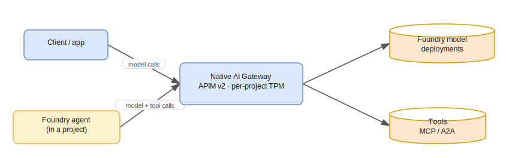
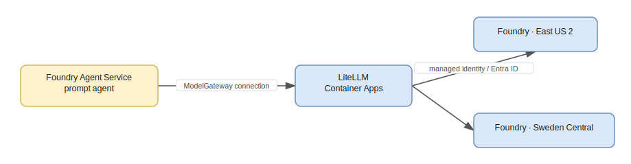
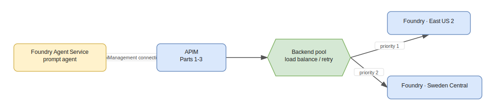

# APIM ❤️ Azure AI Foundry — Building an AI Gateway

As organizations adopt generative AI, a single model endpoint quickly becomes a bottleneck for **resilience**, **cost control**, and **governance**. An *AI gateway* sits between your applications and your AI models to add load balancing, retries, token limits, observability, and policy enforcement — without changing client code.

This workshop walks through **five complementary patterns** for building an AI gateway in front of [Azure AI Foundry](https://learn.microsoft.com/azure/ai-foundry/):

1. **APIM as an AI gateway** — load balance a model across **two Foundry regions** using an Azure API Management backend pool with priority/weight routing and automatic 429 failover.
2. **MCP governance** — expose and govern the **Microsoft Learn MCP server** through APIM so agents consume tools through your gateway. The same passthrough pattern also governs an **A2A (Agent2Agent) agent**, so one agent calls another *through* your gateway.
3. **Foundry's native AI Gateway** — the built-in portal experience that attaches an APIM v2 instance to a Foundry resource for per-project token limits.
4. **Bring your own gateway** — a proof-of-concept deploying the open-source **LiteLLM** proxy in front of Foundry, and what it can (and cannot) do.
5. **Bring your own gateway *into* Foundry** — register a gateway with **Foundry Agent Service** as a connection (your **APIM** as an `ApiManagement` connection, *or* **LiteLLM** as a `ModelGateway` connection), so Foundry agents run their models through your gateway.

<div class="info" data-title="What you will build">

> A load-balanced inference API in front of two Foundry regions, the Microsoft Learn MCP server governed by APIM, Foundry's native AI Gateway, and a bring-your-own LiteLLM gateway — plus connecting your gateway **into** Foundry Agent Service.

</div>


By the end you will understand the trade-offs between using **Azure-native AI Gateway capabilities** and a **third-party gateway**, and you will have working infrastructure to demonstrate each.

---

# Prerequisites

To complete the hands-on parts you need:

- An **Azure subscription** with **Owner** (or **Contributor** + **Role Based Access Control Administrator**) on a resource group. The lab creates role assignments, so plain Contributor is not enough.
- **Azure CLI** installed and signed in: `az login`.
- **Python 3.10+** for the test scripts.
- *(Part 4 only)* **Python 3.10+** to run the LiteLLM proxy (`pip install "litellm[proxy]"`). Docker is optional.
- Quota for the **`gpt-4o-mini`** model (GlobalStandard) in **two regions** — this lab uses `eastus2` and `swedencentral`. Check the [model availability by region](https://learn.microsoft.com/azure/ai-services/openai/concepts/models).

<div class="warning" data-title="Cost & SKU">

> This lab deploys **Azure API Management Standard v2**. v2 tiers provision in minutes (versus ~40 min for classic tiers) and are **required** for the native Foundry AI Gateway integration in Part 3. APIM and the Foundry deployments incur charges — run the [clean-up](#clean-up) when finished.

</div>

The lab assets are organized as:

```
foundry-ai-gateway/
├── workshop.md              # this file
├── infra/
│   ├── main.bicep           # APIM v2 + 2 Foundry accounts + backend pool + inference API
│   ├── policy.xml           # load-balancing + retry policy
│   ├── deploy.ps1           # one-command deploy (Parts 1–3)
│   ├── litellm-foundry.bicep        # Part 5: LiteLLM (+ Postgres sidecar) on Container Apps + Model Gateway connection
│   ├── deploy-litellm-foundry.ps1   # Part 5: deploy the LiteLLM (ModelGateway) variant
│   ├── apim-foundry.bicep           # Part 5: APIM as a Foundry ApiManagement connection
│   ├── deploy-apim-foundry.ps1      # Part 5: deploy the APIM-connection variant
│   ├── a2a-agent.bicep              # Part 2b: dummy A2A agent on Container Apps + APIM passthrough
│   ├── deploy-a2a.ps1               # Part 2b: deploy the dummy agent + passthrough
│   └── cleanup.ps1          # tear down
└── src/
    ├── test/                # Python samples & tests
    │   ├── test_load_balancing.py   # APIM: shows the region serving each request
    │   ├── test_burst.py            # APIM: concurrent burst that forces failover
    │   ├── sample_openai_apim.py    # APIM: OpenAI SDK (AzureOpenAI) client
    │   ├── agent_apim.py            # APIM: OpenAI Agents SDK agent + tool
    │   ├── agent_maf_apim.py        # APIM: Microsoft Agent Framework agent + tool
    │   ├── agent_mcp_apim.py        # APIM: agent + local tool + remote MS Learn MCP (proxied by APIM)
    │   ├── agent_a2a_apim.py        # APIM: agent + local tool + remote A2A agent (proxied by APIM)
    │   ├── test_litellm_tools.py    # LiteLLM: models + tools (function calling)
    │   ├── sample_openai_litellm.py # LiteLLM: OpenAI SDK (OpenAI) client
    │   ├── agent_litellm.py         # LiteLLM: OpenAI Agents SDK agent + tool
    │   ├── agent_maf_litellm.py     # LiteLLM: Microsoft Agent Framework agent + tool
    │   ├── agent_mcp_litellm.py     # LiteLLM: agent + local tool + remote MS Learn MCP (proxied by LiteLLM)
    │   ├── agent_a2a_litellm.py     # LiteLLM: agent + local tool + remote A2A agent (LiteLLM governs model + A2A)
    │   ├── register_a2a_agent.py    # registers the dummy agent in LiteLLM's DB-backed A2A gateway
    │   ├── agent_foundry_litellm.py # Part 5: Foundry agent via the LiteLLM (ModelGateway) connection
    │   └── agent_foundry_apim.py    # Part 5: Foundry agent via the APIM connection
    ├── a2a/                 # Part 2b: stdlib-only dummy A2A agent (dummy_agent.py)
    └── litellm/             # BYO gateway: config.yaml (Part 4), config.foundry.yaml (Part 5),
                             #   docker-compose.yml, .env.example
```

---

# Part 1 — Load balance Foundry models with APIM

## The pattern

A **typical prioritized fallback scenario**: a priority-1 backend (for example, your Provisioned Throughput deployment) absorbs traffic until it is exhausted, then requests gracefully fall back to one or more priority-2 backends (for example, pay-as-you-go in other regions).


Key mechanics implemented in [infra/main.bicep](infra/main.bicep) and [infra/policy.xml](infra/policy.xml):

- **Backend pool** — APIM's built-in `Pool` backend type spreads traffic across backends using `priority` (lower = higher) and `weight` (share within a priority). Round-robin is the default within equal priority/weight.
- **Circuit breaker** — each backend trips for 1 minute after a 429, honoring `Retry-After`.
- **Retry policy** — the `retry` policy re-sends to the pool on HTTP 429/503 (`first-fast-retry`), so the caller never sees the throttle. If no backend is viable, a generic 503 is returned.
- **Managed identity auth** — APIM authenticates to Foundry with its system-assigned identity (granted the **Cognitive Services User** role), so no API keys are stored in policy.

<div class="info" data-title="Why capacity is set low">

> `modelsConfig.capacity` is intentionally set to **8** (8K tokens/min) to make it easy to trigger throttling and observe failover during the lab. Raise it for real workloads.

</div>

## Deploy

From the `infra` folder:

```powershell
# If az is not on PATH, point to it first, e.g.:
# $env:AZ_CMD = "C:\Program Files\Microsoft SDKs\Azure\CLI2\wbin\az.cmd"

az login
az account set --subscription "<your-subscription-id>"

./deploy.ps1
```

`deploy.ps1` creates the resource group `lab-foundry-ai-gateway`, deploys the Bicep, and prints the **APIM gateway URL**, a **subscription key**, and the two Foundry endpoints.

<details>
<summary>What the Bicep deploys</summary>

- 1 × API Management (Standard v2) with system-assigned identity
- 2 × Azure AI Foundry (`AIServices`) accounts in `eastus2` and `swedencentral`, each with a project and a `gpt-4o-mini` deployment
- `Cognitive Services User` role assignment for the APIM identity on each account
- 2 × APIM backends + 1 × load-balancing backend pool (priority 1 / priority 2)
- 1 × Inference API (`/inference/openai`) with the retry + load-balancing policy
- 1 × APIM subscription (the `api-key` clients use)

</details>

## Test the load balancer

Install dependencies and run the test, which fires 20 requests and reports the **region** that served each (from the `x-ms-region` response header):

```powershell
pip install -r ../src/test/requirements.txt

$env:APIM_GATEWAY_URL = "<apimResourceGatewayURL from outputs>"
$env:APIM_API_KEY      = "<subscription key from outputs>"
python ../src/test/test_load_balancing.py
```

With 20 small, spaced-out requests you will likely see **all traffic stay on the priority-1 region** — the load is well under the 8K-TPM cap, so there is nothing to fail over from. That confirms routing and managed-identity auth work, but to *see the failover* you need to exhaust priority 1.

<div class="info" data-title="How clients call the gateway (OpenAI SDK)">

> `test_load_balancing.py` / `test_burst.py` use a plain HTTPS client (`requests`) on purpose — so they can read the `x-ms-region` header and *show* which region served each call. Real app code just uses the **OpenAI SDK**, since the gateway is a standard **Azure OpenAI-compatible** endpoint:
>
> ```powershell
> # Official OpenAI SDK (AzureOpenAI client) → APIM
> python ../src/test/sample_openai_apim.py
>
> # OpenAI Agents SDK: a client-side agent with a tool, on the load-balanced gateway
> python ../src/test/agent_apim.py
>
> # Microsoft Agent Framework: the same agent + tool, driven by `agent-framework`
> python ../src/test/agent_maf_apim.py
> ```
>
> - **OpenAI SDK** — [sample_openai_apim.py](src/test/sample_openai_apim.py) points the `AzureOpenAI` client at `{gateway}/inference` with the `api-key` header.
> - **OpenAI Agents SDK (client-side agent)** — [agent_apim.py](src/test/agent_apim.py) runs a real agent loop whose model backend is the APIM gateway; it called its `get_exchange_rate` tool and answered *"250 US dollars is approximately 230 euros and 197.50 pounds."* APIM load balances and authenticates with its managed identity — a drop-in OpenAI-compatible backend — even though APIM is **not** an agent *runtime*.
> - **Microsoft Agent Framework** — [agent_maf_apim.py](src/test/agent_maf_apim.py) is the *same* scenario built with `agent-framework`'s `OpenAIChatCompletionClient` (Azure routing) → `as_agent(...)`. It shows the gateway works unchanged across agent frameworks; only the client library differs.

</div>

<div class="tip" data-title="Using Foundry's Agent Service (the Azure AI Agent SDK)?">

> The agent above runs **client-side, in your process**. To use **Foundry Agent Service** instead — where the agent runs *inside Foundry* and Foundry routes its model call **through this same APIM gateway** — you don't write a custom client: you register APIM as an **`ApiManagement` connection** on the Foundry account, then name the agent's model `apim-gateway/gpt-4o-mini`. That connection setting is exactly what **Part 5 — Bring your own gateway *into* Foundry** does (validated end to end).

</div>

## Force a failover (burst test)

[src/test/test_burst.py](src/test/test_burst.py) fires **concurrent** requests with a larger prompt to blow past the priority-1 TPM cap:

```powershell
$env:TOTAL = "60"; $env:CONCURRENCY = "15"
python ../src/test/test_burst.py
```

<div class="tip" data-title="Real result from this lab">

> Running 60 concurrent requests against the deployed gateway produced **60 × HTTP 200** (zero visible 429s — the retry policy absorbed them) with this region distribution:
>
> ```
> Status distribution:  { "200": 60 }
> Region distribution:  { "East US 2": 39, "Sweden Central": 21 }
> ```
>
> The first ~39 requests were served by **East US 2** (priority 1). Once it hit the 8K-TPM cap and started returning 429s, the circuit breaker tripped and the remaining **21** requests transparently failed over to **Sweden Central** (priority 2) — exactly the prioritized-fallback behavior.

</div>

<div class="task" data-title="Try it">

> 1. Add a third Foundry region to `aiServicesConfig` in `main.bicep` with `priority: 2, weight: 50` and redeploy. Observe the 50/50 split across the two priority-2 backends.
> 2. Use the [APIM tracing tool](https://learn.microsoft.com/azure/api-management/api-management-howto-api-inspector) to watch the backend selection per request.
> 3. Lower `modelsConfig.capacity` to `1` and rerun the burst test — failover triggers even sooner.

</div>

---

# Part 2 — Govern the Microsoft Learn MCP server

The [Model Context Protocol (MCP)](https://modelcontextprotocol.io/) lets agents call **tools**. The **Microsoft Learn MCP server** is a free, public, remote MCP server (streamable HTTP) that grounds agents in official Microsoft documentation:

```
https://learn.microsoft.com/api/mcp
```

It exposes tools to **search docs**, **fetch a full article**, and **search code samples**. In an enterprise you rarely want agents talking to external tool servers directly — you want them to go **through your gateway** for authentication, rate limiting, and tracing.

Azure API Management's AI gateway can **expose and govern an existing MCP server**. APIM places your policies (rate limits, auth, tracing) in front of the Learn MCP tools.


## Expose the Learn MCP server through APIM

1. In the [Azure portal](https://portal.azure.com/), open the API Management instance the lab deployed.
2. Under **APIs**, select **MCP Servers** > **Create MCP server** > **Expose an existing MCP server**.
3. Enter the backend MCP endpoint: `https://learn.microsoft.com/api/mcp` (transport: **streamable HTTP**).
4. Give it a name (e.g. `learn-mcp`) and create it. APIM shows a **Server URL** like:
   `https://<apim-name>.azure-api.net/learn-mcp/mcp`
5. Under **MCP** > **Policies**, add governance. For example, rate-limit and trace the caller:

   ```xml
   <inbound>
       <base />
       <rate-limit-by-key calls="5" renewal-period="30"
           counter-key="@(context.Request.IpAddress)" />
       <trace source="Learn MCP" severity="information">
           <message>MCP tool invoked via APIM gateway</message>
       </trace>
   </inbound>
   ```

<div class="warning" data-title="Streaming & logging">

> MCP uses streaming transport. If you enabled Application Insights/Azure Monitor diagnostics at the **All APIs** scope, set **Frontend Response → Number of payload bytes to log = 0**, and never read `context.Response.Body` in MCP policies — buffering breaks the MCP transport.

</div>

## Use the governed MCP server

Add it to VS Code (Command Palette → **MCP: Add Server** → **HTTP**) using the APIM **Server URL**, then in GitHub Copilot **Agent mode** select the tools and ask a documentation question. Traffic now flows through your APIM gateway where your policies apply.

<div class="info" data-title="Two MCP directions in APIM">

> APIM can both **expose a managed REST API as an MCP server** (turn your APIs into agent tools) and **govern an existing MCP server** (like Learn MCP). This lab uses the second. APIM currently supports MCP **tools** (not resources or prompts).

</div>

## Deploy it as code (and call it from an agent)

The portal steps above are reproduced as **infrastructure-as-code** in [infra/main.bicep](infra/main.bicep): a `mslearn-mcp` **backend** (`https://learn.microsoft.com/api`), a `learn-mcp` **API** with `POST`/`GET`/`DELETE` `/mcp` operations, an API-key subscription, and a passthrough policy (`set-backend-service` + `forward-request buffer-response="false"` so the streamable-HTTP transport is not buffered). It is created automatically by `./deploy.ps1`, and the gateway exposes:

```
https://<apim-name>.azure-api.net/learn-mcp/mcp
```

[agent_mcp_apim.py](src/test/agent_mcp_apim.py) shows an agent that combines a **local** Python tool (`get_exchange_rate`) with the **remote** MS Learn MCP toolset — both reached **through APIM** with the *same* subscription key:

```powershell
> $env:APIM_GATEWAY_URL = "<apimResourceGatewayURL>"
> $env:APIM_API_KEY      = "<subscription key>"
> python ../src/test/agent_mcp_apim.py
```

<div class="tip" data-title="Validated">

> The agent asked MS Learn *what Azure API Management is* **and** converted *100 USD → EUR*, answering: *"Azure API Management is a hybrid, multicloud management platform for APIs … (Source: learn.microsoft.com) … 100 USD is approximately 92 EUR."* The model (inference) call **and** the MCP tool call both flowed through APIM on one key — one gateway governs both.

</div>

---

# Part 2b — Govern an A2A agent

MCP governs the **tools** an agent calls. The [**A2A (Agent2Agent) protocol**](https://a2a-protocol.org/) governs the **other agents** an agent talks to: A2A is a simple **JSON-RPC 2.0 over HTTP** contract where an agent publishes an **AgentCard** at `/.well-known/agent-card.json` and accepts a `message/send` call. As multi-agent systems grow, you want those agent-to-agent hops to flow **through your gateway** — same as model and tool traffic — for auth, rate limiting, and tracing.

Because A2A is just HTTP + JSON-RPC, **the APIM passthrough pattern from Part 2 works unchanged** — no special A2A feature is required. APIM proxies the agent card and the `message/send` calls to a backend A2A agent and applies your policies in front.

## A dummy A2A agent on Container Apps

The lab ships a tiny, dependency-free A2A agent in [src/a2a/dummy_agent.py](src/a2a/dummy_agent.py) — a standard-library `http.server` that serves an AgentCard and answers `message/send` with canned "specialist" advice. It is deliberately minimal so it runs inside a stock `python:3.12-slim` container with **no pip install** (instant, reliable startup), with its code mounted from a secret volume.

A public endpoint is required because **APIM runs in the cloud and cannot reach an A2A server on `localhost`** — so the dummy agent is deployed as an **Azure Container App** (public HTTPS ingress), mirroring how Part 5 hosts LiteLLM.

## Deploy it as code (and call it from an agent)

[infra/a2a-agent.bicep](infra/a2a-agent.bicep) deploys the dummy agent Container App **and** wires the APIM passthrough: a `dummy-a2a` **backend** (the Container App FQDN), a `dummy-a2a` **API** (path `dummy-a2a`) with a `POST /` operation (the A2A JSON-RPC) and `GET /.well-known/agent-card.json` operations, an API-key subscription, and the same passthrough policy as Part 2 (`set-backend-service` + `forward-request buffer-response="false"`). Deploy it on top of the main deployment:

```powershell
> cd infra
> ./deploy-a2a.ps1     # prints the agent's direct URL and its APIM URL
```

The gateway then exposes the agent at:

```
https://<apim-name>.azure-api.net/dummy-a2a
```

[agent_a2a_apim.py](src/test/agent_a2a_apim.py) shows an **orchestrator** agent that combines a **local** Python tool (`get_exchange_rate`) with a `consult_specialist` tool that delegates to the **remote A2A agent** — both reached **through APIM** with the *same* subscription key (the A2A call is plain JSON-RPC over `httpx`, so it matches the dummy agent's wire format exactly):

```powershell
> $env:APIM_GATEWAY_URL = "<apimResourceGatewayURL>"
> $env:APIM_API_KEY      = "<subscription key>"
> $env:A2A_URL_APIM      = "<apimResourceGatewayURL>/dummy-a2a"
> python ../src/test/agent_a2a_apim.py
```

<div class="tip" data-title="Validated">

> The orchestrator asked the specialist agent *whether to put a gateway in front of agents* **and** converted *100 USD → EUR*, answering: *"The specialist provided the following advice: 'Always place an AI gateway in front of your models AND your agents so a single control plane handles auth, quotas, logging and routing.' … 100 USD is equivalent to 92 EUR."* The model (inference) call **and** the A2A agent call both flowed through APIM on one key — **one gateway governs models, tools, and agents**.

</div>

## What about LiteLLM?

LiteLLM ships an **Agent Gateway (A2A)** that proxies A2A agents at `POST /a2a/{agent_id}` with master/virtual-key auth, logging, and spend tracking ([docs](https://docs.litellm.ai/docs/a2a)). Registering an agent requires a **DB-backed control plane** (`store_model_in_db` + a database). So [infra/litellm-foundry.bicep](infra/litellm-foundry.bicep) now runs a **PostgreSQL sidecar container** alongside LiteLLM in the same Container App (reachable over `localhost:5432`), and the config sets `store_model_in_db: true` — which turns the A2A gateway on.

With the database in place you register the dummy specialist once (it persists in Postgres), then invoke it **through LiteLLM**:

```powershell
> $env:LITELLM_BASE_URL   = "<gatewayUrl>"
> $env:LITELLM_MASTER_KEY = "sk-litellm-foundry-poc"
> $env:A2A_URL_DIRECT     = "<a2aAgentDirectUrl>"   # upstream the gateway forwards to
> python ../src/test/register_a2a_agent.py          # POST /v1/agents -> dummy-specialist
> python ../src/test/agent_a2a_litellm.py           # model AND A2A hop both via LiteLLM
```

[agent_a2a_litellm.py](src/test/agent_a2a_litellm.py) runs the same orchestrator, but now the `consult_specialist` tool calls `{litellm}/a2a/dummy-specialist` with the master key — so **LiteLLM governs both the model calls and the A2A hop**, exactly like the APIM variant.

<div class="tip" data-title="Validated">

> After deploying the Postgres-backed LiteLLM and registering the agent, the orchestrator quoted the specialist's advice verbatim **and** converted *100 USD → 92 EUR* — with **both** the model (inference) call and the A2A `message/send` flowing through LiteLLM on one master key. Like APIM, **one gateway now governs models, tools, and agents**.

</div>

<div class="info" data-title="Production note">

> The Postgres **sidecar** uses ephemeral storage, so registrations are lost if the replica restarts — re-run `register_a2a_agent.py` (it is idempotent). For production, point `DATABASE_URL` at **Azure Database for PostgreSQL Flexible Server** instead of the in-cluster container.

</div>


---

# Part 3 — Foundry native AI Gateway

Parts 1–2 build a gateway *you* assemble in APIM. Foundry also offers a **built-in, portal-driven AI Gateway** that attaches an APIM v2 instance to a Foundry resource and enforces **per-project token limits and quotas** — no Bicep required.

Once a project is gateway-enabled, **all of its requests flow through APIM** — including a **Foundry agent's** model *and* tool calls, not just direct model calls ([AI Gateway architecture](https://learn.microsoft.com/azure/foundry/configuration/enable-ai-api-management-gateway-portal#ai-gateway-architecture)). It is the same "route the model call through the gateway" idea as the bring-your-own-gateway connection in **Part 5** — but **native and transparent**: Foundry wires the routing for you, so there is no connection to register and no change to the model name.



## Enable it

1. Sign in to [Microsoft Foundry](https://ai.azure.com/) (ensure **New Foundry** is on).
2. Go to **Operate** > **Admin console** > **AI Gateway** tab.
3. Select **Add AI Gateway**, choose your Foundry resource, then either:
   - **Create new** — provisions a **Basic v2** APIM, or
   - **Use existing** — select the **Standard v2** APIM from Part 1 (it appears only if it is in the **same tenant and subscription**, is a **v2 tier**, you have **API Management Service Contributor**, and it is not already linked to another gateway).
4. Name the gateway and select **Add**. Wait until status is **Enabled**.
5. New projects are gateway-enabled by default; for existing projects choose **Add project to gateway** and set **token limits**.

## Verify

In the APIM instance, open **Monitoring** > **Metrics** → **Requests**, make a model call in an enabled project, and confirm the count increments. Use **Monitoring** > **Logs** with the `GatewayLogs` table to inspect `200`s. If you set a token limit, a request that exceeds it returns **429 Too Many Requests**.

<div class="info" data-title="When to use which">

> - **Native AI Gateway** = fastest path to **governance** (token limits, quotas, per-project containment, custom agent registration) with minimal setup.
> - **APIM you build (Part 1)** = full control over **routing, load balancing, retries, transformations, and custom policies**.
> - You can combine them: use an existing Standard v2 APIM for both.

</div>

---

# Part 4 — Bring your own gateway (LiteLLM)

Can you put a **third-party** gateway in front of Foundry instead of APIM? This part is a POC with the popular open-source [**LiteLLM**](https://docs.litellm.ai/) proxy, which exposes an **OpenAI-compatible** endpoint and routes to many providers — including Azure AI Foundry.

The configuration in [src/litellm/config.yaml](src/litellm/config.yaml) reuses the **same two Foundry regions** and load-balances across them with LiteLLM's router (retries, cooldowns, fallbacks) — mirroring Part 1, but client-side.

<div class="important" data-title="Auth: Entra ID, not keys">

> This lab's Foundry accounts have **local (API-key) auth disabled** (a common, secure default — often enforced by Azure Policy). So LiteLLM authenticates with **Microsoft Entra ID** using an Azure AD bearer token, *not* an API key. LiteLLM's `azure/` provider reads the token from the `AZURE_AD_TOKEN` environment variable.

</div>

## Run it

You don't need Docker — run the proxy straight from `pip`:

```powershell
cd ../src/litellm
pip install "litellm[proxy]"

# 1) Fill in .env (endpoints are the account's Azure OpenAI URL; mint a short-lived Entra token)
cp .env.example .env   # set FOUNDRY1/2_API_BASE = https://<account>.openai.azure.com/
$tok = az account get-access-token --resource https://cognitiveservices.azure.com --query accessToken -o tsv
# put $tok into the AZURE_AD_TOKEN line of .env

# 2) Export the .env values into the shell, then start the proxy
Get-Content .env | ForEach-Object { if ($_ -match '^([^#=]+)=(.*)$') { Set-Item -Path "env:$($matches[1])" -Value $matches[2] } }
litellm --config config.yaml --port 4000
```

<div class="warning" data-title="Export the env vars before launching">

> The proxy resolves `os.environ/...` references and reads `AZURE_AD_TOKEN` from its **process environment** — it does **not** auto-load `.env`. Export the variables in the same shell first (the `Get-Content .env | ...` line above), or `litellm` will start but every call fails with *"Missing credentials"* and the deployments drop into cooldown. (Docker users get this for free — `docker compose` injects the `.env`.)

</div>

The endpoints come from the deployment; mint the token with the Azure CLI (valid ~1 hour):

```powershell
az cognitiveservices account show -g lab-foundry-ai-gateway -n <foundry-account-name> --query "properties.endpoints"
az account get-access-token --resource https://cognitiveservices.azure.com --query accessToken -o tsv
```

## Test models, tools, *and* agents

In a second terminal:

```powershell
pip install -r ../test/requirements.txt
$env:LITELLM_BASE_URL  = "http://localhost:4000"
$env:LITELLM_MASTER_KEY = "sk-litellm-local-poc"

python ../test/test_litellm_tools.py   # plain chat + function calling (models + tools)
python ../test/sample_openai_litellm.py # OpenAI SDK (OpenAI client) -> LiteLLM
python ../test/agent_litellm.py        # OpenAI Agents SDK agent (models + tools + agent loop)
python ../test/agent_maf_litellm.py    # Microsoft Agent Framework agent (same scenario, MAF)
```

<div class="tip" data-title="Real result from this lab">

> Against the LiteLLM proxy (Entra ID auth, two Foundry regions), validated end to end:
>
> ```
> test_litellm_tools.py  -> "Hello!"  +  tool call get_current_weather(location="Boston, MA")
> agent_litellm.py       -> "250 US dollars is approximately 230 euros and 197.50 pounds."
> ```
>
> The proxy returned **HTTP 200** for every call. The agent script is the *same* OpenAI Agents SDK code as [agent_apim.py](src/test/agent_apim.py) — only the base URL changes — proving the BYO gateway is a drop-in OpenAI-compatible backend for **models + tools + agents**.

</div>

## LiteLLM as an MCP gateway

LiteLLM is not only a model gateway — it can also act as an **MCP gateway**. Register one or more remote MCP servers under a top-level `mcp_servers:` block (already added to [src/litellm/config.yaml](src/litellm/config.yaml) and [config.foundry.yaml](src/litellm/config.foundry.yaml)):

```yaml
mcp_servers:
  mslearn:
    url: "https://learn.microsoft.com/api/mcp"
    transport: "http"
    description: "Microsoft Learn documentation MCP server"
```

LiteLLM aggregates the registered servers and re-exposes them on its own endpoint at **`/mcp/`**. A client authenticates with the LiteLLM master key and selects a server with the `x-mcp-servers` header — so the **same proxy + key** front both model traffic *and* MCP-tool traffic, mirroring the APIM passthrough from Part 2.

[agent_mcp_litellm.py](src/test/agent_mcp_litellm.py) is the LiteLLM twin of `agent_mcp_apim.py`: one agent, a **local** `get_exchange_rate` tool plus the **remote** MS Learn MCP toolset, both through LiteLLM:

```powershell
python ../test/agent_mcp_litellm.py    # agent + local tool + remote MS Learn MCP, both THROUGH LiteLLM
```

<div class="tip" data-title="Validated (and a trailing-slash gotcha)">

> The agent answered the *what is Azure API Management* question from MS Learn (with a `learn.microsoft.com` citation) **and** converted *100 USD ≈ 92 EUR* with the local tool — both governed by LiteLLM.
>
> Note the MCP URL needs a **trailing slash** (`{base_url}/mcp/`): LiteLLM `307`-redirects `/mcp` → `/mcp/`, and the streamable-HTTP MCP client refuses to follow that redirect (it can downgrade HTTPS→HTTP behind the Container Apps proxy). The sample defaults to the trailing-slash URL.

</div>

## Findings: models, tools, and agents

<div class="important" data-title="POC conclusion">

> - ✅ **Models** — LiteLLM proxies Foundry chat/completions and embeddings, and can **load balance and fail over** across regions just like the APIM backend pool.
> - ✅ **Tools (function calling)** — LiteLLM passes `tools`/`tool_choice` through to the model and returns `tool_calls` (validated: `get_current_weather`). **Client-side** tool orchestration works. The model returns *which* tool to call; **your application still executes the tool** (LiteLLM does not host the tools).
> - ✅ **Agents (as a model backend)** — validated by running the **OpenAI Agents SDK** ([agent_litellm.py](src/test/agent_litellm.py)) and the **Microsoft Agent Framework** ([agent_maf_litellm.py](src/test/agent_maf_litellm.py)) on top of the proxy: the agent completed a full tool-calling loop and composed the final answer. LiteLLM is **not** an agent *runtime*, but it is a fine **model backend** for any agent framework (OpenAI Agents SDK, Microsoft Agent Framework, Semantic Kernel, LangChain, …).
> - ✅ **MCP gateway** — LiteLLM can also aggregate **remote MCP servers** (`mcp_servers:`) and re-expose them at `/mcp/`, so the same proxy + key govern model *and* MCP-tool traffic ([agent_mcp_litellm.py](src/test/agent_mcp_litellm.py)). This is a **proxy** with key auth — not the full policy governance (rate limits, tracing) of the APIM MCP passthrough in Part 2.
> - ⚠️ **Hosted agents / governance** — LiteLLM does **not** replace the **Foundry Agent Service** (server-side hosted agents, threads, hosted tools) nor the **native Foundry AI Gateway** governance plane (per-project token limits, custom agent registration, MCP/A2A tool governance from Part 3).
> - 🔒 **Native *governance* integration** — Foundry's **Admin console AI Gateway only attaches Azure API Management (v2)**. A third-party gateway like LiteLLM cannot register *there* (the governance plane from Part 3).
> - ✅ **Native *agent* integration** — but Foundry Agent Service has a **separate** "bring your own model" mechanism: a **Model Gateway connection** that *does* accept LiteLLM (or any non-Azure gateway). That is exactly **Part 5**, where Foundry agents call their model **through** the LiteLLM gateway.

</div>

**Bottom line:** Bring-your-own LiteLLM is a great **model + tool (function-calling) gateway** and is portable across clouds/providers. If you need **Foundry-native governance** (per-project quotas, agent/tool governance, control-plane registration), use **Azure API Management** — either the one you build (Parts 1–2) or the native AI Gateway (Part 3).

| Capability | APIM (Parts 1–3) | LiteLLM (BYO) |
|---|---|---|
| Load balance Foundry models across regions | ✅ Backend pool | ✅ Router |
| Retry / failover on 429 | ✅ Policy + circuit breaker | ✅ num_retries / cooldown |
| Managed-identity auth to Foundry (no keys) | ✅ | ⚠️ Entra ID token (no keys, but client-managed) |
| Function-calling (tools) pass-through | ✅ | ✅ |
| Govern / proxy remote MCP servers | ✅ Passthrough API + policies | ⚠️ MCP gateway (`mcp_servers`, key auth) |
| Agent framework as a model backend | ✅ OpenAI-compatible | ✅ OpenAI-compatible |
| Govern external MCP tool servers | ✅ | ❌ |
| Per-project token limits / quotas | ✅ (native AI Gateway) | ⚠️ virtual-key budgets only |
| Registered in Foundry control plane (governance) | ✅ | ❌ |
| Backend for Foundry Agent Service (BYO connection) | ✅ APIM connection | ✅ Model Gateway connection (Part 5) |
| Multi-provider / portable | ⚠️ Azure-centric | ✅ |

---

# Part 5 — Bring your own gateway INTO Foundry

Part 4's LiteLLM proxy sits *in front of* Foundry. **Foundry Agent Service can also reach *into* your gateway**: its [*bring your own model*](https://learn.microsoft.com/azure/foundry/agents/how-to/ai-gateway) feature lets agents use models hosted behind **Azure API Management *or* a non-Azure gateway** (LiteLLM, Kong, MuleSoft, …). Foundry agents then route their model calls **through** your gateway.

There are **two connection types** — pick the one that matches your gateway:

| Connection type | `category` | Use when | This lab |
| --- | --- | --- | --- |
| **API Management** | `ApiManagement` | You already use **Azure API Management** for model routing (Parts 1–3) and want APIM's intelligent defaults. | [infra/apim-foundry.bicep](infra/apim-foundry.bicep) |
| **Model Gateway** | `ModelGateway` | You use a **self-hosted / third-party** gateway (LiteLLM, Kong, MuleSoft, …). | [infra/litellm-foundry.bicep](infra/litellm-foundry.bicep) |

We implement **both**: the APIM connection reuses the gateway you already built, and the Model Gateway connection brings the LiteLLM proxy from Part 4.

<div class="important" data-title="Why this needs a public endpoint">

> Foundry Agent Service runs in the cloud, so it **cannot** call a LiteLLM proxy on `localhost:4000`. The gateway must be reachable over **public HTTPS**. This part deploys LiteLLM to **Azure Container Apps** with a **managed identity** (so it uses **Entra ID auto-refresh** — no API keys, no 1-hour token expiry) and registers it as a Foundry connection.

</div>

## The pattern



The only thing that turns a normal agent into a *BYO-gateway* agent is the model deployment name format: **`<connection-name>/<model-name>`** (e.g. `litellm-gateway/gpt-4o-mini`).

## What a Model Gateway connection supports

This is the key question for a BYO gateway: once LiteLLM is connected, **how much of Foundry can you actually use through it?** Per the [BYO model docs](https://learn.microsoft.com/azure/foundry/agents/how-to/ai-gateway):

| Foundry capability | Through the gateway? | What it means |
| --- | --- | --- |
| **Models** | ✅ Yes | Your LiteLLM models appear as **admin-connected deployments** (`<connection>/<model>`) implementing the OpenAI chat-completions API. Supports **static** discovery (models listed in connection metadata, as in this lab) and **dynamic** discovery (models listed by the gateway at runtime). |
| **Tools** | ✅ Yes (Foundry-side) | The agent's tools run in **Foundry's** agent runtime, not in LiteLLM — supported tools include **Code Interpreter, Functions, File Search, OpenAPI, Foundry IQ, SharePoint Grounding, Fabric Data Agent, MCP, and Browser Automation**. Foundry calls *your* model for the reasoning turns and executes the tools itself. |
| **Agents** | ⚠️ Prompt agents only | Only **prompt agents in the Agent SDK** can use a BYO-gateway model today. Other/hosted agent types are not yet supported. |
| **Control plane** | ⚠️ Foundry governs it, not LiteLLM | The connection lives in **Foundry's** control plane (Admin console → **Admin-connected models**), so admins approve and manage it centrally. LiteLLM stays a **data-plane model backend** — it does **not** become Foundry's governance/quota plane (for that, use APIM — Parts 1–3). |

So the BYO-gateway connection gives you **models + Foundry-native agent tools + (prompt) agents**, all governed from **Foundry's** control plane, while your gateway keeps doing routing/auth/observability on the model traffic.

## Deploy it

This deploys the container, grants it `Cognitive Services User` on both Foundry accounts, and creates the `ModelGateway` connection — all from [infra/litellm-foundry.bicep](infra/litellm-foundry.bicep):

```powershell
cd infra
# main.bicep (Parts 1–3) must already be deployed; this reads its Foundry account names.
./deploy-litellm-foundry.ps1
```

It prints the public gateway URL, the connection name, and the `<connection>/<model>` deployment name to use.

## Run a Foundry agent through your gateway

```powershell
pip install -r ../src/test/requirements.txt   # adds azure-ai-projects + azure-identity
$env:FOUNDRY_PROJECT_ENDPOINT = "https://<account>.services.ai.azure.com/api/projects/<project>"
$env:FOUNDRY_MODEL_DEPLOYMENT_NAME = "litellm-gateway/gpt-4o-mini"
python ../src/test/agent_foundry_litellm.py
```

[agent_foundry_litellm.py](src/test/agent_foundry_litellm.py) creates a **prompt agent** whose `model` is `litellm-gateway/gpt-4o-mini`, runs one turn, and cleans up. Foundry Agent Service resolves the connection, calls `POST {gateway}/chat/completions`, and LiteLLM forwards to a Foundry region with its managed identity.

<div class="tip" data-title="Real result (validated)">

> The deployed gateway answered directly — `GET /v1/models` → **200** (lists `gpt-4o-mini`), `POST /v1/chat/completions` → **200**. Then the Foundry agent ran end to end and replied **through the gateway**:
>
> ```
> Created agent 'litellm-gateway-agent' (version 1) -> model 'litellm-gateway/gpt-4o-mini'
>
> Agent reply (served through the LiteLLM gateway):
> An AI gateway serves as an interface that facilitates communication and data exchange
> between AI models and applications, enabling seamless integration and deployment of AI
> capabilities.
> ```
>
> Confirming the full path: **Foundry Agent Service → Model Gateway connection → LiteLLM (Container Apps, Entra ID) → Foundry**.

</div>

## APIM connection variant (no container)

If your gateway is the **APIM** instance from Parts 1–3, you don't need a container at all — register APIM directly as an **`ApiManagement`** connection. Foundry knows APIM's Azure-OpenAI conventions, so it builds `/deployments/{name}/chat/completions` for you.



[infra/apim-foundry.bicep](infra/apim-foundry.bicep) creates the connection on the Foundry account, pointing `target` at the APIM inference API (`{gateway}/inference/openai`) and authenticating with an existing **APIM subscription key** (`api-key` header — the APIM-connection default). Key metadata: `deploymentInPath: "true"` (path-based Azure-OpenAI routing) and `inferenceAPIVersion`.

```powershell
cd infra
# main.bicep (Parts 1–3) must already be deployed; this reads the APIM name + Foundry account.
./deploy-apim-foundry.ps1
```

Then run a prompt agent exactly like before — only the connection name changes:

```powershell
$env:FOUNDRY_PROJECT_ENDPOINT = "https://<account>.services.ai.azure.com/api/projects/<project>"
$env:FOUNDRY_MODEL_DEPLOYMENT_NAME = "apim-gateway/gpt-4o-mini"
python ../src/test/agent_foundry_apim.py
```

<div class="tip" data-title="Real result (validated)">

> The APIM connection deployed (`provisioningState: Succeeded`, `category: ApiManagement`, `target: https://apim-...azure-api.net/inference/openai`) and the Foundry agent ran end to end **through APIM**:
>
> ```
> Created agent 'apim-gateway-agent' (version 1) -> model 'apim-gateway/gpt-4o-mini'
>
> Agent reply (served through the APIM gateway):
> An AI gateway acts as an interface that facilitates communication and data exchange
> between different AI systems and applications, streamlining integration and access to
> AI capabilities.
> ```
>
> Confirming the full path: **Foundry Agent Service → ApiManagement connection → APIM → Foundry (backend pool)**.

</div>

### Which connection should I use?

Both connections expose models the same way (`<connection>/<model>`) and support the same Foundry-side agent tools — they differ mainly in the gateway behind them:

| | `ApiManagement` | `ModelGateway` |
| --- | --- | --- |
| **Use when** | APIM is your gateway (Parts 1–3) | LiteLLM or any other gateway |
| **Container to host?** | None | Yes (e.g. Container Apps) |
| **Model discovery** | Intelligent `/deployments` defaults | Static or dynamic |
| **Supported tiers** | APIM **Standard v2 / Premium** | Any OpenAI-compatible gateway |
| **Model reference** | `<connection>/<model>` | `<connection>/<model>` |
| **Foundry-side tools** | ✅ Same | ✅ Same |

<div class="warning" data-title="Preview feature & limits">

> The *bring your own model* / Model Gateway connection is in **preview**:
>
> - **Agents** — prompt agents only (Agent SDK).
> - **Supported tools** — Code Interpreter, Functions, File Search, OpenAPI, Foundry IQ, SharePoint Grounding, Fabric Data Agent, MCP, Browser Automation.
> - **Networking** — public networking works for both APIM and self-hosted gateways; full network isolation needs the gateway reachable inside the Agent Service VNet.
> - **Responsible AI** — BYO models are **Non-Microsoft Products**; content filters and other mitigations are **your** responsibility.
> - **Docs** — [Bring your own model to Foundry Agent Service](https://learn.microsoft.com/azure/foundry/agents/how-to/ai-gateway).

</div>

---

# Clean up

Stop charges by deleting everything the lab created:

```powershell
cd infra
./cleanup.ps1
# or: az group delete --name lab-foundry-ai-gateway --yes --no-wait
```

For Part 4, stop the proxy with `Ctrl+C` (or `docker compose down` if you used Docker). **Part 5** deploys real Azure resources (Container Apps + a Foundry connection) — `cleanup.ps1` / deleting the resource group removes them all. If you enabled the native AI Gateway (Part 3), first **remove projects from the gateway** and **delete the AI Gateway** in the Foundry Admin console, then delete the APIM instance.

<div class="tip" data-title="What you learned">

> - Built an **APIM AI gateway** that load balances a Foundry model across regions with priority routing, circuit breakers, and transparent retries.
> - **Governed an MCP server** (Microsoft Learn) through APIM policies.
> - Enabled **Foundry's native AI Gateway** for per-project token governance.
> - POC'd a **bring-your-own LiteLLM** gateway (Entra ID auth) and mapped exactly where it fits — validated **models, tools, and agents** (OpenAI Agents SDK), but not Foundry-native agent governance.
> - **Connected your gateway *into* Foundry** two ways — registered the existing **APIM** instance as an **`ApiManagement`** connection *and* deployed **LiteLLM** to Container Apps as a **`ModelGateway`** connection, then ran a **Foundry Agent Service** prompt agent whose model is served **through** your own gateway (both validated end to end).

</div>

## References

- [Backend pool load balancing lab (AI-Gateway)](https://github.com/Azure-Samples/AI-Gateway/blob/main/labs/backend-pool-load-balancing/backend-pool-load-balancing.ipynb)
- [AI gateway capabilities in Azure API Management](https://learn.microsoft.com/azure/api-management/genai-gateway-capabilities)
- [Configure AI Gateway in your Foundry resources](https://learn.microsoft.com/azure/foundry/configuration/enable-ai-api-management-gateway-portal)
- [Bring your own model to Foundry Agent Service (Model Gateway connection)](https://learn.microsoft.com/azure/foundry/agents/how-to/ai-gateway)
- [Expose an existing MCP server in APIM](https://learn.microsoft.com/azure/api-management/expose-existing-mcp-server)
- [Microsoft Learn MCP server](https://learn.microsoft.com/training/support/mcp)
- [LiteLLM — Azure AI provider](https://docs.litellm.ai/docs/providers/azure_ai)
