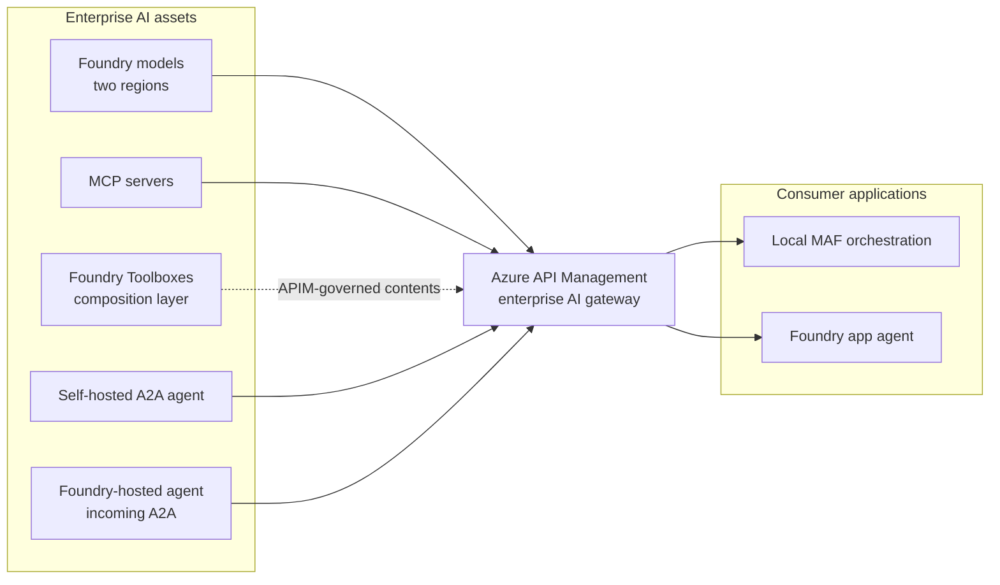
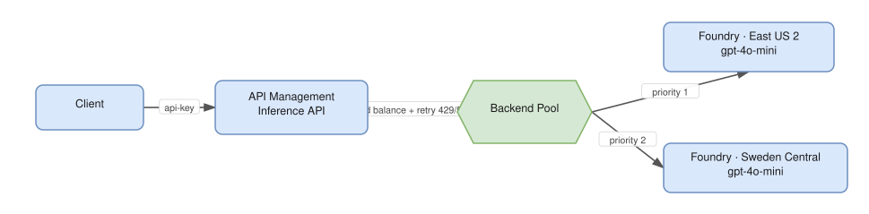
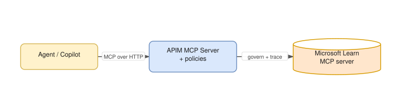
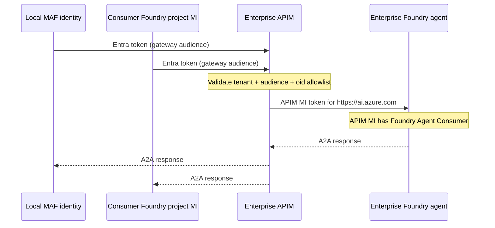
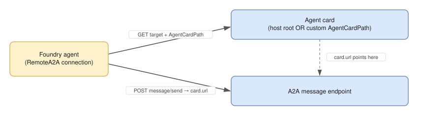
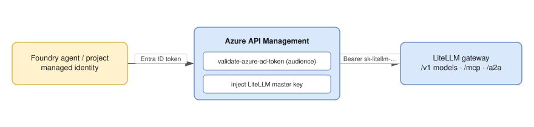
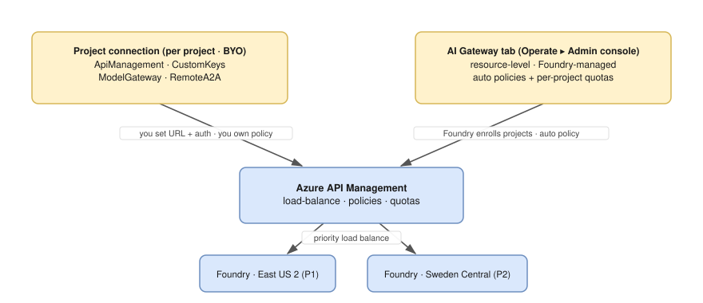

# Enterprise AI Gateway with APIM and Microsoft Foundry

An enterprise AI platform publishes more than model endpoints. Applications also need governed access to **MCP servers**, reusable **Foundry Toolboxes**, and remote **agents**. In this workshop, **Azure API Management is the enterprise front door** for models, MCP, and A2A agents; Toolboxes are the reusable composition layer whose downstream capabilities cross APIM. The gateway authenticates callers, applies policy and observability, and uses managed identity for Azure backends.

The workshop has two sides:

- **Enterprise publishers** — two Foundry regions with models, Microsoft Learn MCP, a versioned Toolbox, a self-hosted dummy A2A agent, and a Foundry-hosted enterprise agent with incoming A2A enabled.
- **Consumer applications** — a locally orchestrated **Microsoft Agent Framework (MAF)** app and a **Foundry app agent**. The advanced agent scenario uses Microsoft Entra ID on both hops and stores no keys.


```mermaid
flowchart LR
  subgraph Enterprise[Enterprise AI assets]
    Models[Foundry models<br/>two regions]
    MCP[MCP servers]
    Toolbox[Foundry Toolboxes<br/>composition layer]
    Dummy[Self-hosted A2A agent]
    FoundryAgent[Foundry-hosted agent<br/>incoming A2A]
  end

  APIM[Azure API Management<br/>enterprise AI gateway]

  subgraph Consumers[Consumer applications]
    MAF[Local MAF orchestration]
    AppAgent[Foundry app agent]
  end

  Models --> APIM
  MCP --> APIM
  Toolbox -. APIM-governed contents .-> APIM
  Dummy --> APIM
  FoundryAgent --> APIM
  APIM --> MAF
  APIM --> AppAgent
```

## Enterprise asset catalog

| Enterprise asset | APIM publication pattern | Backend authentication |
| --- | --- | --- |
| Foundry models | OpenAI-compatible inference API + backend pool, retry, circuit breaker | APIM managed identity |
| MCP servers | Streamable HTTP passthrough; no response buffering | public backend or APIM managed identity |
| Foundry Toolbox | Existing demo: Toolbox composes APIM-governed MCP and A2A assets. Optional stricter pattern: import its stable MCP consumer endpoint into APIM too | Microsoft Entra ID, audience `https://ai.azure.com` |
| Self-hosted agent | A2A card + JSON-RPC passthrough | backend-specific; the lab dummy is public behind APIM |
| Foundry-hosted agent | Native incoming A2A endpoint behind an APIM A2A facade | APIM managed identity + **Foundry Agent Consumer** |

> **Toolbox boundary:** Scenario 1 already makes the Toolbox's *contents* cross APIM. The Toolbox consumer endpoint itself is a Foundry MCP endpoint. In a production catalog it can also be imported as an APIM MCP passthrough when every Toolbox request must cross the enterprise gateway.

## Scenario map

The first scenarios build from model to tool to agent. **Scenario 4** — the advanced APIM extension — then publishes a real Foundry-hosted agent and consumes it from both application types. Scenario numbers match the script filenames in `src/test/`; Scenario 3 (LiteLLM) is optional and presented last because the core workshop is APIM-first.

| Scenario | Consumer | Enterprise APIM assets | Authentication |
| --- | --- | --- | --- |
| **0** | local MAF app | model + MCP + dummy A2A | APIM subscription key (baseline only) |
| **1** | Foundry agent + Toolbox | model + MCP + dummy A2A | project MI for Toolbox/MCP/A2A; one flagged model key |
| **2** | Foundry app agent | model + MCP + dummy A2A | project MI for the model path; legacy tool connections remain |
| **4a** | local MAF app | **Foundry-hosted enterprise agent** | local Entra identity → APIM; APIM MI → Foundry; **no keys** |
| **4b** | Foundry app agent | **same Foundry-hosted enterprise agent** | project MI → APIM; APIM MI → Foundry; **no keys** |
| **3** *(optional)* | Foundry app agent | model + MCP + A2A comparison | LiteLLM master key |

The core workshop is now APIM-first. LiteLLM remains as an optional portability comparison rather than the organizing architecture.

---

# Prerequisites

To complete the hands-on parts you need:

- An **Azure subscription** with **Owner** (or **Contributor** + **Role Based Access Control Administrator**) on a resource group. The lab creates role assignments, so plain Contributor is not enough.
- **Azure CLI** installed and signed in: `az login`.
- **Python 3.10+** for the test/scenario scripts (`pip install -r src/test/requirements.txt`).
- *(LiteLLM setup only)* Python to run the LiteLLM proxy (`pip install "litellm[proxy]"`). Docker is optional.
- Quota for the **`gpt-4o-mini`** model (GlobalStandard) in **two regions** — this lab uses `eastus2` and `swedencentral`. Check the [model availability by region](https://learn.microsoft.com/azure/ai-services/openai/concepts/models).
- The **Foundry User** role on each client project and on the enterprise project where the publishing script creates the agent (required for agent and connection data-plane operations).
- For the enterprise-agent extension, permission to assign **Foundry Agent Consumer** to the APIM managed identity. The deployment uses this least-privilege role rather than granting APIM permission to create or modify agents.

> **Cost & SKU:** this lab deploys **Azure API Management Standard v2**. v2 tiers provision in minutes (versus ~40 min for classic tiers) and are **required** for the native Foundry AI Gateway integration. APIM and the Foundry deployments incur charges — run the [clean-up](#clean-up) when finished.

The lab assets are organized as:

```
foundry-ai-gateway/
├── infra/
│   ├── main.bicep              # APIM v2 + 2 Foundry regions + backend pool + inference API + learn-mcp passthrough
│   ├── policy.xml              # load-balancing + retry policy
│   ├── deploy.ps1              # Setup step 1: APIM load balancer + MCP passthrough
│   ├── a2a-agent.bicep         # dummy A2A agent on Container Apps + APIM passthrough
│   ├── deploy-a2a.ps1          # Setup step 2: deploy the A2A agent + passthrough
│   ├── a2a-apim.bicep          # Entra-protected A2A card + message APIs for the dummy agent
│   ├── deploy-a2a-apim.ps1     # Setup step 4: publish those Entra-protected A2A APIs
│   ├── deploy-scenario1-apim.ps1 # Setup step 3: Scenario 1 consumer project + MI connections
│   ├── litellm-foundry.bicep   # (optional) LiteLLM + Postgres on Container Apps + ModelGateway connection
│   ├── deploy-litellm-foundry.ps1   # (optional) deploy the LiteLLM gateway
│   ├── apim-foundry.bicep      # (optional) register APIM as an ApiManagement connection
│   ├── enterprise-foundry-agent-apim.bicep   # Foundry-hosted agent -> APIM A2A facade, keyless
│   ├── deploy-enterprise-foundry-agent-apim.ps1 # Setup step 6: publish agent + configure both consumers
│   ├── deploy-scenario2-apim.ps1 # Setup step 5: Scenario 2 consumer; no LiteLLM dependency
│   ├── client-foundry-sc1.bicep     # Scenario 1 client account (BYO APIM, managed identity)
│   ├── client-foundry-sc2.bicep     # Scenario 2 client account (native APIM, MI + key)
│   ├── client-foundry-sc3.bicep     # (optional) Scenario 3 client account (BYO LiteLLM)
│   ├── deploy-client-foundry.ps1    # all-scenarios helper: deploys sc1 + sc2 + sc3 (needs LiteLLM)
│   └── cleanup.ps1             # tear down
└── src/
    ├── test/
    │   ├── scenario_lib.py          # shared helpers for the Foundry scenarios
    │   ├── scenario_config.py       # reads infra/scenario-outputs.json (written by deployment helpers)
    │   ├── scenario0_local_apim.py  # Scenario 0 — local MAF agent via APIM (no Foundry)
    │   ├── scenario1_custom_apim.py # Scenario 1 — Foundry Toolbox via APIM (managed identity)
    │   ├── scenario2_aigateway_native.py  # Scenario 2 — Foundry agent via APIM (native, MI)
│   ├── scenario3_aigateway_litellm.py # Scenario 3 (optional) — Foundry agent via LiteLLM
    │   ├── setup_enterprise_foundry_agent.py # create agent + enable incoming A2A
    │   ├── scenario4_maf_enterprise_agent_apim.py # local MAF -> APIM -> Foundry agent
    │   ├── scenario4_foundry_agent_apim.py # Foundry app agent -> APIM -> Foundry agent
    │   ├── invoke_enterprise_foundry_agent_direct.py # direct Responses comparison (bypasses APIM)
    │   ├── test_load_balancing.py   # Setup verify: shows the region serving each request
    │   ├── test_burst.py            # Setup verify: concurrent burst that forces failover
    │   └── register_a2a_agent.py    # registers the dummy agent in LiteLLM's A2A gateway
    ├── a2a/dummy_agent.py      # stdlib-only dummy A2A agent
    └── litellm/                # config.yaml, config.foundry.yaml, docker-compose.yml, .env.example
```

---

# Setup — build the enterprise APIM gateway

Deploy the APIM gateway, enterprise model regions, MCP route, and self-hosted A2A test agent first. Then deploy the Foundry consumer projects. The final command is the advanced extension: it creates a Foundry-hosted enterprise agent, enables its incoming A2A endpoint, places APIM in front of it, and configures both keyless consumers.

```powershell
cd infra
az login
az account set --subscription "<your-subscription-id>"

./deploy.ps1                                   # 1. enterprise APIM + models + MCP
./deploy-a2a.ps1                               # 2. self-hosted dummy A2A agent
./deploy-scenario1-apim.ps1                    # 3. Toolbox consumer + keyless tool connections
./deploy-a2a-apim.ps1                          # 4. Entra-protected self-hosted A2A facade
./deploy-scenario2-apim.ps1                    # 5. Foundry app consumer; no LiteLLM
./deploy-enterprise-foundry-agent-apim.ps1     # 6. Foundry agent -> APIM; keyless consumers
```

That is the complete APIM-focused path — it never deploys, configures, or requires LiteLLM.

The enterprise-agent deployment automatically allowlists the signed-in developer object ID for the local MAF sample and the Scenario 2 project managed identity for the Foundry app-agent sample. For automation, pass a service principal or managed-identity object ID explicitly:

```powershell
./deploy-enterprise-foundry-agent-apim.ps1 `
  -LocalCallerObjectId "<entra-object-id>"
```

To include the LiteLLM comparison, deploy it before the all-scenarios consumer helper:

```powershell
./deploy-litellm-foundry.ps1
./deploy-client-foundry.ps1 `
  -LitellmMasterKey "sk-litellm-foundry-poc" `
  -DummyA2aUrl "<a2aAgentDirectUrl from step 2>"
```

The deployment helpers merge their outputs into **`infra/scenario-outputs.json`** (endpoints, connection IDs, gateway URLs — no secrets), which the scenario scripts read automatically through [scenario_config.py](src/test/scenario_config.py). The sections below explain what each step builds.

## 1. APIM load balancer across two regions

[deploy.ps1](infra/deploy.ps1) deploys [main.bicep](infra/main.bicep): an **APIM Standard v2** instance, **two Foundry accounts** (`eastus2` + `swedencentral`) each with a `gpt-4o-mini` deployment, an APIM **backend pool**, an **inference API** (`/inference/openai`), and the **MS Learn MCP passthrough** API. It prints the **APIM gateway URL**, a **subscription key**, and the two Foundry endpoints.



How it works (in [main.bicep](infra/main.bicep) + [policy.xml](infra/policy.xml)):

- **Backend pool** spreads traffic by `priority` (lower = higher) and `weight`; round-robin within equal priority/weight.
- **Circuit breaker** trips a backend for 1 minute after a 429, honoring `Retry-After`.
- **Retry policy** re-sends to the pool on 429/503 (`first-fast-retry`), so the caller never sees the throttle.
- **Managed-identity auth** — APIM calls Foundry with its system-assigned identity (**Cognitive Services User** role); no keys in policy.

> `modelsConfig.capacity` is set low (**8** = 8K tokens/min) so throttling and failover are easy to trigger. Raise it for real workloads.

**Verify (scripts).** APIM is a drop-in Azure OpenAI-compatible endpoint — real apps just use the OpenAI SDK; these scripts add a `requests` client only to read the `x-ms-region` header and *show* which region served each call:

```powershell
pip install -r ../src/test/requirements.txt
$env:APIM_GATEWAY_URL = "<apimResourceGatewayURL>"
$env:APIM_API_KEY     = "<subscription key>"

python ../src/test/test_load_balancing.py      # 20 spaced requests — routing + MI auth
$env:TOTAL = "60"; $env:CONCURRENCY = "15"
python ../src/test/test_burst.py               # concurrent burst — forces failover
```

> **Verified:** 60 concurrent requests returned **60 × HTTP 200** (zero visible 429s — the retry policy absorbed them), split **East US 2: 39 / Sweden Central: 21**: priority‑1 absorbed traffic until the 8K‑TPM cap, then the circuit breaker failed over to priority‑2.

**Test from the APIM portal (no code).** Open the APIM instance → **APIs → Inference API → Test → "Creates a completion for the chat message"**, then fill in:

| Field | Value |
| --- | --- |
| Template parameter `deployment-id` | `gpt-4o-mini` |
| Query parameter | **name** `api-version` (not `version`), **value** `2024-10-21` |
| Header | `Content-Type: application/json` |

Request body (Raw):

```json
{
  "messages": [
    { "role": "system", "content": "You are a concise assistant. Answer in one sentence." },
    { "role": "user", "content": "What does an AI gateway do?" }
  ],
  "max_tokens": 100,
  "temperature": 0.7
}
```

The Test console adds the `Ocp-Apim-Subscription-Key` for you; APIM injects the Foundry auth with its managed identity (no model key needed). The final URL is `…/inference/openai/deployments/gpt-4o-mini/chat/completions?api-version=2024-10-21`. **Send** returns `200` with `choices[0].message.content`, and the `x-ms-region` response header shows which region served the call.

## 2. Govern the MCP tool and A2A agent through APIM

Agents call **tools** (MCP) and **other agents** (A2A). In an enterprise you want both to flow **through your gateway** for auth, rate limiting, and tracing. Because MCP (streamable HTTP) and A2A (JSON-RPC 2.0 over HTTP) are just HTTP, APIM governs them with a simple **passthrough API** — no special feature required.



- **MCP** — `deploy.ps1` already created a `learn-mcp` passthrough API in front of `https://learn.microsoft.com/api/mcp`, exposed at `https://<apim>.azure-api.net/learn-mcp/mcp` with an APIM **subscription key**. Scenario 1 adds a second, **key-free** front door on the same backend (`/learn-mcp-mi/mcp`, `subscriptionRequired: false`) whose only accepted credential is a **Microsoft Entra token from the calling project's managed identity**. (Portal equivalent: **APIs → MCP Servers → Expose an existing MCP server**, then add `validate-azure-ad-token` / `rate-limit-by-key` / `trace` policies. Use `forward-request buffer-response="false"` so the streaming transport isn't buffered.)
- **A2A** — [deploy-a2a.ps1](infra/deploy-a2a.ps1) deploys a tiny, dependency-free A2A agent ([src/a2a/dummy_agent.py](src/a2a/dummy_agent.py)) to **Azure Container Apps** (public HTTPS — APIM can't reach `localhost`) and wires a `dummy-a2a` passthrough API. It prints the agent's **direct URL** (used by `deploy-client-foundry.ps1 -DummyA2aUrl`) and its APIM URL. [deploy-a2a-apim.ps1](infra/deploy-a2a-apim.ps1) then adds the **Entra-protected** pair used by Scenario 1: a host-root card API (which rewrites the card's `url` back through APIM) and a message API, both validating the project MI's token and stripping `Authorization` before forwarding.

> **Streaming gotcha:** if you enabled Application Insights at the **All APIs** scope, set **Frontend Response → payload bytes to log = 0** and never read `context.Response.Body` in MCP policies — buffering breaks the MCP transport.

## 3. The client Foundry consumer accounts

Each consumer scenario gets its **own** client Foundry account, because the native AI Gateway integration is configured at the Foundry **resource** level — a separate account per pattern keeps each connection set small and clear.

On the APIM-only path, [deploy-scenario1-apim.ps1](infra/deploy-scenario1-apim.ps1) (step 3) and [deploy-scenario2-apim.ps1](infra/deploy-scenario2-apim.ps1) (step 5) deploy the two accounts you need. [deploy-client-foundry.ps1](infra/deploy-client-foundry.ps1) is the all-scenarios helper that deploys all three at once and therefore requires LiteLLM.

| Account | Bicep | Connections it creates |
| --- | --- | --- |
| `client-foundry-sc1` | [client-foundry-sc1.bicep](infra/client-foundry-sc1.bicep) | `mslearn-mcp-apim` (MCP, project MI) · `dummy-a2a-apim` (A2A, project MI) · `sc1-toolbox` (Toolbox, project MI) · `apim-custom-key` (model, ⚠️ key) |
| `client-foundry-sc2` | [client-foundry-sc2.bicep](infra/client-foundry-sc2.bicep) | `apim-gateway-mi` (`ApiManagement`, ProjectManagedIdentity) · `apim-gateway` (`ApiManagement`, key) · `mslearn-mcp-apim` · `dummy-a2a-direct` + driver |
| `client-foundry-sc3` | [client-foundry-sc3.bicep](infra/client-foundry-sc3.bicep) | `litellm-gateway` (`ModelGateway`, key) · `mslearn-mcp-litellm` (`CustomKeys`) · `dummy-a2a-direct` + driver |

> **Where to see these in the portal:** the **model** connections are `ApiManagement` / `ModelGateway` category, so they appear under **Models + endpoints** (admin-connected deployments), *not* the generic **Connections** list. The **MCP tool** (`CustomKeys`) and **A2A** (`RemoteA2A`) connections appear under **Connections**. The agents each scenario creates appear under **Build → Agents** and persist by default (set `KEEP_AGENT=0` to clean up).

## 4. Optional — bring your own gateway (LiteLLM)

[deploy-litellm-foundry.ps1](infra/deploy-litellm-foundry.ps1) deploys [litellm-foundry.bicep](infra/litellm-foundry.bicep): the open-source **LiteLLM** proxy on **Container Apps** (managed identity → Entra ID auth, no keys), load balancing the same two Foundry regions, with a **Postgres sidecar** (enables LiteLLM's MCP + A2A gateways) and a **`ModelGateway` connection** registered on the Scenario 3 account. It prints the public gateway URL and the `<connection>/<model>` deployment name (`litellm-gateway/gpt-4o-mini`).

LiteLLM also re-exposes registered MCP servers at **`/mcp/`** (note the **trailing slash** — `/mcp` `307`-redirects and the MCP client won't follow it), so one proxy + key fronts model *and* MCP traffic. What a BYO gateway can do, validated:

| Capability | APIM (steps 1–2) | LiteLLM (BYO) |
|---|---|---|
| Load balance / failover across regions | ✅ Backend pool + circuit breaker | ✅ Router + cooldown |
| Managed-identity auth to Foundry | ✅ | ⚠️ Entra ID token (client-managed) |
| Function-calling (tools) pass-through | ✅ | ✅ |
| Govern / proxy remote MCP servers | ✅ Passthrough API + policies | ⚠️ MCP gateway (`mcp_servers`, key auth) |
| Agent framework as a model backend | ✅ OpenAI-compatible | ✅ OpenAI-compatible |
| Per-project token limits / quotas | ✅ (native AI Gateway) | ⚠️ virtual-key budgets only |
| Registered in Foundry control plane | ✅ | ✅ as a `ModelGateway` connection |
| Multi-provider / portable | ⚠️ Azure-centric | ✅ |

> **Bottom line:** LiteLLM is a portable **model + tool** gateway. The core workshop uses Azure API Management for enterprise policy, managed identity, model/MCP/agent governance, and control-plane integration. The optional comparison registers LiteLLM as a Foundry `ModelGateway` connection.

> **(Optional) Foundry native AI Gateway.** Foundry also has a built-in, portal-driven gateway that attaches an APIM v2 instance to a Foundry resource for **per-project token limits** — **Operate → Admin console → AI Gateway → Add AI Gateway** (Create new, or Use existing Standard v2 APIM). It governs models, and (preview) MCP tools and registered agents. It's portal/control-plane driven (no Bicep), so this lab documents it; steps 1–2 already prove the equivalent MCP + A2A through APIM. See [Configure AI Gateway](https://learn.microsoft.com/azure/foundry/configuration/enable-ai-api-management-gateway-portal).

You're now ready to run the scenarios.

---

# Scenario 0 — Local app via APIM (Microsoft Agent Framework)

The baseline: a **client-orchestrated** agent. There is **no Foundry account and no connection** — an ordinary in-memory **Microsoft Agent Framework (MAF)** agent runs in your process and reaches all three targets straight through the **APIM passthrough APIs** on one subscription key. (Foundry SDK is not used here — this is the "plain app" comparison for the Foundry scenarios that follow.)

**Setup.** Only the APIM gateway (steps 1–2) is required — no client Foundry account. Provide the gateway URL and subscription key:

> **No Foundry connections here** — this scenario uses no `Microsoft.CognitiveServices/.../connections` resources. The MAF agent calls the APIM passthrough APIs directly with a subscription key; those APIs are defined on APIM in [main.bicep](infra/main.bicep) (`/inference/openai`, `/learn-mcp/mcp`) and [a2a-agent.bicep](infra/a2a-agent.bicep) (`/dummy-a2a`). The bicep connection resources start with Scenario 1.

**Run.**

```powershell
$env:APIM_GATEWAY_URL = "https://apim-xxxx.azure-api.net"
$env:APIM_API_KEY     = "<subscription key>"
python ../src/test/scenario0_local_apim.py
```

**Result** ([scenario0_local_apim.py](src/test/scenario0_local_apim.py)):

| Leg | How it reaches the target | Result |
| --- | --- | --- |
| model | MAF chat client → APIM `/inference` (load balanced) | ✅ PASS |
| tool | `MCPStreamableHTTPTool` → `{apim}/learn-mcp/mcp` | ✅ PASS |
| A2A | local function tool → A2A JSON-RPC `{apim}/dummy-a2a` | ✅ PASS |

---

# Scenario 1 — Foundry Toolbox + authenticated BYO APIM (managed identity)

The agent runs in **Foundry Agent Service** and receives one reusable, versioned **Toolbox**. The Toolbox contains both the MCP server and the A2A specialist; both are exposed through customer-owned APIM, and both authenticate with the **project managed identity** — no key, no secret in code.

- **agent → Toolbox** — `MCPTool` → the stable Toolbox consumer endpoint, authenticated by the project MI through the `sc1-toolbox` `RemoteTool` connection (audience `https://ai.azure.com`).
- **MCP in Toolbox** — `MCPTool` → `{apim}/learn-mcp-mi/mcp`, authenticated by the `mslearn-mcp-apim` connection with `authType: 'ProjectManagedIdentity'`. The API sets `subscriptionRequired: false`; the only accepted credential is an Entra token.
- **A2A in Toolbox** — `A2APreviewTool` → the APIM **host root**, authenticated by the `dummy-a2a-apim` `RemoteA2A` connection with `authType: 'ProjectManagedIdentity'`. APIM serves the agent card there and rewrites its `url`, so card discovery *and* `message/send` both stay on the gateway and both are Entra-protected.
- **model** — `apim-custom-key/gpt-4o-mini`, an `ApiManagement` connection carrying the APIM subscription key. **⚠️ This is the one key in the scenario** (see the credential inventory below).

**Authorization, not just authentication.** Each Entra-protected API pins the token's `oid` claim to *this project's* managed identity, so another tenant principal holding a valid token for the same audience is still rejected. APIM then deletes the `Authorization` header before forwarding, so neither `learn.microsoft.com` nor the A2A Container App ever receives the gateway token.

```xml
<validate-azure-ad-token tenant-id="{tenant-id}" header-name="Authorization"
    failed-validation-httpcode="401"
    failed-validation-error-message="Unauthorized: a Microsoft Entra token from the Scenario 1 project managed identity is required.">
  <audiences>
    <audience>https://cognitiveservices.azure.com</audience>
    <audience>https://cognitiveservices.azure.com/</audience>
  </audiences>
  <required-claims>
    <claim name="oid" match="any"><value>{project-mi-object-id}</value></claim>
  </required-claims>
</validate-azure-ad-token>
<set-header name="Authorization" exists-action="delete" />
```

> Override `entraAudience` with your own app registration Application ID URI (`api://…`) if you front APIM with a dedicated Entra application. The default (`https://cognitiveservices.azure.com`) needs no app registration, which keeps the lab to a single `az deployment` step.

**Credential inventory** — what actually holds a secret:

| Leg | Auth | Secret stored? |
| --- | --- | --- |
| agent → Toolbox | project managed identity (Entra) | no |
| Toolbox → MCP via APIM | project managed identity (Entra), `oid` pinned | no |
| Toolbox → A2A via APIM | project managed identity (Entra), `oid` pinned | no |
| agent → model via APIM | **⚠️ APIM subscription key** on an `ApiManagement` connection | **yes — 1 key** |

The model leg keeps a key on purpose: Scenario 1 *is* the "bring your own gateway URL + credential" pattern, and a raw `CustomKeys` connection cannot back a model. **Scenario 2 runs the identical model leg with `ProjectManagedIdentity` and no key at all** — use it as the reference when you want zero secrets.

**Connections (bicep)** — from [infra/client-foundry-sc1.bicep](infra/client-foundry-sc1.bicep):

```bicep
resource mcpApimConnection 'Microsoft.CognitiveServices/accounts/projects/connections@2025-04-01-preview' = {
  parent: project                          // PROJECT-scoped — required for ProjectManagedIdentity
  name: 'mslearn-mcp-apim'                 // TOOL — MS Learn MCP behind APIM
  properties: {
    category: 'CustomKeys'
    target: apimMcpMiUrl                    // {apim}/learn-mcp-mi/mcp (subscriptionRequired: false)
    authType: 'ProjectManagedIdentity'      // no stored key
    audience: entraAudience                 // token audience APIM validates
    credentials: {}
  }
}

resource a2aApimConnection 'Microsoft.CognitiveServices/accounts/projects/connections@2025-04-01-preview' = {
  parent: project
  name: 'dummy-a2a-apim'                   // A2A — APIM host root (card + message legs)
  properties: {
    category: 'RemoteA2A'
    target: apimA2aRootUrl                  // the RemoteA2A resolver reads the card from the HOST ROOT
    authType: 'ProjectManagedIdentity'
    audience: entraAudience
    credentials: {}
  }
}

resource toolboxConnection 'Microsoft.CognitiveServices/accounts/projects/connections@2025-04-01-preview' = {
  parent: project
  name: 'sc1-toolbox'
  properties: {
    category: 'RemoteTool'
    target: toolboxMcpUrl
    authType: 'ProjectManagedIdentity'
    audience: 'https://ai.azure.com'
    credentials: {}
  }
}

// ⚠️ The only key in Scenario 1 — see Scenario 2 for the managed-identity model leg.
resource apimCustomKeyConnection 'Microsoft.CognitiveServices/accounts/connections@2025-04-01-preview' = {
  parent: account
  name: 'apim-custom-key'                  // MODEL
  properties: {
    category: 'ApiManagement'             // a model must ride ApiManagement/ModelGateway
    authType: 'ApiKey'
    target: apimGatewayUrl                 // {apim}/inference/openai
    credentials: { key: apimSubscription.listSecrets().primaryKey }
    metadata: { models: modelsMetadata, deploymentInPath: 'true', inferenceAPIVersion: inferenceApiVersion }
  }
}
```

**Setup.** Run the two additive deployments, then the sample. Endpoints and connection IDs are written to `infra/scenario-outputs.json`. On first execution, the Python sample creates a Toolbox version containing `MCPTool` and `A2APreviewTool`, then attaches the Toolbox's stable MCP consumer endpoint to the prompt agent.

```powershell
./deploy-scenario1-apim.ps1     # project, Entra-protected MCP API, MI connections
./deploy-a2a-apim.ps1           # Entra-protected A2A card + message APIs on APIM
```

**Run.**

```powershell
python ../src/test/scenario1_custom_apim.py
```

**Result** ([scenario1_custom_apim.py](src/test/scenario1_custom_apim.py)):

| Leg | Connection / boundary | Result |
| --- | --- | --- |
| model | `apim-custom-key` (`ApiManagement`, ⚠️ key) | ✅ PASS |
| agent → Toolbox | `sc1-toolbox` (`RemoteTool`, project MI) | ✅ PASS |
| Toolbox → MCP | `mslearn-mcp-apim` (project MI, Entra) | ✅ PASS |
| Toolbox → A2A | `dummy-a2a-apim` (`RemoteA2A`, project MI, Entra) | ✅ PASS |

---

# Scenario 2 — Foundry agent via APIM (managed identity)

The same APIM gateway and `ApiManagement` category as Scenario 1, on the `client-foundry-sc2` account, but the model connection authenticates with the project's **managed identity** (`authType: ProjectManagedIdentity`, no stored key). This validates the **native AI Gateway** auth path: Foundry sends the project MI's Entra token, APIM validates it and calls the backend Foundry with APIM's own identity. A subscription-key connection (`apim-gateway`) remains as a fallback.

**Setup.** Already deployed by [deploy-scenario2-apim.ps1](infra/deploy-scenario2-apim.ps1) (or by `deploy-client-foundry.ps1` on the all-scenarios path) — two model connections (`apim-gateway-mi` managed identity, `apim-gateway` key) plus the shared MCP + A2A connections. The MI leg targets a dedicated APIM API (`/inference-mi/openai`, no subscription key) whose inbound policy runs `validate-azure-ad-token` to accept the project MI's Entra token.

**How the managed-identity path is wired (steps).** To make a Foundry `ApiManagement` connection authenticate with the project's managed identity instead of a key, three things must line up:

1. **Expose an APIM API for inference without a subscription key.** Add an inference API (here `/inference-mi/openai`) and set `subscriptionRequired: false` so the caller authenticates with an Entra token rather than an APIM subscription key.
2. **Validate the caller's Entra token in the APIM inbound policy.** Add `validate-azure-ad-token` to the API's inbound policy, accepting the audience the Foundry project requests its token for (`https://cognitiveservices.azure.com`). APIM then forwards the request to the backend Foundry/Azure OpenAI using its **own** managed identity (`authentication-managed-identity` / `set-backend-service`), so no client key is ever stored.

   ```xml
   <validate-azure-ad-token tenant-id="{tenant-id}" header-name="Authorization"
       failed-validation-httpcode="401"
       failed-validation-error-message="Unauthorized: invalid or missing Entra token.">
     <audiences>
       <audience>https://cognitiveservices.azure.com</audience>
       <audience>https://cognitiveservices.azure.com/</audience>
     </audiences>
   </validate-azure-ad-token>
   ```
3. **Create a project-scoped `ProjectManagedIdentity` connection.** The connection must be **project-scoped** (`Microsoft.CognitiveServices/accounts/projects/connections`, `parent: project` — not account-scoped), with `authType: 'ProjectManagedIdentity'`, an explicit `audience` matching the policy, and empty `credentials: {}`. Foundry then sends the project MI's Entra token (for that audience) on every inference call. (An account-scoped connection or `authType: 'AAD'` without an `audience` is **not** resolved for inference and returns `400 — Connection '<name>' not found`.)

**Connections (bicep)** — from [infra/client-foundry-sc2.bicep](infra/client-foundry-sc2.bicep); the model has two connections (MI first, key fallback):

```bicep
resource apimModelMiConnection 'Microsoft.CognitiveServices/accounts/projects/connections@2025-04-01-preview' = {
  parent: project                          // PROJECT-scoped connection
  name: 'apim-gateway-mi'                  // MODEL (managed identity, tried first)
  properties: {
    category: 'ApiManagement'
    target: apimMiGatewayUrl                 // {apim}/inference-mi/openai (no subscription key)
    authType: 'ProjectManagedIdentity'       // no stored key — uses the project MI's Entra token
    audience: 'https://cognitiveservices.azure.com'  // token audience APIM validates
    credentials: {}
    metadata: { models: modelsMetadata, deploymentInPath: 'true', inferenceAPIVersion: inferenceApiVersion }
  }
}

resource apimModelConnection 'Microsoft.CognitiveServices/accounts/connections@2025-04-01-preview' = {
  parent: account
  name: 'apim-gateway'                     // MODEL (subscription-key fallback)
  properties: {
    category: 'ApiManagement'
    target: apimGatewayUrl
    authType: 'ApiKey'
    credentials: { key: apimSubscription.listSecrets().primaryKey }
    metadata: { models: modelsMetadata, deploymentInPath: 'true', inferenceAPIVersion: inferenceApiVersion }
  }
}

// TOOL + A2A use the same `mslearn-mcp-apim` (CustomKeys) and `dummy-a2a-direct`
// (RemoteA2A) connections shown in Scenario 1.
```

**Run.**

```powershell
python ../src/test/scenario2_aigateway_native.py
```

**Result** ([scenario2_aigateway_native.py](src/test/scenario2_aigateway_native.py)):

| Leg | Connection (auth) | Result |
| --- | --- | --- |
| model (MI) | `apim-gateway-mi` (`ApiManagement`, ProjectManagedIdentity) | ✅ PASS |
| tool | `mslearn-mcp-apim` (`CustomKeys`) | ✅ PASS |
| A2A | `dummy-a2a-direct` (`RemoteA2A`, native driver) | ✅ PASS |

> The MI leg works because the connection is **project-scoped** with `authType: ProjectManagedIdentity` and an explicit `audience`, and APIM carries a `validate-azure-ad-token` inbound policy on the `/inference-mi/openai` API that accepts the project MI's Entra token (audience `https://cognitiveservices.azure.com`). APIM then calls the backend Foundry with its **own** managed identity. The subscription-key connection (`apim-gateway`) stays available as a fallback.

---

# Scenario 4 — publish a Foundry-hosted agent as A2A (advanced APIM)

Scenarios 0–2 consume models, tools, and a small self-hosted agent. Scenario 4 adds the enterprise publishing pattern: create another agent in an **enterprise Foundry project**, enable its native incoming **A2A** endpoint, and expose only that agent through APIM.

Two applications consume the same APIM URL:

1. **Local MAF orchestration** — `A2AAgent` calls APIM with the developer or workload identity from `DefaultAzureCredential`.
2. **Foundry app agent** — `A2APreviewTool` calls APIM through a project-scoped `RemoteA2A` connection using the consumer project's managed identity.

No API key or APIM subscription key exists on either path.

## The two Foundry call surfaces

A Foundry prompt agent has two useful invocation shapes. They serve different purposes:

| Surface | Addressing | Best use | Goes through APIM in this lab? |
| --- | --- | --- | --- |
| **Incoming A2A endpoint** | `.../api/projects/{project}/agents/{agent}/endpoint/protocols/a2a` | Publish one agent as an interoperable remote capability | **Yes** |
| **Project Responses API** | project endpoint + `agent_reference.name` in the request body | First-party SDK invocation and agent administration | No; the comparison sample intentionally calls Foundry directly |

> The agent name is **not a query parameter** on the Responses API. The SDK sends `extra_body={"agent_reference":{"name":"...","type":"agent_reference"}}`. Microsoft Agent Framework's `FoundryAgent(project_endpoint=..., agent_name=...)` is a higher-level form of the same direct Foundry pattern. Both bypass the APIM A2A facade unless you deliberately proxy the broader Responses surface.

The A2A URL is the cleaner enterprise publication contract because it exposes one agent, includes agent-card discovery, and lets APIM apply agent-specific authorization and telemetry.

## 1. Create the enterprise agent and enable incoming A2A

[setup_enterprise_foundry_agent.py](src/test/setup_enterprise_foundry_agent.py) creates a stable agent name (`enterprise-specialist`) in the first enterprise Foundry project, then configures its agent card and enables both `responses` and `a2a` protocols.

Foundry publishes these protected URLs:

```text
Base:    https://{account}.services.ai.azure.com/api/projects/{project}/agents/{agent}/endpoint/protocols/a2a
Card v1: {base}/agentCard/v1.0
Card .3: {base}/agentCard/v0.3
```

All three require a Microsoft Entra token for `https://ai.azure.com/.default`. Anonymous card access and key authentication are not supported. A caller needs **Foundry Agent Consumer** (or a higher Foundry data-plane role) on the project or individual agent.

The deployment helper runs the setup sample automatically. To run only the publisher step yourself:

```powershell
python ../src/test/setup_enterprise_foundry_agent.py `
  --project-endpoint "https://<account>.services.ai.azure.com/api/projects/<project>" `
  --agent-name "enterprise-specialist" `
  --model "gpt-4o-mini"
```

## 2. Put the Foundry A2A endpoint behind APIM

[enterprise-foundry-agent-apim.bicep](infra/enterprise-foundry-agent-apim.bicep) creates:

- an APIM backend pointing at the Foundry agent's A2A base URL, authenticated with APIM's managed identity;
- `POST /enterprise-agents/enterprise-specialist` for A2A JSON-RPC;
- pass-through `agentCard/v1.0` and `agentCard/v0.3` routes;
- `/.well-known/agent-card.json` and `/.well-known/agent.json` discovery aliases;
- card rewriting so every advertised runtime URL points back to APIM;
- the **Foundry Agent Consumer** role assignment for the APIM identity;
- a project-scoped, keyless `RemoteA2A` connection for the consumer Foundry project.

Azure API Management now has native **A2A Agent API** import in the portal (**APIs → Add API → A2A Agent**). That import adds A2A-aware telemetry and card transformations. This template builds the equivalent routes explicitly so the workshop can enforce its custom Entra allowlist and remain repeatable as infrastructure as code.

### Four gateway behaviours this scenario has to handle

Each of these was found by deploying the lab and reading APIM traces and request logs. They are the interesting part of the exercise — a naive passthrough fails on all four.

**1. The card body must be buffered.** The JSON-RPC route uses `forward-request buffer-response="false"` so the runtime is not buffered. A streamed body cannot be read in `outbound`, so the card operations override it:

```xml
<backend><forward-request buffer-response="true" /></backend>
```

**2. The card body must be uncompressed.** Foundry gzips the card when the caller advertises gzip, and `context.Response.Body.As<JObject>()` then fails with *"The message body is not a valid JSON"* (surfaced to the caller as `500`). The card routes force identity encoding on the way to the backend:

```xml
<set-header name="Accept-Encoding" exists-action="override">
  <value>identity</value>
</set-header>
```

**3. The discovery base URL needs a trailing slash.** Foundry resolves the agent card with `urljoin`, which **drops the last path segment** when the base has none. With target `…/enterprise-agents/enterprise-specialist`, the gateway received:

```text
GET /enterprise-agents/.well-known/agent-card.json   → 404
```

So the `RemoteA2A` connection target ends with `/`. The JSON-RPC runtime URL stays unslashed.

**4. The two A2A card shapes are not interchangeable.** Foundry's `A2A.AgentCard` deserializer requires the **v0.3** shape (top-level `url` and `protocolVersion`) and rejects the v1.0 `supportedInterfaces` shape with *"missing required properties including: 'url', 'protocolVersion'"*. The current `a2a-sdk` client wants the opposite. The gateway therefore serves both:

| Route | Card shape | Consumer |
| --- | --- | --- |
| `/.well-known/agent-card.json`, `/.well-known/agent.json` | v0.3 | Foundry Agent Service |
| `/agentCard/v1.0` | v1.0 | `a2a-sdk` / Microsoft Agent Framework |
| `/agentCard/v0.3` | v0.3 | explicit v0.3 clients |

Because both shapes flow through the same rewrite, every advertised URL stays on the gateway.

## 3. Keyless authentication on both hops


```mermaid
sequenceDiagram
  participant Local as Local MAF identity
  participant App as Consumer Foundry project MI
  participant APIM as Enterprise APIM
  participant Agent as Enterprise Foundry agent

  Local->>APIM: Entra token (gateway audience)
  App->>APIM: Entra token (gateway audience)
  Note over APIM: Validate tenant + audience + oid allowlist
  APIM->>Agent: APIM MI token for https://ai.azure.com
  Note over Agent: APIM MI has Foundry Agent Consumer
  Agent-->>APIM: A2A response
  APIM-->>Local: A2A response
  APIM-->>App: A2A response
```

| Hop | Credential | Authorization |
| --- | --- | --- |
| local MAF → APIM | `DefaultAzureCredential`, default lab audience `https://cognitiveservices.azure.com` | APIM validates the user/workload `oid` against an allowlist |
| Foundry app agent → APIM | consumer project managed identity | APIM validates the project MI `oid` against the same allowlist |
| APIM → enterprise Foundry agent | APIM system-assigned managed identity, audience `https://ai.azure.com` | least-privilege **Foundry Agent Consumer** role on the enterprise project |

> For production, replace the convenient lab inbound audience with a dedicated Application ID URI such as `api://<enterprise-ai-gateway-app-id>`. The downstream Foundry audience remains `https://ai.azure.com`.

Deploy the whole extension after Scenario 2:

```powershell
cd infra
./deploy-enterprise-foundry-agent-apim.ps1
```

The script writes only URLs, names, connection IDs, and audiences to `infra/scenario-outputs.json`; it writes no tokens or keys.

## 4a. Consume from local Microsoft Agent Framework

[scenario4_maf_enterprise_agent_apim.py](src/test/scenario4_maf_enterprise_agent_apim.py) authenticates at the **HTTP client** layer, so the token covers agent-card discovery *and* every JSON-RPC call:

```python
class EntraAuth(httpx.Auth):
    async def async_auth_flow(self, request):
        token = await self._credential.get_token(self._scope)
        request.headers["Authorization"] = f"Bearer {token.token}"
        yield request

async with httpx.AsyncClient(auth=EntraAuth(credential, INBOUND_SCOPE)) as http_client:
    resolver = A2ACardResolver(
        httpx_client=http_client,
        base_url=A2A_APIM_URL,
        agent_card_path="agentCard/v1.0",   # a2a-sdk expects the v1.0 shape
    )
    card = await resolver.get_agent_card()
    agent = A2AAgent(agent_card=card, http_client=http_client)
    response = await agent.run("Why expose enterprise agents through APIM?")
```

> **Why not `AuthInterceptor`?** `a2a-sdk`'s `AuthInterceptor` only applies credentials for security schemes **declared on the agent card**. The Foundry-generated card declares none, so the interceptor silently does nothing and the call returns `401`. Authenticating on the `httpx` client is the reliable pattern.
>
> The sample also does not use `A2AAgent` as an async context manager: `agent-framework-a2a` 1.0.0b260604 raises `AttributeError: '_close_http_client'` in `__aexit__` when the caller supplies its own HTTP client. The `httpx` client owns the connection lifetime instead.

Run it after signing in with the allowlisted identity:

```powershell
python ../src/test/scenario4_maf_enterprise_agent_apim.py
```

Verified output:

```text
Scenario 4a - local MAF -> APIM -> enterprise Foundry agent
  A2A URL : https://<apim>.azure-api.net/enterprise-agents/enterprise-specialist
  Auth    : DefaultAzureCredential -> https://cognitiveservices.azure.com/.default (no key)
  Card    : enterprise-specialist -> advertises https://<apim>.azure-api.net/enterprise-agents/enterprise-specialist
  PASS    : Exposing enterprise agents through an API Management (APIM) allows for secure, ...
```

## 4b. Consume from a Foundry app agent

The Bicep template creates the consumer connection with no credentials. Note the **trailing slash**:

```bicep
resource consumerA2aConnection 'Microsoft.CognitiveServices/accounts/projects/connections@2025-04-01-preview' = {
  parent: consumerProject
  name: 'enterprise-agent-apim'
  properties: {
    category: 'RemoteA2A'
    target: publicA2aDiscoveryBaseUrl      // '{apim}/enterprise-agents/enterprise-specialist/'
    authType: 'ProjectManagedIdentity'
    audience: inboundAudience
    credentials: {}
  }
}
```

[scenario4_foundry_agent_apim.py](src/test/scenario4_foundry_agent_apim.py) attaches that connection as an A2A tool. Because APIM protects the agent card as well as the runtime, the tool enables `send_credentials_for_agent_card`:

```python
a2a_tool = A2APreviewTool({
    "type": "a2a_preview",
    "base_url": A2A_DISCOVERY_URL,          # trailing slash - see behaviour 3 above
    "project_connection_id": A2A_CONNECTION_ID,
    "send_credentials_for_agent_card": True,
})
```

> `azure-ai-projects` 2.2 predates the `send_credentials_for_agent_card` field, so its generated constructor rejects the keyword. Building the tool **from a mapping** passes the field through unchanged on 2.2 and 2.3+.

Run:

```powershell
python ../src/test/scenario4_foundry_agent_apim.py
```

Verified result:

| Leg | Connection (auth) | Result |
| --- | --- | --- |
| consumer agent → APIM | `enterprise-agent-apim` (`RemoteA2A`, ProjectManagedIdentity) | ✅ PASS |
| APIM → enterprise agent | APIM managed identity + Foundry Agent Consumer | ✅ PASS |

## Direct Responses comparison

[invoke_enterprise_foundry_agent_direct.py](src/test/invoke_enterprise_foundry_agent_direct.py) demonstrates the alternative project-endpoint call. It is useful for first-party app integration, but it intentionally **bypasses APIM**:

```python
response = project.get_openai_client().responses.create(
    input="What is an enterprise AI gateway?",
    extra_body={
        "agent_reference": {
            "name": AGENT_NAME,
            "type": "agent_reference",
        }
    },
)
```

Use the direct sample to compare APIs, not as the governed path:

```powershell
python ../src/test/invoke_enterprise_foundry_agent_direct.py
```

## Verify the security boundary

The gateway rejects everything except an allowlisted identity presenting the expected audience:

```powershell
$card = "$env:ENTERPRISE_AGENT_APIM_URL/.well-known/agent-card.json"

# anonymous
Invoke-RestMethod -Uri $card                                   # 401

# valid Entra token, wrong audience (ARM instead of the gateway audience)
$wrong = az account get-access-token --resource https://management.azure.com --query accessToken -o tsv
Invoke-RestMethod -Uri $card -Headers @{ Authorization = "Bearer $wrong" }   # 401
```

Both return **401**, confirming that `validate-azure-ad-token` is enforcing tenant, audience, and the `oid` allowlist rather than merely accepting any bearer token. Confirm the downstream role is least privilege:

```powershell
az role assignment list `
  --scope "<enterprise project resource id>" `
  --query "[?principalId=='<apim mi object id>'].roleDefinitionName" -o tsv
# Foundry Agent Consumer
```

---

# Scenario 3 (optional) — Foundry agent via LiteLLM (bring your own)

Same Foundry agent shape as Scenario 2, on the `client-foundry-sc3` account, but the gateway is the self-hosted **LiteLLM** proxy registered as a **`ModelGateway`** connection (master key). The model **and** the MCP tool both ride LiteLLM; A2A uses the direct `RemoteA2A` connection (LiteLLM serves its agent card under a path, not the host root Foundry requires for the managed A2A tool — see [What works today](#what-works-today)).

**Setup.** Requires the optional LiteLLM path: `deploy-litellm-foundry.ps1` followed by `deploy-client-foundry.ps1`.

**Connections (bicep)** — from [infra/client-foundry-sc3.bicep](infra/client-foundry-sc3.bicep):

```bicep
resource litellmModelConnection 'Microsoft.CognitiveServices/accounts/connections@2025-04-01-preview' = {
  parent: account
  name: 'litellm-gateway'                  // MODEL — self-hosted LiteLLM proxy
  properties: {
    category: 'ModelGateway'
    target: litellmBaseUrl                  // the LiteLLM base URL
    authType: 'ApiKey'
    credentials: { key: litellmMasterKey }
    metadata: { models: modelsMetadata, deploymentInPath: 'false', authConfig: litellmAuthConfig }
  }
}

resource mcpLitellmConnection 'Microsoft.CognitiveServices/accounts/connections@2025-04-01-preview' = {
  parent: account
  name: 'mslearn-mcp-litellm'              // TOOL — MS Learn MCP behind LiteLLM
  properties: {
    category: 'CustomKeys'
    target: '${litellmBaseUrl}/${litellmMcpPath}'   // {litellm}/mcp/
    authType: 'CustomKeys'
    credentials: { keys: { Authorization: 'Bearer ${litellmMasterKey}' } }
  }
}

// A2A uses the same `dummy-a2a-direct` (RemoteA2A, host-root card) connection as Scenarios 1-2.
```

**Run.**

```powershell
python ../src/test/scenario3_aigateway_litellm.py
```

**Result** ([scenario3_aigateway_litellm.py](src/test/scenario3_aigateway_litellm.py)):

| Leg | Connection | Result |
| --- | --- | --- |
| model | `litellm-gateway` (`ModelGateway`, key) | ✅ PASS |
| tool | `mslearn-mcp-litellm` (`CustomKeys`) | ✅ PASS |
| A2A | `dummy-a2a-direct` (`RemoteA2A`, native driver) | ✅ PASS |

---

# What works today

The original regression scenarios (0–3) run **model → tool → A2A**. The APIM enterprise-agent extension (4a / 4b) was deployed and executed end to end against live Azure resources, including the negative authorization tests.

| Scenario | Published asset | Consumer | Authentication | Status |
| --- | --- | --- | --- | --- |
| **0 — Local app via APIM** | model + MCP + dummy A2A | local MAF | APIM key baseline | ✅ live verified |
| **1 — Foundry Toolbox via APIM** | model + Toolbox (MCP + A2A) | Foundry app agent | project MI; one flagged model key | ✅ live verified |
| **2 — Foundry app via APIM** | model + MCP + dummy A2A | Foundry app agent | model MI; legacy tool connections | ✅ live verified |
| **4a — Enterprise Foundry agent via APIM** | Foundry-hosted A2A agent | local MAF | Entra → APIM MI; **no keys** | ✅ live verified |
| **4b — Enterprise Foundry agent via APIM** | same Foundry-hosted A2A agent | Foundry app agent | project MI → APIM MI; **no keys** | ✅ live verified |
| **Optional LiteLLM** | model + MCP + A2A | Foundry app agent | LiteLLM key | ✅ live verified |

Legend: ✅ live verified · ⚠️ fallback/conditional · ⛔ not supported.

**Negative tests (4a / 4b):** anonymous request → `401`; valid Entra token for the wrong audience → `401`; APIM identity holds only **Foundry Agent Consumer** on the enterprise project.

**Not supported today (and the workaround used):**

- **A `CustomKeys` connection can't back a *model*.** Foundry serves models only through `ApiManagement` / `ModelGateway` connections (a `CustomKeys` model returns `400 — Category cannot be null`); `CustomKeys` is fine for **tool** auth. See [Bring your own model to Foundry Agent Service](https://learn.microsoft.com/azure/foundry/agents/how-to/ai-gateway).
- **Managed-identity model auth needs an APIM-side token policy.** A `ProjectManagedIdentity` `ApiManagement` connection only resolves if APIM validates the project MI's Entra token (`validate-azure-ad-token`, audience `https://cognitiveservices.azure.com`). Scenario 2 provisions a dedicated `/inference-mi/openai` API carrying that policy, so the MI leg passes; the native AI Gateway configures the same policy automatically — the same principle as the *MCP behind a gateway* behavior in [the reference below](#mcp-tool--managed-identity-including-behind-a-gateway). See [Configure AI Gateway in your Foundry resources](https://learn.microsoft.com/azure/foundry/configuration/enable-ai-api-management-gateway-portal).
- **Foundry's managed A2A tool can't be driven by a *gateway* model in the original live tests.** It returned `500` when the calling agent's model was an `ApiManagement` / `ModelGateway` connection, so Foundry A2A legs use a small **native `gpt-4o-mini` driver** model. The advanced enterprise-agent consumer follows the same conservative pattern. Re-test as the preview service evolves.
- **A2A card discovery must match the endpoint.** Foundry resolves the card with `urljoin`, so a gateway base URL **must end with a slash** or the last path segment is dropped. Foundry also requires the **v0.3** card shape, while `a2a-sdk` requires **v1.0**, so the gateway publishes both. See [Four gateway behaviours](#four-gateway-behaviours-this-scenario-has-to-handle); [a2a-apim.bicep](infra/a2a-apim.bicep) remains the legacy host-root shim for the dummy agent.
- **Rewriting a card in APIM requires buffering and identity encoding.** A streamed (`buffer-response="false"`) or gzip-compressed body cannot be parsed by `context.Response.Body.As<JObject>()`, and the caller sees an opaque `500`. Both are handled on the card routes only, so the JSON-RPC runtime keeps streaming.
- **Prefer managed identity; flag every remaining key.** MCP, A2A and Toolbox connections all support `authType: 'ProjectManagedIdentity'` with an explicit `audience`, so Scenario 1 stores no secret for them. The **model** leg is the exception: a model must ride an `ApiManagement` / `ModelGateway` connection, and Scenario 1 keeps the APIM subscription key there on purpose to demonstrate the BYO-credential pattern — Scenario 2 shows the same leg key-free.

The **Foundry User** role on the project is required for any connection-backed model / tool / A2A call (see [agent identity concepts](https://learn.microsoft.com/azure/foundry/agents/concepts/agent-identity)).

**What you built:** an enterprise **APIM AI gateway** that load balances Foundry models across regions, governs MCP and Toolbox-backed tools, publishes both self-hosted and Foundry-hosted A2A agents, and serves two application patterns: local MAF orchestration and Foundry app agents. The advanced Foundry-agent path uses managed identity on both hops and stores no keys. LiteLLM remains an optional portability comparison.

## Reference — A2A and MCP tool behavior (per Microsoft docs)

This appendix describes how **Foundry Agent Service** handles **A2A** and **MCP** tools in a real implementation, independent of this lab's wiring. It is sourced from Microsoft Learn (links at the end), and backs the limitations called out above.

### Behavior summary

| Tool | Behavior | Supported? | Notes |
| --- | --- | --- | --- |
| **A2A** | Key-based auth (header) | ✅ | `Authorization: Bearer …` or `x-api-key: …`; attached to every request. |
| **A2A** | **Managed identity** (agent identity / project MI) | ✅ | Endpoint must accept the correct **audience** + identity needs role assignments. |
| **A2A** | OAuth identity passthrough (per-user) | ✅ | Preserves user context; consent on first use. |
| **A2A** | Unauthenticated access | ✅ | Only for public/network-protected endpoints. |
| **A2A** | Configurable agent card path (`AgentCardPath`) | ✅ | REST-API only; default `.well-known/agent-card.json`, Foundry-hosted = `agentCard/v1.0`. |
| **A2A** | Anonymous card on Foundry-hosted endpoint | ⛔ | All Foundry-hosted A2A URLs require Entra ID auth. |
| **A2A** | HTTP+JSON / gRPC transport (v1.0) | ⛔ | v1.0 is **JSONRPC-only**; only A2A v1.0 + v0.3 supported. |
| **A2A** | Non-text modality / streaming (SSE) | ⛔ | Text modality only; no streaming responses. |
| **MCP** | Key-based auth | ✅ | Credential stored in the project connection. |
| **MCP** | **Managed identity** (agent identity / project MI) | ✅ | Provide **Audience** (App ID URI); category `RemoteTool`, auth `AgenticIdentityToken`. |
| **MCP** | OAuth identity passthrough | ✅ | Per-user consent link on first use. |
| **MCP** | **Managed identity behind APIM** | ⚠️ | Works **only if** APIM validates the Entra token (`validate-azure-ad-token`, correct audience + MI client ID); otherwise falls back to key-based. |

Legend: ✅ supported · ⚠️ conditional · ⛔ not supported.

### A2A (Agent2Agent) tool

**Connection.** A Foundry agent calls a remote A2A agent through a project connection of category `RemoteA2A` that stores the endpoint URL, the authentication, and an optional **agent card path**.

**Discovery (agent card).**

- Foundry resolves the agent card from the connection **target** plus an **`AgentCardPath`** (connection metadata). The A2A default is `.well-known/agent-card.json`; Foundry-hosted agents instead serve theirs at `agentCard/v1.0`, so you set `AgentCardPath` explicitly. Setting a custom card path is **REST-API only** — it isn't exposed in the Foundry portal.
- Registering an external A2A agent in the **Foundry control plane** returns a Foundry-generated **proxy URL**; Foundry discovers the card at `/.well-known/agent-card.json` and adds access control and monitoring through the AI gateway.
- For Foundry-hosted A2A endpoints, **all** A2A URLs (including the card) require **Microsoft Entra ID** auth — anonymous card access isn't supported — and the caller needs the **Foundry User** role on the project.

**Host root vs custom path (e.g. behind APIM).** You don't have to serve the card at the gateway **host root**. Because the card location is `target` + `AgentCardPath`, you can point the connection `target` at an APIM **sub-path** API (for example `https://gw.azure-api.net/agent-b`) and set `AgentCardPath` in the connection `metadata` to the relative card path. This lets **multiple A2A agents share one gateway** on different paths. The host root is only the default that applies when `AgentCardPath` is left unset (the A2A client resolves `.well-known/agent-card.json` against the target's host).



**Authentication.** An A2A connection supports:

- **Key-based** — a header credential (e.g. `Authorization: Bearer <token>` or `x-api-key: <key>`); Agent Service attaches it to each request.
- **Microsoft Entra ID** — **agent identity** or **project managed identity**; Agent Service mints a token and includes it. Requires role assignments on the underlying service and the endpoint accepting the correct **audience**.
- **OAuth identity passthrough** — per-user sign-in/consent; preserves user context across calls.
- **Unauthenticated** — only for endpoints that are public or network-protected.

**Limitations (preview).** A2A **v1.0 and v0.3** only; for v1.0, **JSONRPC transport only** (no HTTP+JSON or gRPC); **text** modality only; **no streaming** (server-sent events).

### MCP tool — managed identity (including behind a gateway)

**Authentication methods.** MCP tools connect via a project connection and support **key-based**, **Microsoft Entra (managed identity)**, and **OAuth identity passthrough**.

**Managed identity.** For Entra auth you choose **Agent Identity** or **Project Managed Identity** and provide an **Audience** = the Application ID URI of the target service's Entra app registration. Agent Service requests a token scoped to that audience and passes it to the MCP endpoint (connection category `RemoteTool`, auth type `AgenticIdentityToken`). The identity needs the required **role assignments** on the underlying service.

**Behind a gateway (e.g. APIM).** Foundry **can** use managed identity to reach a remote MCP server fronted by APIM — **but only if the gateway validates the Entra token**. APIM must run a `validate-azure-ad-token` (or `validate-jwt`) inbound policy configured with the expected **audience** and accept the agent/project managed identity's **application (client) ID**. If the gateway doesn't validate the token (or only checks a subscription key), the managed-identity token is ignored and you fall back to key-based auth — the same principle that governs managed-identity **model** auth.

**Troubleshooting (Entra).** `401` = wrong/unaccepted audience, or the endpoint doesn't accept Entra tokens; `403` = the identity is missing role assignments (changes take up to ~10 minutes to propagate).

### APIM as the front door for LiteLLM (Entra ID in, key out)

You can put **APIM in front of LiteLLM** so callers authenticate with **Microsoft Entra ID** while the **LiteLLM master key stays server-side**. APIM validates the inbound token (`validate-azure-ad-token`) and injects the LiteLLM key on the backend call (`set-header Authorization: Bearer sk-…`). This is the **recommended enterprise pattern**: centralized auth, hidden secrets, throttling, and observability — clients never see the LiteLLM key.



**Works for all three target types:**

- **Models** — a `ModelGateway` / `ApiManagement` connection with managed identity (audience `https://cognitiveservices.azure.com/`). APIM validates the token, then calls LiteLLM's OpenAI-compatible route with the key. (This is essentially what the native AI Gateway configures for you.)
- **MCP tools** — a `RemoteTool` connection with `AgenticIdentityToken` + **audience**. APIM validates, injects the key, and forwards to LiteLLM's `/mcp/`.
- **A2A agents** — a `RemoteA2A` connection with `ProjectManagedIdentity` / `AgenticIdentityToken` + **audience**, plus a custom `AgentCardPath` pointing at the APIM A2A path. APIM validates the token and injects the key to LiteLLM's `/a2a/…`.

**Advice / caveats.**

- ✅ **Recommended for models and MCP tools** — it's the standard secret-hiding gateway pattern and is fully additive (new APIM APIs + connections).
- ⚠️ APIM must validate the token with the **correct audience** and accept the managed identity's **application (client) ID**; otherwise the token is ignored and you fall back to key-based.
- ⚠️ **A2A discovery caveat** — confirm whether the **card fetch** carries the MI token. If the card path is Entra-protected but discovery is unauthenticated, keep the **card path anonymous** and protect only the **message endpoint**. Using a custom `AgentCardPath` also means a second A2A agent no longer collides with an existing host-root card on the same gateway.

### Project connections vs. the AI Gateway tab

Both approaches put **APIM in front of Foundry**; they differ in **who configures the gateway**. This lab uses **project connections** (the manual / bring-your-own path) against an APIM it deploys itself — it does **not** use the native **AI Gateway** tab.



**How this lab is wired (confirming the architecture).** Three dedicated **client** Foundry accounts (`client-foundry-sc1/2/3`) hold **no enterprise models of their own**. Each reaches the **enterprise APIM**, which load-balances across **two enterprise Foundry accounts** — `foundry1` (East US 2, priority 1) and `foundry2` (Sweden Central, priority 2) — with circuit breakers:

- **sc1** — `apim-custom-key` (**ApiManagement**, subscription **key**) for the model; `mslearn-mcp-apim` (**CustomKeys**) for the tool; `dummy-a2a-direct` (**RemoteA2A**) for the agent.
- **sc2** — `apim-gateway-mi` (**ApiManagement**, **managed identity** / AAD) with `apim-gateway` (**ApiManagement**, key) fallback for the model; same MCP + A2A connections.
- **sc3** — `litellm-gateway` (**ModelGateway**) to the BYO LiteLLM gateway; same MCP + A2A connections.
- **advanced APIM extension** — `enterprise-agent-apim` (**RemoteA2A**, project managed identity) points to a path-scoped APIM A2A API. APIM then uses its own managed identity to call the enterprise Foundry agent.

| | Project connection (this lab) | AI Gateway tab (native) |
| --- | --- | --- |
| **Where configured** | Per **project**, in the project's connections | Per **Foundry resource**, in **Operate ▸ Admin console ▸ AI Gateway** |
| **Who configures APIM** | **You** — bring the gateway URL + auth and author the APIM policies | **Foundry** — creates (or attaches) the APIM and writes the policies |
| **How targets are wired** | One `ApiManagement` / `CustomKeys` / `ModelGateway` / `RemoteA2A` connection per leg | Enroll a project with **Add project to gateway**; no per-leg wiring |
| **Managed-identity auth** | Works only if **your** APIM validates the token (`validate-azure-ad-token`) | Foundry configures MI token validation for you |
| **Governance** | Whatever you put in your APIM | Per-project **token limits / quotas**, model + MCP + A2A governance, telemetry in Foundry / App Insights |
| **Scope** | One connection = one project = one target | One gateway shared by all projects in the resource (**1 APIM ↔ 1 AI Gateway**) |

**Why the lab uses connections.** It needs explicit, per-scenario control over a customer-owned APIM. Scenario 2's managed-identity model leg now has a dedicated `/inference-mi/openai` API with `validate-azure-ad-token`, so it passes keylessly; the key connection remains only as an explicit fallback. The advanced agent extension uses the same separation of responsibilities for A2A: APIM validates the consumer identity, then authenticates to Foundry with APIM's managed identity.

**Docs:**

- [Configure AI Gateway in your Foundry resources](https://learn.microsoft.com/azure/foundry/configuration/enable-ai-api-management-gateway-portal)
- [AI gateway in Microsoft Foundry (APIM)](https://learn.microsoft.com/azure/api-management/genai-gateway-capabilities#ai-gateway-in-microsoft-foundry-preview)
- [Bring your own model to Foundry Agent Service (Model Gateway / APIM connection)](https://learn.microsoft.com/azure/foundry/agents/how-to/ai-gateway)
- [Govern MCP and A2A tools by using an AI gateway](https://learn.microsoft.com/azure/ai-foundry/agents/how-to/tools/governance)

- [Agent2Agent (A2A) authentication](https://learn.microsoft.com/azure/foundry/agents/concepts/agent-to-agent-authentication)
- [Connect to an A2A agent endpoint from Foundry Agent Service](https://learn.microsoft.com/azure/foundry/agents/how-to/tools/agent-to-agent)
- [Enable incoming A2A on a Foundry agent](https://learn.microsoft.com/azure/foundry/agents/how-to/enable-agent-to-agent-endpoint)
- [Set up authentication for MCP tools](https://learn.microsoft.com/azure/foundry/agents/how-to/mcp-authentication)
- [Agent identity concepts in Microsoft Foundry](https://learn.microsoft.com/azure/foundry/agents/concepts/agent-identity)

---

# Clean up

Stop charges by deleting everything the lab created:

```powershell
cd infra
./cleanup.ps1
# or: az group delete --name lab-foundry-ai-gateway --yes --no-wait
```

`cleanup.ps1` (or deleting the resource group) removes the APIM instance, both Foundry regions, the Container Apps (A2A agent + LiteLLM), and the three client Foundry accounts. If you enabled the **native AI Gateway**, first **remove projects from the gateway** and **delete the AI Gateway** in the Foundry Admin console, then delete the APIM instance.

## References

- [Azure AI Projects client library for Python](https://learn.microsoft.com/python/api/overview/azure/ai-projects-readme)
- [Get started with Foundry SDKs and endpoints](https://learn.microsoft.com/azure/foundry/how-to/develop/sdk-overview?pivots=programming-language-python)
- [AI gateway capabilities in Azure API Management](https://learn.microsoft.com/azure/api-management/genai-gateway-capabilities)
- [Configure AI Gateway in your Foundry resources](https://learn.microsoft.com/azure/foundry/configuration/enable-ai-api-management-gateway-portal)
- [Bring your own model to Foundry Agent Service (Model Gateway connection)](https://learn.microsoft.com/azure/foundry/agents/how-to/ai-gateway)
- [Expose an existing MCP server in APIM](https://learn.microsoft.com/azure/api-management/expose-existing-mcp-server)
- [Import an A2A agent API into APIM](https://learn.microsoft.com/azure/api-management/agent-to-agent-api)
- [Enable incoming A2A on a Foundry agent](https://learn.microsoft.com/azure/foundry/agents/how-to/enable-agent-to-agent-endpoint)
- [Foundry Agent Consumer and agent-scope RBAC](https://learn.microsoft.com/azure/foundry/concepts/rbac-foundry)
- [Consume an A2A endpoint with Microsoft Agent Framework](https://learn.microsoft.com/agent-framework/integrations/by-component/agent-services/a2a)
- [Microsoft Learn MCP server](https://learn.microsoft.com/training/support/mcp)
- [LiteLLM — Azure AI provider](https://docs.litellm.ai/docs/providers/azure_ai)
