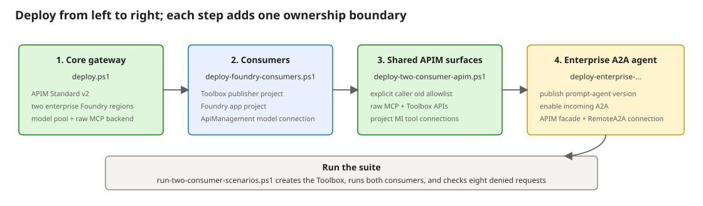
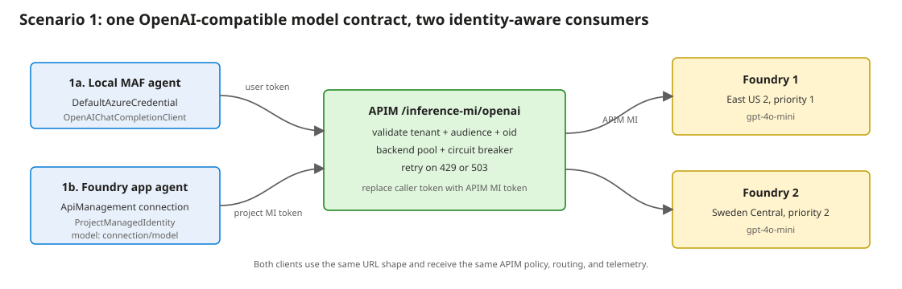
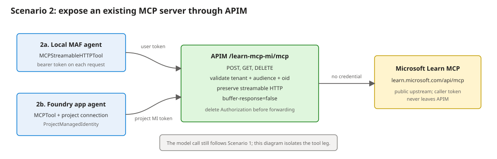
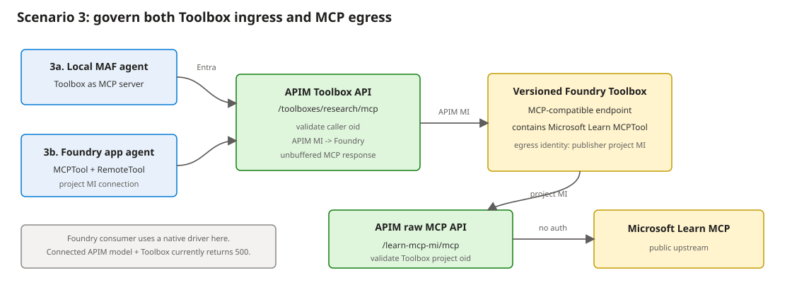
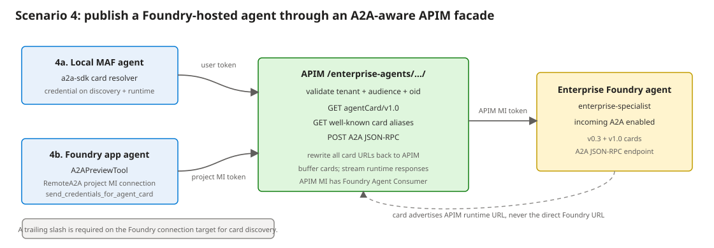
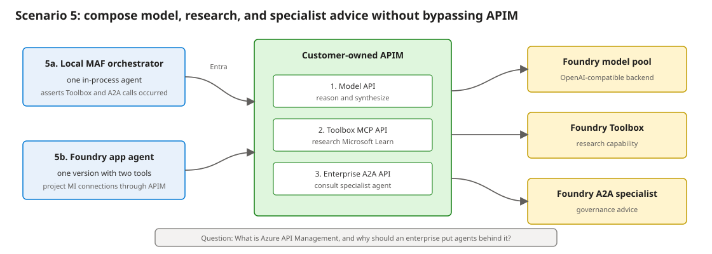
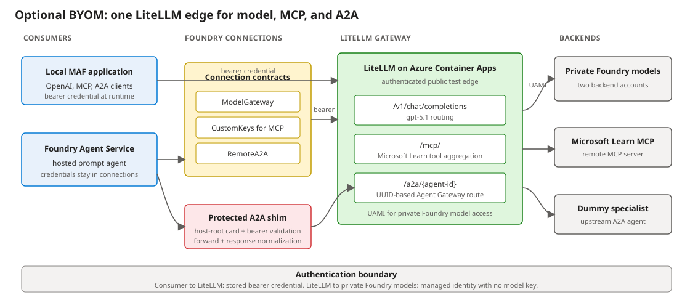
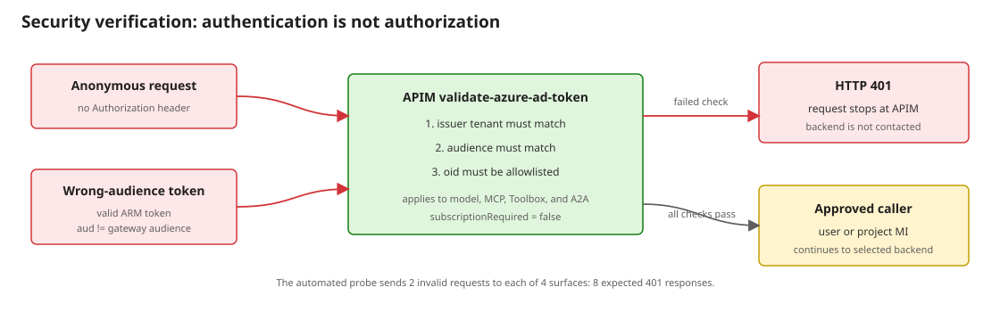

# Keyless Enterprise AI Gateway with APIM and Microsoft Foundry


This lab builds one **customer-owned Azure API Management (APIM)** gateway and tests it from two runtimes:

- A local **Microsoft Agent Framework (MAF)** application.
- A prompt agent hosted by **Microsoft Foundry Agent Service**.

Both runtimes use the same governed API contracts. Scenarios 1-5 are the core keyless APIM path: there are no APIM subscription keys, model keys, connection secrets, or key fallbacks.

Scenario 6 is an optional comparison. It registers a customer-operated LiteLLM instance as a Foundry `ModelGateway` and also exposes MCP and A2A through LiteLLM. That path uses a bearer credential at the LiteLLM edge because the current `ModelGateway` connection contract does not support project managed identity. LiteLLM still uses managed identity to reach its private Foundry model backends.

## What is implemented

<div style="max-width: 100%; overflow-x: auto;">

| Scenario | Gateway surface | Local MAF | Foundry Agent Service | Backend |
|---|---|---:|---:|---|
| 1. Model | `/inference-mi/openai` | Yes | `ApiManagement` connected model | Two Foundry model regions |
| 2. Raw MCP | `/learn-mcp-mi/mcp` | Yes | `MCPTool` project connection | Microsoft Learn MCP |
| 3. Toolbox | `/toolboxes/research/mcp` | Yes | `MCPTool` project connection | Versioned Foundry Toolbox |
| 4. A2A agent | `/enterprise-agents/enterprise-specialist/` | Yes | `A2APreviewTool` project connection | Foundry-hosted prompt agent |
| 5. Capstone | Model + Toolbox + A2A | Yes | Yes | All three assets |
| 6. LiteLLM BYOM (optional) | `/v1`, `/mcp/`, `/a2a/{id}` | Yes | `ModelGateway`, `MCPTool`, `A2APreviewTool` | Private Foundry models, Microsoft Learn MCP, dummy A2A agent |

</div>

Every APIM API has `subscriptionRequired: false`. APIM instead validates the caller's Microsoft Entra token:

1. The token must come from this tenant.
2. Its audience must be `https://cognitiveservices.azure.com`.
3. Its `oid` must match the local caller or one of the Foundry project managed identities.

After validation, APIM terminates that credential. It uses its own managed identity for Foundry backends and removes the token before forwarding to the public Microsoft Learn MCP server.

> [!IMPORTANT]
> Scenarios 1-5 use a **bring-your-own-model `ApiManagement` connection** to customer-owned APIM. They do not attach APIM through Foundry's integrated AI Gateway administration experience. Scenario 6 separately demonstrates the generic **`ModelGateway` connection** with LiteLLM; it is not the Foundry-integrated AI Gateway experience either.

## Resource roles

<div style="max-width: 100%; overflow-x: auto;">

| Resource | Responsibility |
|---|---|
| Enterprise Foundry 1 and 2 | Publish the same `gpt-4o-mini` deployment for APIM priority failover. |
| Toolbox publisher project | Own the versioned Toolbox and calls raw MCP through APIM with its project identity. |
| Foundry app project | Hosts the second consumer and its model, MCP, Toolbox, and A2A connections. |
| APIM Standard v2 | Validates callers, routes protocols, load-balances models, rewrites A2A cards, and establishes backend identity. |
| LiteLLM stack (optional) | Provides an OpenAI-compatible model gateway plus MCP and A2A gateways; uses a user-assigned identity for private Foundry model access. |

</div>

---

# Prerequisites and deployment



## Prerequisites

You need:

- An Azure subscription where you can create resources and role assignments. `Owner`, or `Contributor` plus `Role Based Access Control Administrator`, is sufficient.
- Azure CLI with Bicep support.
- Python 3.11 or later.
- PowerShell 5.1 or PowerShell 7.
- `gpt-4o-mini` quota in `eastus2` and `swedencentral`.

Sign in and select the target subscription:

```powershell
az login
az account set --subscription "<subscription-id>"
az account show --query "{name:name,id:id,tenantId:tenantId}" -o table
```

If `az` is not on `PATH`, point the deployment scripts to it:

```powershell
$env:AZ_CMD = "C:\Program Files\Microsoft SDKs\Azure\CLI2\wbin\az.cmd"
```

## Create the Python environment

Run these commands from the repository root:

```powershell
python -m venv .\src\test\.venv
& .\src\test\.venv\Scripts\python.exe -m pip install --upgrade pip
& .\src\test\.venv\Scripts\python.exe -m pip install -r .\src\test\requirements.txt
```

The examples use `DefaultAzureCredential`. On a developer machine, it reuses the Azure CLI sign-in. In automation, use a workload identity and pass its object ID to the APIM deployment scripts.

## Deploy the lab

Run the four deployments in order:

```powershell
.\infra\deploy.ps1
.\infra\deploy-foundry-consumers.ps1
.\infra\deploy-two-consumer-apim.ps1
.\infra\deploy-enterprise-foundry-agent-apim.ps1
```

The scripts create or update these layers:

1. `deploy.ps1` creates APIM, two enterprise Foundry accounts, two model deployments, the APIM model backend pool, and the raw MCP backend.
2. `deploy-foundry-consumers.ps1` creates the Toolbox publisher and Foundry app projects. It also creates the app project's project-managed-identity `ApiManagement` model connection.
3. `deploy-two-consumer-apim.ps1` tightens the caller allowlist and creates the raw MCP and Toolbox APIs plus project-scoped tool connections.
4. `deploy-enterprise-foundry-agent-apim.ps1` publishes `enterprise-specialist`, enables incoming A2A, creates the APIM facade, and creates the app project's `RemoteA2A` connection.

Deployment values are merged into `infra/scenario-outputs.json`. The file contains endpoints and resource IDs only; it contains no secrets.

> [!NOTE]
> Foundry project connections are ownership-bound. The repeatable scripts test whether each connection exists before trying to create it again.

## Confirm the four APIs

```powershell
$config = Get-Content .\infra\scenario-outputs.json -Raw | ConvertFrom-Json
$config.apimGatewayUrl
$config.modelApimMiUrl
$config.rawMcpApimUrl
$config.toolboxApimUrl
$config.enterpriseAgentApimUrl
```

You should see one APIM hostname and four paths. Do not look for or create an APIM subscription key.

---

# Scenario 1 - model through APIM



## Goal

Prove that both consumers can use the same OpenAI-compatible APIM model surface with Microsoft Entra authentication.

The local application supplies `DefaultAzureCredential` directly to `OpenAIChatCompletionClient`. The hosted agent instead selects this connected model:

```text
apim-gateway-mi/gpt-4o-mini
```

That name means `<connection-name>/<model-name>`. The `ApiManagement` connection uses the Foundry app project's managed identity; it does not store a key.

## Run both consumers

```powershell
$python = ".\src\test\.venv\Scripts\python.exe"
& $python .\src\test\scenario1_maf_model_apim.py
& $python .\src\test\scenario1_foundry_model_apim.py
```

Each script asks for a one-sentence explanation of an AI gateway and exits nonzero if the response is empty or the call fails.

## Follow the implementation

<div style="max-width: 100%; overflow-x: auto;">

| Layer | File | What to inspect |
|---|---|---|
| Local consumer | `src/test/scenario1_maf_model_apim.py` | `OpenAIChatCompletionClient(..., credential=credential)` |
| Foundry consumer | `src/test/scenario1_foundry_model_apim.py` | `PromptAgentDefinition` with the connected model name |
| Project connection | `infra/foundry-consumers.bicep` | `category: 'ApiManagement'`, `authType: 'ProjectManagedIdentity'` |
| Model API | `infra/main.bicep` | backend pool, circuit breaker, and `subscriptionRequired: false` |
| APIM policy | `infra/policy-mi.xml` | token validation, backend selection, APIM managed identity, and retry |

</div>

## Verify steady routing

The load test uses Entra authentication and prints the serving region from `x-ms-region`:

```powershell
$env:APIM_GATEWAY_URL = $config.apimGatewayUrl
& $python .\src\test\test_load_balancing.py
```

Steady traffic normally remains on the priority-1 East US 2 backend. To deliberately exhaust its low workshop quota and observe failover, run the burst test:

```powershell
$env:TOTAL = "60"
$env:CONCURRENCY = "15"
& $python .\src\test\test_burst.py
```

The test fails if any request does not return HTTP 200. It intentionally consumes model quota, so use it only when you want to exercise the circuit breaker.

---

# Scenario 2 - raw MCP through APIM



## Goal

Expose an existing MCP server behind the same APIM authorization boundary and consume it from both runtimes.

The public contract is streamable HTTP at:

```text
https://<apim>.azure-api.net/learn-mcp-mi/mcp
```

APIM defines `POST`, `GET`, and `DELETE` operations and forwards responses without buffering. This matters because MCP sessions can stream events over a long-lived HTTP exchange.

## Run both consumers

```powershell
& $python .\src\test\scenario2_maf_mcp_apim.py
& $python .\src\test\scenario2_foundry_mcp_apim.py
```

Both agents use the Scenario 1 model path, invoke Microsoft Learn through APIM, and answer a question about Azure API Management.

## Compare the consumers

<div style="max-width: 100%; overflow-x: auto;">

| Local MAF | Foundry Agent Service |
|---|---|
| `MCPStreamableHTTPTool` receives an `httpx` client that adds an Entra token to each request. | `MCPTool` references the project-scoped `app-mcp-via-apim` connection. |
| The signed-in user identity reaches APIM. | The Foundry app project managed identity reaches APIM. |
| Context managers close the MCP session and HTTP client. | Agent Service manages the MCP session. The test deletes its temporary agent when run by the suite. |

</div>

The owning files are `src/test/scenario2_maf_mcp_apim.py`, `src/test/scenario2_foundry_mcp_apim.py`, and `infra/two-consumer-apim.bicep`.

---

# Scenario 3 - Foundry Toolbox through APIM



## Goal

Publish a reusable Foundry Toolbox as an MCP-compatible endpoint, then govern both directions:

- **Ingress:** consumer to APIM to Foundry Toolbox.
- **Egress:** Toolbox project identity to APIM to Microsoft Learn MCP.

The consumer does not need to know which tools are inside the Toolbox. A publisher can create a new version and change the default without changing the consumer URL.

## Create or update the Toolbox

```powershell
& $python .\src\test\setup_foundry_toolbox.py
```

The setup script creates a version containing an `MCPTool`, points that tool at the raw MCP APIM URL, and promotes the new version as default.

## Run both consumers

```powershell
& $python .\src\test\scenario3_maf_toolbox_apim.py
& $python .\src\test\scenario3_foundry_toolbox_apim.py
```

The local MAF application consumes the Toolbox as an MCP server. The Foundry app agent consumes the same URL through its `app-toolbox-via-apim` project-managed-identity connection.

> [!WARNING]
> In the currently verified preview combination, Foundry Agent Service returns HTTP 500 when this Toolbox is paired with the `ApiManagement` connected model. Scenario 3b therefore uses the app project's native `gpt-4o-mini` driver while the **Toolbox still enters and exits through APIM**. Raw MCP plus the connected APIM model works in Scenario 2b.

The implementation is in `src/test/setup_foundry_toolbox.py`, the two `scenario3_*.py` files, and the Toolbox backend/API section of `infra/two-consumer-apim.bicep`.

---

# Scenario 4 - Foundry agent through APIM



## Goal

Publish a Foundry-hosted prompt agent as a governed A2A API and consume it from both runtimes.

This flow has two distinct protocol phases:

1. **Discovery:** fetch an agent card.
2. **Invocation:** send A2A JSON-RPC messages to the URL advertised by that card.

Both phases are protected. The Foundry consumer therefore sets `send_credentials_for_agent_card: true`; otherwise Agent Service would fetch the card anonymously and receive HTTP 401.

## Run both consumers

```powershell
& $python .\src\test\scenario4_maf_enterprise_agent_apim.py
& $python .\src\test\scenario4_foundry_agent_apim.py
```

The local client requests the v1.0 card explicitly. Foundry Agent Service uses the well-known v0.3 card shape. APIM serves both and rewrites every advertised runtime URL back to the APIM path.

## Gateway requirements

<div style="max-width: 100%; overflow-x: auto;">

| Requirement | Why it exists |
|---|---|
| Trailing slash on the Foundry connection target | Foundry uses URL-join semantics during card discovery. Without the slash, it drops the final path segment. |
| `Accept-Encoding: identity` on card routes | APIM must parse and rewrite the JSON body; a compressed card cannot be read as JSON by the policy. |
| Buffered card responses | APIM must read the complete card before rewriting its URLs. |
| Unbuffered runtime responses | A2A runtime calls can stream and must not inherit the card buffering behavior. |
| Foundry Agent Consumer role for APIM | Gives APIM least-privilege access to the enterprise agent endpoint. |

</div>

See `infra/enterprise-foundry-agent-apim.bicep` for the operations and policies, and `src/test/setup_enterprise_foundry_agent.py` for publisher-side agent creation and incoming A2A enablement.

---

# Scenario 5 - enterprise capstone



## Goal

Use the governed surfaces together instead of testing each one in isolation.

The prompt asks:

> What is Azure API Management, and why should an enterprise put agents behind it?

The answer should combine Microsoft Learn research from the Toolbox with governance advice from the enterprise A2A specialist.

## Run both capstones

```powershell
& $python .\src\test\scenario5_maf_capstone.py
& $python .\src\test\scenario5_foundry_capstone.py
```

Scenario 5a instruments its local HTTP client and specialist wrapper. It fails unless it observes at least one Toolbox request and one A2A specialist call.

Scenario 5b creates one Foundry agent version with `MCPTool` and `A2APreviewTool`, then runs a directed research turn followed by a specialist-advice turn. It uses the native driver for the same preview limitation described in Scenario 3.

When `KEEP_AGENT=0`, both scripts delete temporary conversations and agent versions. The full runner sets this value automatically.

---

# Scenario 6 - BYO ModelGateway with LiteLLM



## Goal

Add a second bring-your-own-model pattern without changing the keyless APIM scenarios:

- Register LiteLLM as a Foundry `ModelGateway` for `gpt-5.1`.
- Expose the Microsoft Learn MCP server through LiteLLM's `/mcp/` endpoint.
- Register the dummy specialist in LiteLLM's A2A Agent Gateway.
- Exercise all three surfaces from local MAF and Foundry Agent Service.

The canonical LiteLLM stack is under `litellm-gateway/litellm-azure-private-endpoints`. Its public test ingress is the client edge; Foundry model endpoints, PostgreSQL, and Key Vault remain private. LiteLLM authenticates to Foundry with its user-assigned managed identity.

## Compare the model connections

Both connection types are bring-your-own-model mechanisms. They describe different gateway contracts.

<div style="max-width: 100%; overflow-x: auto;">

| Concern | `ApiManagement` in Scenarios 1-5 | `ModelGateway` in Scenario 6 |
|---|---|---|
| Intended gateway | Azure API Management | Generic custom or non-Azure model gateway |
| Target shape in this lab | Azure-style deployment path plus `api-version` | OpenAI-compatible `/v1/chat/completions`, model in the request body |
| Foundry-to-gateway authentication | `ProjectManagedIdentity` | API key formatted as a bearer header |
| Model discovery | Static `models` metadata | Static metadata here; the contract can also support gateway discovery |
| Gateway-to-model authentication | APIM system-assigned managed identity | LiteLLM user-assigned managed identity |
| MCP and A2A coverage | Separate APIM APIs and project connections | Separate LiteLLM endpoints and project connections |

</div>

`ModelGateway` only registers the **model** contract. It does not automatically turn MCP servers or A2A agents into Foundry tools. The deployment therefore creates three Foundry-facing objects:

1. Account-level `litellm-gateway` with category `ModelGateway`.
2. Project-level `app-mcp-via-litellm` with category `CustomKeys`.
3. Project-level `app-a2a-via-litellm` with category `RemoteA2A`.

## Understand the A2A shim

LiteLLM exposes a registered agent at `/a2a/{agent-id}`. Foundry A2A discovery instead starts at the connection host root and requests `/.well-known/agent-card.json`.

The deployment adds a small protected Container App that:

1. Serves the agent card at its host root.
2. Requires the same bearer credential for card discovery and invocation.
3. Forwards JSON-RPC to LiteLLM's UUID-based A2A route.
4. Normalizes LiteLLM's nested `result.message` response into a standard A2A Message.

This is a compatibility adapter, not a bypass. The invocation still crosses LiteLLM and remains visible to its A2A gateway.

## Deploy the optional path

First deploy the canonical LiteLLM stack by following its README. For a new public-ingress test deployment:

```powershell
Push-Location .\litellm-gateway\litellm-azure-private-endpoints
terraform init
terraform apply
Pop-Location
```

Then add the Foundry connections and authenticated A2A shim:

```powershell
.\infra\deploy-litellm-scenario.ps1
```

The script reads the LiteLLM URL, public model name, and credential from that Terraform state. It writes only non-secret URLs and connection resource IDs to `infra/scenario-outputs.json`.

> [!WARNING]
> The workshop runner uses the existing LiteLLM administrator credential to keep the optional setup repeatable. Do not use a master key as an application credential in production. Create scoped virtual keys with budgets and model restrictions, or configure OAuth 2.0 when supported by your LiteLLM deployment and Foundry connection contract. Keep all such credentials in a secret store.

## Run both consumers

```powershell
.\src\test\run-litellm-scenario.ps1
```

The runner keeps the credential in an environment variable only for the child processes. It executes:

- `scenario6_maf_litellm.py`: local MAF model, MCP, and native A2A calls.
- `scenario6_foundry_litellm.py`: Foundry `ModelGateway`, `MCPTool`, and `A2APreviewTool` calls.
- `scenario6_litellm_security.py`: missing and invalid bearer requests against all three edges.

A successful run ends with:

```text
Optional LiteLLM two-consumer scenario passed.
```

The owning infrastructure is `infra/litellm-foundry-connections.bicep`. Re-running its deployment script does not recreate ownership-bound Foundry connections, and an embedded source fingerprint rolls the A2A shim whenever its code changes.

---

# Security, limits, and cleanup



## Run the negative authorization tests

```powershell
& $python .\src\test\scenario_security_boundaries.py
```

The script sends two invalid requests to each of the model, raw MCP, Toolbox, and A2A surfaces:

- No token.
- A valid Azure Resource Manager token with the wrong audience.

All eight requests must return HTTP 401. A different status fails the script.

## Run everything end to end

```powershell
.\src\test\run-two-consumer-scenarios.ps1
```

The runner creates a new Toolbox version, executes all ten positive consumer scenarios, runs the eight negative requests, and stops at the first nonzero exit code. Its final line should be:

```text
All two-consumer scenarios passed.
```

Use `-KeepAgents` when you want to inspect the generated prompt-agent versions in the Foundry portal:

```powershell
.\src\test\run-two-consumer-scenarios.ps1 -KeepAgents
```

Scenario 6 remains optional and has its own runner so it cannot change the keyless APIM validation result:

```powershell
.\src\test\run-litellm-scenario.ps1 -KeepAgents
```

## Identity matrix

<div style="max-width: 100%; overflow-x: auto;">

| Hop | Presented identity | APIM action | Backend identity |
|---|---|---|---|
| Local MAF to any APIM API | Signed-in user or workload identity | Validate tenant, audience, and `oid` | Depends on surface |
| Foundry app to any APIM API | App project managed identity | Validate tenant, audience, and `oid` | Depends on surface |
| Toolbox egress to raw MCP APIM | Toolbox project managed identity | Validate tenant, audience, and `oid` | No credential to public MCP |
| APIM to Foundry models | APIM system identity | Replace caller authorization | Cognitive Services User |
| APIM to Foundry Toolbox | APIM system identity | Replace caller authorization | Foundry project user role |
| APIM to Foundry A2A | APIM system identity | Backend credential | Foundry Agent Consumer |

</div>

## Verified limitations

- Toolbox and A2A integrations use preview APIs and SDK types.
- The connected APIM model plus Toolbox combination currently returns HTTP 500 in Agent Service; Scenarios 3b and 5b use the native driver and keep every tool call behind APIM.
- `setup_foundry_toolbox.py` creates a new immutable Toolbox version on every run and promotes it. Delete old versions manually if you run the suite frequently.
- The sample enables public network access. For production, add private connectivity, DNS, diagnostics, policy fragments, and a dedicated application audience.
- The deployment allowlists the signed-in developer object ID. For CI/CD, pass `-LocalCallerObjectId <workload-object-id>` to the APIM extension scripts.
- APIM always has a built-in all-access subscription, but none of the four workshop APIs requires it and the lab never reads or distributes its keys.
- The optional `ModelGateway` path uses a stored LiteLLM bearer credential at the client edge. This is a deliberate contrast with the project-managed-identity `ApiManagement` path, not a keyless claim.

## Clean up

The resource group contains billable APIM and model deployments. Remove it when you finish:

```powershell
.\infra\cleanup.ps1
```

Deletion runs asynchronously. APIM soft deletion can retain the service name temporarily.

## References

- [AI gateway capabilities in Azure API Management](https://learn.microsoft.com/azure/api-management/genai-gateway-capabilities)
- [Backends and load-balanced pools in API Management](https://learn.microsoft.com/azure/api-management/backends)
- [Validate Microsoft Entra tokens in API Management](https://learn.microsoft.com/azure/api-management/validate-azure-ad-token-policy)
- [Bring your own model to Foundry Agent Service](https://learn.microsoft.com/azure/foundry/agents/how-to/ai-gateway)
- [LiteLLM proxy server](https://docs.litellm.ai/docs/simple_proxy)
- [LiteLLM virtual keys](https://docs.litellm.ai/docs/proxy/virtual_keys)
- [Connect Foundry agents to MCP servers and Toolboxes](https://learn.microsoft.com/azure/foundry/agents/how-to/tools/model-context-protocol)
- [Connect Foundry Agent Service to an A2A endpoint](https://learn.microsoft.com/azure/foundry/agents/how-to/tools/agent-to-agent)
- [Agent2Agent authentication and protected agent cards](https://learn.microsoft.com/azure/foundry/agents/concepts/agent-to-agent-authentication)
