# Keyless Enterprise AI Gateway with APIM and Microsoft Foundry


This lab builds one **customer-owned Azure API Management (APIM)** gateway and tests it from two runtimes:

- A local **Microsoft Agent Framework (MAF)** application.
- A prompt agent hosted by **Microsoft Foundry Agent Service**.

Both runtimes use the same governed API contracts. Scenarios 1-5 are the core keyless APIM path: there are no APIM subscription keys, model keys, connection secrets, or key fallbacks.

Scenario 6 is an optional comparison. It registers a customer-operated LiteLLM instance as a Foundry `ModelGateway` and also exposes MCP and A2A through LiteLLM. That path uses a bearer credential at the LiteLLM edge because the current `ModelGateway` connection contract does not support project managed identity. LiteLLM still uses managed identity to reach its private Foundry model backends.

## What is implemented

<div style="max-width: 100%; overflow-x: auto;">

| Scenario | Gateway surface | Local MAF | Foundry Agent Service | Backend |
|---|---|---:|---:|---|
| 1. Model | `/inference-mi/openai` | Yes | `ApiManagement` connected model | Two Foundry model regions |
| 2. Raw MCP | `/learn-mcp-mi/mcp` | Yes | `MCPTool` project connection | Microsoft Learn MCP |
| 3. Toolbox | `/toolboxes/research/mcp` | Yes | `MCPTool` project connection | Versioned Foundry Toolbox |
| 4. A2A agent | `/enterprise-agents/enterprise-specialist/` | Yes | `A2APreviewTool` project connection | Foundry-hosted prompt agent |
| 5. Combined workflow | APIM model + Toolbox + A2A | All three through APIM | Toolbox + A2A through APIM; native model driver | APIM model pool plus Toolbox and A2A assets |
| Observe APIM | Gateway request metadata + metrics | Generated traffic | Portal or PowerShell | Resource-specific Log Analytics tables |
| 6. LiteLLM BYOM (optional) | `/v1`, `/mcp/`, `/a2a/{id}` | Yes | `ModelGateway`, `MCPTool`, `A2APreviewTool` | Private Foundry models, Microsoft Learn MCP, dummy A2A agent |

</div>

Every APIM API has `subscriptionRequired: false`. APIM instead validates the caller's Microsoft Entra token:

1. The token must come from this tenant.
2. Its audience must be `https://cognitiveservices.azure.com`.
3. Its `oid` must match the local caller or one of the Foundry project managed identities.

After validation, APIM terminates that credential. It uses its own managed identity for Foundry backends and removes the token before forwarding to the public Microsoft Learn MCP server.

> [!IMPORTANT]
> Scenarios 1-5 use a **bring-your-own-model `ApiManagement` connection** to customer-owned APIM. They do not attach APIM through Foundry's integrated AI Gateway administration experience. Scenario 6 separately demonstrates the generic **`ModelGateway` connection** with LiteLLM; it is not the Foundry-integrated AI Gateway experience either.

## Resource roles

<div style="max-width: 100%; overflow-x: auto;">

| Resource | Responsibility |
|---|---|
| Enterprise Foundry 1 and 2 | Publish the same `gpt-4o-mini` deployment for APIM priority failover. |
| Toolbox publisher project | Own the versioned Toolbox and calls raw MCP through APIM with its project identity. |
| Foundry app project | Hosts the second consumer and its model, MCP, Toolbox, and A2A connections. |
| APIM Standard v2 | Validates callers, routes protocols, load-balances models, rewrites A2A cards, and establishes backend identity. |
| Log Analytics workspace | Receives current APIM request metadata and metrics; content-bearing rows collected by an earlier setting remain subject to retention. |
| LiteLLM stack (optional) | Provides an OpenAI-compatible model gateway plus MCP and A2A gateways; uses a user-assigned identity for private Foundry model access. |

</div>

## Source documentation

- [AI gateway capabilities in Azure API Management](https://learn.microsoft.com/azure/api-management/genai-gateway-capabilities)
- [Bring your own model to Foundry Agent Service](https://learn.microsoft.com/azure/foundry/agents/how-to/ai-gateway)
- [What is Foundry Toolbox?](https://learn.microsoft.com/azure/foundry/agents/concepts/toolbox-overview)
- [Connect Foundry agents to A2A endpoints](https://learn.microsoft.com/azure/foundry/agents/how-to/tools/agent-to-agent)

---

# Inspect the deployed lab

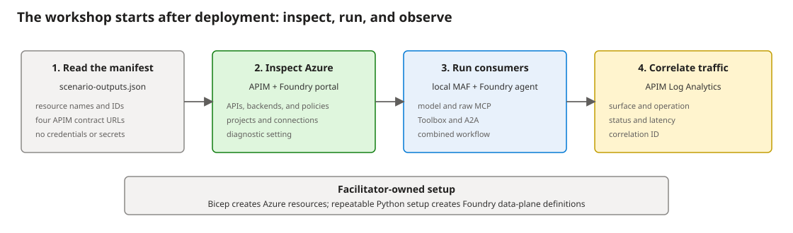

The lab environment is already deployed. You will inspect its configuration in Azure, run the two consumers, and correlate those calls with APIM telemetry. **Do not run the deployment scripts during the workshop.**

## What you need

- Access to the facilitator's Azure subscription and `lab-foundry-ai-gateway` resource group.
- Azure CLI, Python 3.11 or later, and PowerShell 5.1 or PowerShell 7.
- A signed-in identity that the facilitator added to APIM's caller allowlist.

Sign in, then confirm the selected subscription:

```powershell
az login
az account show --query "{name:name,id:id,tenantId:tenantId}" -o table
```

If the resource group is not visible in that subscription, select the facilitator-provided subscription and check again:

```powershell
az account set --subscription "<facilitator-provided-subscription-id>"
```

If `az` is not on `PATH`, use the copy installed with the Azure SDK:

```powershell
$env:AZ_CMD = "C:\Program Files\Microsoft SDKs\Azure\CLI2\wbin\az.cmd"
```

## What is automated

No manual portal configuration is required to build this environment. The repository automates every persistent prerequisite, but it uses the correct management surface for each kind of object.

<div style="max-width: 100%; overflow-x: auto;">

| Layer | Owning files | What they create | Lifetime |
|---|---|---|---|
| Core Azure control plane | `infra/main.bicep` | APIM and its identity, two Foundry model resources and deployments, the model backend pool/API, raw MCP backend, Log Analytics, and APIM diagnostic settings | Persistent IaC |
| Consumer control plane | `infra/foundry-consumers.bicep` | Toolbox publisher project, Foundry app project, native driver models, and the `ApiManagement` model connection | Persistent IaC |
| APIM tool surfaces | `infra/two-consumer-apim.bicep` | Caller allowlist, raw MCP and Toolbox APIs/backends/policies, role assignments, and project tool connections | Persistent IaC |
| A2A facade | `infra/enterprise-foundry-agent-apim.bicep` | A2A API/backend/policies, least-privilege role assignment, and the app project's `RemoteA2A` connection | Persistent IaC |
| Foundry data plane | `src/test/setup_foundry_toolbox.py`, `src/test/setup_enterprise_foundry_agent.py` | Immutable Toolbox versions and the `enterprise-specialist` prompt-agent definition with incoming A2A enabled | Repeatable setup code |
| Runtime examples | `src/test/scenario*.py` | Local calls plus temporary Foundry conversations and consumer agent versions | Deleted after each run unless kept |

</div>

Bicep owns Azure Resource Manager resources. Toolbox versions and prompt-agent definitions are Foundry **data-plane** objects, so the setup scripts create them through the Foundry SDK. The PowerShell deployment entry points discover existing resources, invoke both layers in order, and merge secret-free IDs and URLs into `infra/scenario-outputs.json`.

> [!NOTE]
> Project connections are ownership-bound. The deployment scripts check whether they already exist before creating them, which makes a facilitator rebuild repeatable without replacing those connections.

## Inspect the resource group

Load the predeployed values and list the workshop resource types:

```powershell
$config = Get-Content .\infra\scenario-outputs.json -Raw | ConvertFrom-Json

az resource list `
  --resource-group $config.resourceGroup `
  --query "[].{Name:name,Type:type,Location:location}" `
  --output table
```

In the Azure portal, open **Resource groups** > **lab-foundry-ai-gateway**. Find these persistent resources:

- APIM Standard v2: `$($config.apimServiceName)`.
- Log Analytics: `$($config.apimLogAnalyticsWorkspaceName)`.
- Two enterprise Foundry model resources and two consumer Foundry resources.

Open APIM and select **APIs**. The supported list contains the model, raw MCP, Toolbox, and enterprise A2A APIs. Each API has **Subscription required** disabled because the policies authorize Microsoft Entra identities instead.

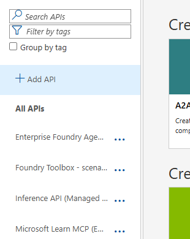

## Confirm the four contracts

```powershell
$config.apimGatewayUrl
$config.modelApimMiUrl
$config.rawMcpApimUrl
$config.toolboxApimUrl
$config.enterpriseAgentApimUrl
```

All values use one APIM hostname. Do not look for or create an APIM subscription key.

## Prepare the local runner

The checked-in examples use `DefaultAzureCredential`, which reuses your Azure CLI sign-in. Create the environment only if the facilitator has not prepared it:

```powershell
if (-not (Test-Path .\src\test\.venv)) {
  python -m venv .\src\test\.venv
}
& .\src\test\.venv\Scripts\python.exe -m pip install -r .\src\test\requirements.txt
$python = ".\src\test\.venv\Scripts\python.exe"
```

## Source documentation

- [Create and manage Microsoft Foundry projects](https://learn.microsoft.com/azure/foundry/how-to/create-projects)
- [Bicep documentation](https://learn.microsoft.com/azure/azure-resource-manager/bicep/)
- [Managed identities in API Management](https://learn.microsoft.com/azure/api-management/api-management-howto-use-managed-service-identity)
- [Add connections to a Foundry project](https://learn.microsoft.com/azure/foundry/how-to/connections-add)

---

# Scenario 1 - model through APIM


## Goal

Prove that both consumers can use the same OpenAI-compatible APIM model surface with Microsoft Entra authentication.

The local application supplies `DefaultAzureCredential` directly to `OpenAIChatCompletionClient`. The hosted agent instead selects this connected model:

```text
apim-gateway-mi/gpt-4o-mini
```

That name means `<connection-name>/<model-name>`. The `ApiManagement` connection uses the Foundry app project's managed identity; it does not store a key.

## Inspect the deployed model path

In the Azure portal:

1. Open APIM > **APIs** > **Foundry inference (managed identity)**. Confirm the URL suffix is `inference-mi` and **Subscription required** is cleared.
2. Open APIM > **Backends**. Inspect the two regional Foundry backends and their priority-based pool.
3. Open the Foundry app project > **Management center** > **Connected resources**. Find `apim-gateway-mi` and confirm its authentication type is managed identity.

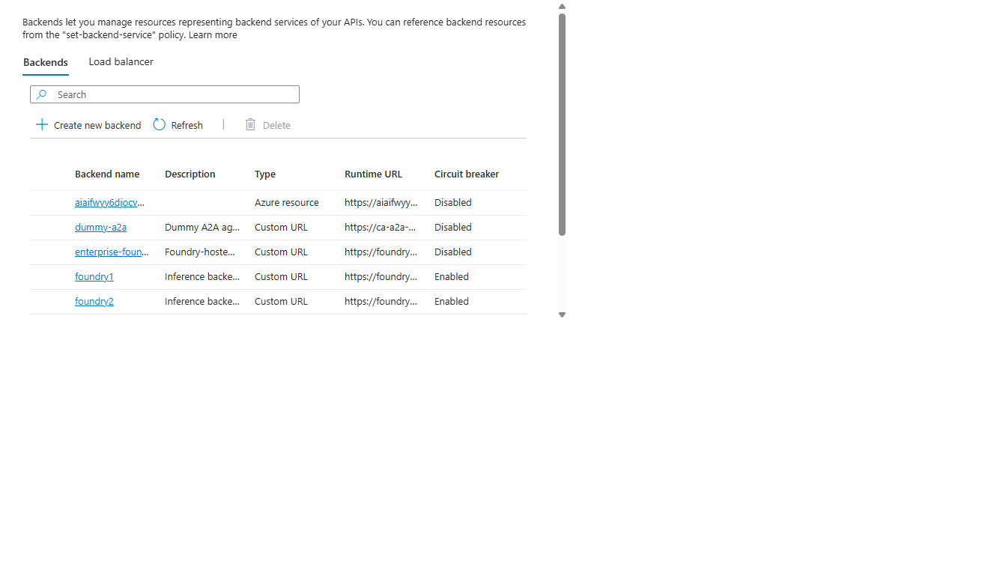

## Run both consumers

```powershell
$python = ".\src\test\.venv\Scripts\python.exe"
& $python .\src\test\scenario1_maf_model_apim.py
& $python .\src\test\scenario1_foundry_model_apim.py
```

Each script asks for a one-sentence explanation of an AI gateway and exits nonzero if the response is empty or the call fails.

## Follow the implementation

<div style="max-width: 100%; overflow-x: auto;">

| Layer | File | What to inspect |
|---|---|---|
| Local consumer | `src/test/scenario1_maf_model_apim.py` | `OpenAIChatCompletionClient(..., credential=credential)` |
| Foundry consumer | `src/test/scenario1_foundry_model_apim.py` | `PromptAgentDefinition` with the connected model name |
| Project connection | `infra/foundry-consumers.bicep` | `category: 'ApiManagement'`, `authType: 'ProjectManagedIdentity'` |
| Model API | `infra/main.bicep` | backend pool, circuit breaker, and `subscriptionRequired: false` |
| APIM policy | `infra/policy-mi.xml` | token validation, backend selection, APIM managed identity, and retry |

</div>

## Verify steady routing

The load test uses Entra authentication and prints the serving region from `x-ms-region`:

```powershell
$env:APIM_GATEWAY_URL = $config.apimGatewayUrl
& $python .\src\test\test_load_balancing.py
```

Steady traffic normally remains on the priority-1 East US 2 backend. To deliberately exhaust its low workshop quota and observe failover, run the burst test:

```powershell
$env:TOTAL = "60"
$env:CONCURRENCY = "15"
& $python .\src\test\test_burst.py
```

The test fails if any request does not return HTTP 200. It intentionally consumes model quota, so use it only when you want to exercise the circuit breaker.

## Source documentation

- [Bring your own model through Azure API Management](https://learn.microsoft.com/azure/foundry/agents/how-to/ai-gateway)
- [Backends and load-balanced pools in API Management](https://learn.microsoft.com/azure/api-management/backends)
- [Validate Microsoft Entra tokens in API Management](https://learn.microsoft.com/azure/api-management/validate-azure-ad-token-policy)
- [Authenticate an APIM backend with managed identity](https://learn.microsoft.com/azure/api-management/authentication-managed-identity-policy)

---

# Scenario 2 - raw MCP through APIM


## Goal

Expose an existing MCP server behind the same APIM authorization boundary and consume it from both runtimes.

The public contract is streamable HTTP at:

```text
https://<apim>.azure-api.net/learn-mcp-mi/mcp
```

APIM defines `POST`, `GET`, and `DELETE` operations and forwards responses without buffering. This matters because MCP sessions can stream events over a long-lived HTTP exchange.

## Inspect the deployed MCP path

1. In APIM, open **Microsoft Learn MCP (managed identity callers)** and inspect its three operations.
2. Open the API policy. The inbound section validates tenant, audience, and caller object ID; the backend section removes `Authorization` before calling the public Microsoft Learn server.
3. In the Foundry app project, inspect the project connection named `app-mcp-via-apim`. Its target is the APIM URL, not the upstream MCP URL.

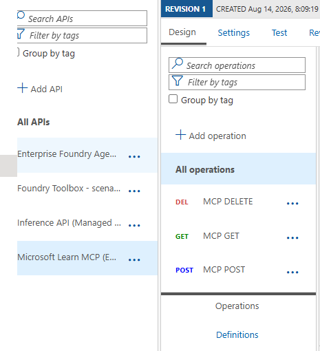

## Run both consumers

```powershell
& $python .\src\test\scenario2_maf_mcp_apim.py
& $python .\src\test\scenario2_foundry_mcp_apim.py
```

Both agents use the Scenario 1 model path, invoke Microsoft Learn through APIM, and answer a question about Azure API Management.

## Compare the consumers

<div style="max-width: 100%; overflow-x: auto;">

| Local MAF | Foundry Agent Service |
|---|---|
| `MCPStreamableHTTPTool` receives an `httpx` client that adds an Entra token to each request. | `MCPTool` references the project-scoped `app-mcp-via-apim` connection. |
| The signed-in user identity reaches APIM. | The Foundry app project managed identity reaches APIM. |
| Context managers close the MCP session and HTTP client. | Agent Service manages the MCP session. The test deletes its temporary agent when run by the suite. |

</div>

The owning files are `src/test/scenario2_maf_mcp_apim.py`, `src/test/scenario2_foundry_mcp_apim.py`, and `infra/two-consumer-apim.bicep`.

## Source documentation

- [Connect Foundry agents to MCP servers](https://learn.microsoft.com/azure/foundry/agents/how-to/tools/model-context-protocol)
- [Secure MCP servers with Azure API Management](https://learn.microsoft.com/azure/api-management/secure-mcp-servers)
- [MCP authorization concepts in API Management](https://learn.microsoft.com/azure/api-management/mcp-server-overview)

---

# Scenario 3 - Foundry Toolbox through APIM


## Goal

Publish a reusable Foundry Toolbox as an MCP-compatible endpoint, then govern both directions:

- **Ingress:** consumer to APIM to Foundry Toolbox.
- **Egress:** Toolbox project identity to APIM to Microsoft Learn MCP.

The consumer does not need to know which tools are inside the Toolbox. A publisher can create a new version and change the default without changing the consumer URL.

## Inspect the deployed Toolbox path

1. In the Toolbox publisher project, open **Build** > **Toolbox** > `scenario1-apim-toolbox`. Inspect the default immutable version and its MCP tool connection.
2. In APIM, open **Foundry research Toolbox**. Its backend targets the Toolbox MCP endpoint, and APIM authenticates with its own managed identity.
3. In the Foundry app project, inspect `app-toolbox-via-apim`. The consumer sees APIM as one MCP endpoint and does not own the Toolbox's downstream credential.

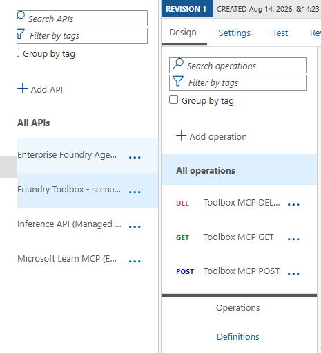

## Create or update the Toolbox

```powershell
& $python .\src\test\setup_foundry_toolbox.py
```

The setup script creates a version containing an `MCPTool`, points that tool at the raw MCP APIM URL, and promotes the new version as default.

## Run both consumers

```powershell
& $python .\src\test\scenario3_maf_toolbox_apim.py
& $python .\src\test\scenario3_foundry_toolbox_apim.py
```

The local MAF application consumes the Toolbox as an MCP server. The Foundry app agent consumes the same URL through its `app-toolbox-via-apim` project-managed-identity connection.

> [!WARNING]
> In the currently verified preview combination, Foundry Agent Service returns HTTP 500 when this Toolbox is paired with the `ApiManagement` connected model. Scenario 3b therefore uses the app project's native `gpt-4o-mini` driver while the **Toolbox still enters and exits through APIM**. Raw MCP plus the connected APIM model works in Scenario 2b.

The implementation is in `src/test/setup_foundry_toolbox.py`, the two `scenario3_*.py` files, and the Toolbox backend/API section of `infra/two-consumer-apim.bicep`.

## Source documentation

- [What is Toolbox in Microsoft Foundry?](https://learn.microsoft.com/azure/foundry/agents/concepts/toolbox-overview)
- [Create and use a Foundry Toolbox](https://learn.microsoft.com/azure/foundry/agents/how-to/tools/toolbox)
- [Use Foundry Toolboxes as MCP endpoints](https://learn.microsoft.com/azure/foundry/agents/how-to/tools/model-context-protocol#use-foundry-toolboxes-as-mcp-endpoints)

---

# Scenario 4 - Foundry agent through APIM


## Goal

Publish a Foundry-hosted prompt agent as a governed A2A API and consume it from both runtimes.

This flow has two distinct protocol phases:

1. **Discovery:** fetch an agent card.
2. **Invocation:** send A2A JSON-RPC messages to the URL advertised by that card.

Both phases are protected. The Foundry consumer therefore sets `send_credentials_for_agent_card: true`; otherwise Agent Service would fetch the card anonymously and receive HTTP 401.

## Inspect the deployed A2A path

1. In the publisher Foundry project, open the `enterprise-specialist` agent and inspect its prompt definition. Incoming A2A enablement is not currently exposed in the Foundry portal; verify that data-plane setting in `src/test/setup_enterprise_foundry_agent.py` or with the REST/SDK method in the source documentation below.
2. In APIM, open **Enterprise Foundry agent**. Compare the protected card operations with the JSON-RPC runtime operation.
3. Inspect the APIM backend and policy. APIM obtains an `https://ai.azure.com` token with its system identity, then rewrites card URLs back to the public APIM path.
4. In the Foundry app project, inspect the `enterprise-agent-apim` A2A connection. Its target ends in `/`, which preserves the discovery base path.

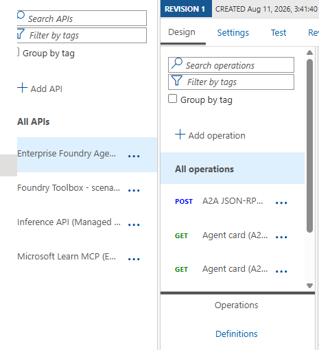

## Run both consumers

```powershell
& $python .\src\test\scenario4_maf_enterprise_agent_apim.py
& $python .\src\test\scenario4_foundry_agent_apim.py
```

The local client requests the v1.0 card explicitly. Foundry Agent Service uses the well-known v0.3 card shape. APIM serves both and rewrites every advertised runtime URL back to the APIM path.

## Gateway requirements

<div style="max-width: 100%; overflow-x: auto;">

| Requirement | Why it exists |
|---|---|
| Trailing slash on the Foundry connection target | Foundry uses URL-join semantics during card discovery. Without the slash, it drops the final path segment. |
| `Accept-Encoding: identity` on card routes | APIM must parse and rewrite the JSON body; a compressed card cannot be read as JSON by the policy. |
| Buffered card responses | APIM must read the complete card before rewriting its URLs. |
| Unbuffered runtime responses | A2A runtime calls can stream and must not inherit the card buffering behavior. |
| Foundry Agent Consumer role for APIM | Gives APIM least-privilege access to the enterprise agent endpoint. |

</div>

See `infra/enterprise-foundry-agent-apim.bicep` for the operations and policies, and `src/test/setup_enterprise_foundry_agent.py` for publisher-side agent creation and incoming A2A enablement.

## Source documentation

- [Connect Foundry Agent Service to an A2A endpoint](https://learn.microsoft.com/azure/foundry/agents/how-to/tools/agent-to-agent)
- [Agent2Agent authentication and protected agent cards](https://learn.microsoft.com/azure/foundry/agents/concepts/agent-to-agent-authentication)
- [Enable an incoming A2A endpoint on a Foundry agent](https://learn.microsoft.com/azure/foundry/agents/how-to/enable-agent-to-agent-endpoint)

---

# Scenario 5 - model + Toolbox + A2A workflow

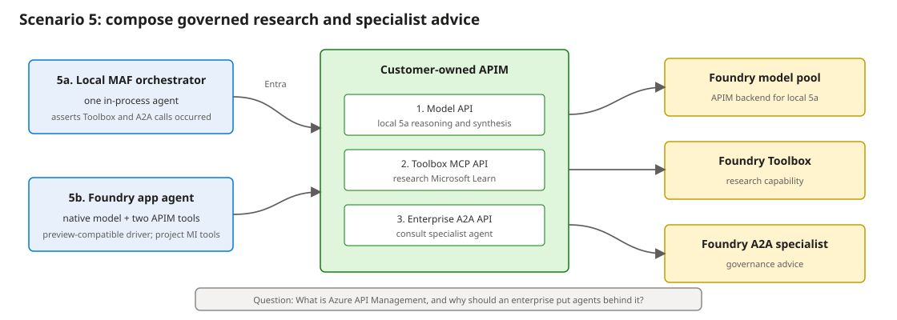

## Goal

Use the governed surfaces together instead of testing each one in isolation.

The prompt asks:

> What is Azure API Management, and why should an enterprise put agents behind it?

The answer should combine Microsoft Learn research from the Toolbox with governance advice from the enterprise A2A specialist.

## Inspect the combined workflow

There is no fifth gateway API. Scenario 5a composes three existing APIM contracts: the model API for reasoning, the Toolbox API for research, and the A2A API for specialist advice. Scenario 5b composes the same Toolbox and A2A contracts with the app project's native driver model because of the preview limitation documented in Scenario 3. In APIM **Logs**, the local task can span all three surfaces; the hosted task contributes Toolbox and A2A requests.

## Run both consumers

```powershell
& $python .\src\test\scenario5_maf_combined_workflow.py
& $python .\src\test\scenario5_foundry_combined_workflow.py
```

Scenario 5a instruments its local HTTP client and specialist wrapper. It fails unless it observes at least one successful Toolbox JSON-RPC `tools/call` response and one nonempty completed A2A specialist result.

Scenario 5b creates one Foundry agent version with `MCPTool` and `A2APreviewTool`, then runs a directed research turn followed by a specialist-advice turn. The test requires a completed Toolbox `mcp_call` plus a matching completed A2A call and result pair, so generated text without both tool invocations cannot pass. It uses the native driver for the same preview limitation described in Scenario 3, so its model calls do not appear in APIM logs.

When `KEEP_AGENT=0`, both scripts delete temporary conversations and agent versions. The full runner sets this value automatically.

## Source documentation

- [AI gateway capabilities in Azure API Management](https://learn.microsoft.com/azure/api-management/genai-gateway-capabilities)
- [Toolbox architecture and centralized tool governance](https://learn.microsoft.com/azure/foundry/agents/concepts/toolbox-overview)
- [A2A tool concepts and usage](https://learn.microsoft.com/azure/foundry/agents/how-to/tools/agent-to-agent)

---

# APIM observability

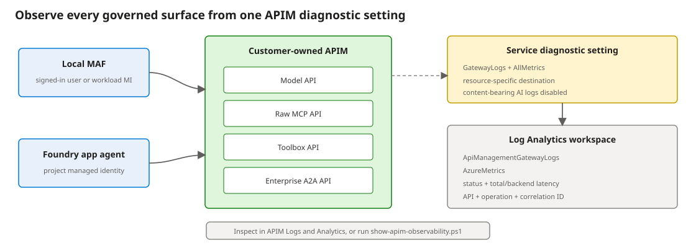

## Goal

Correlate the model, raw MCP, Toolbox, and A2A calls you ran in Scenarios 1-5 with APIM status, timing, operation, and correlation data. The logging path is already configured; this page makes no infrastructure changes.

## What the IaC configures

`infra/main.bicep` creates one workspace and one APIM service-level diagnostic setting. Because the setting is scoped to the APIM service, it also covers APIs added by the later Toolbox and A2A templates.

<div style="max-width: 100%; overflow-x: auto;">

| Export | Dedicated table | What it contributes |
|---|---|---|
| `GatewayLogs` | `ApiManagementGatewayLogs` | Every gateway request: URL, API/operation IDs, status, total/backend latency, error details, and correlation ID |
| `AllMetrics` | `AzureMetrics` | APIM capacity and request metrics for charts and alerts |

</div>

The destination type is `Dedicated`, so queries use resource-specific tables instead of the legacy shared `AzureDiagnostics` table. The workspace keeps data for 30 days.

> [!IMPORTANT]
> `GatewayLlmLogs` is deliberately disabled because it records request and response message fields. `GatewayMCPLogs` is also disabled: these workshop MCP surfaces are ordinary HTTP APIs, so their activity appears in `ApiManagementGatewayLogs` rather than the native MCP table. This metadata-only default lets you inspect routing and performance without copying prompts, model responses, or tool payloads into Log Analytics.

Disabling a category stops new ingestion; it does not delete records that were collected earlier. Historical rows remain subject to the workspace's 30-day retention unless a workspace owner separately approves a purge.

## Inspect the diagnostic setting

In the Azure portal:

1. Open the APIM service from `lab-foundry-ai-gateway`.
2. Select **Monitoring** > **Diagnostic settings**.
3. Open `apim-gateway-observability`.
4. Confirm **Gateway** and **AllMetrics** are selected. Confirm **Generative AI gateway** and **MCP** are cleared.
5. Confirm the destination is the `log-apim-...` Log Analytics workspace and **Resource specific** is selected.

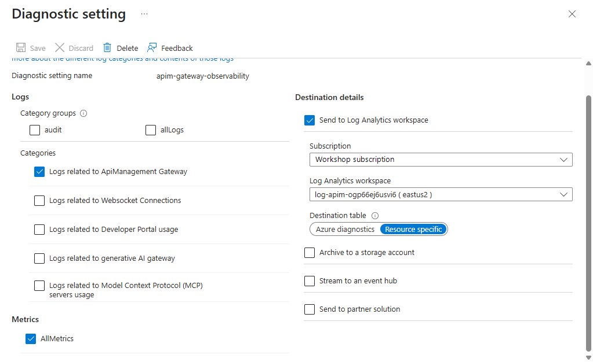

The same facts are available without changing anything:

```powershell
$config = Get-Content .\infra\scenario-outputs.json -Raw | ConvertFrom-Json

az monitor diagnostic-settings show `
  --name $config.apimDiagnosticSettingsName `
  --resource $config.apimServiceId `
  --query "{logs:logs[].{category:category,enabled:enabled},metrics:metrics[].{category:category,enabled:enabled},workspaceId:workspaceId}"
```

## Query the scenario traffic

Open APIM > **Monitoring** > **Logs**, close the welcome query window if it appears, and run:

```kusto
ApiManagementGatewayLogs
| where TimeGenerated > ago(2h)
| extend Surface = case(
  ApiId == 'inference-mi-api', 'Model',
  ApiId == 'mslearn-mcp-mi', 'Raw MCP',
  ApiId startswith 'foundry-toolbox-', 'Toolbox',
  ApiId startswith 'enterprise-foundry-agent-', 'A2A agent',
    'Other')
| where Surface != 'Other'
| project TimeGenerated, Surface, Method, ResponseCode,
          TotalTime, BackendTime, ApiId, OperationId, CorrelationId
| order by TimeGenerated desc
| take 50
```

Or run the same read-only query from the repository:

```powershell
.\src\test\show-apim-observability.ps1 -LookbackMinutes 120 -Limit 50
```

For a screenshot-sized proof of both outcomes on each surface, run this compact projection:

```kusto
ApiManagementGatewayLogs
| where TimeGenerated > ago(2h)
| extend Surface = case(
  ApiId == 'inference-mi-api', 'Model',
  ApiId == 'mslearn-mcp-mi', 'Raw MCP',
  ApiId startswith 'foundry-toolbox-', 'Toolbox',
  ApiId startswith 'enterprise-foundry-agent-', 'A2A agent',
    'Other')
| where Surface != 'Other'
| extend Outcome = iff(ResponseCode between (200 .. 399), 'Allowed', 'Denied')
| summarize arg_max(TimeGenerated, *) by Surface, Outcome
| extend ResultLatency = strcat(
    Outcome, ' ', ResponseCode, ' | ',
    tolong(TotalTime), '/', iff(isnull(BackendTime), '-', tostring(tolong(BackendTime))), ' ms')
| order by Surface asc, Outcome asc
| project Surface, ResultLatency
```

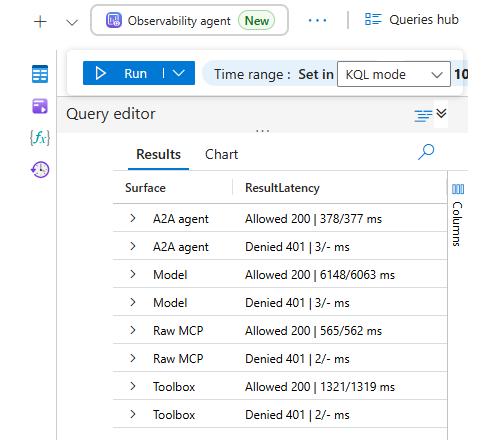

`ResultLatency` is `outcome status | total/backend ms`. A `-` backend value means APIM rejected the request before calling a backend.

Look for:

- `Model` with operation `chat-completions`.
- `Raw MCP` and `Toolbox` with MCP operations such as `mcp-post`.
- `A2A agent` with card discovery and `a2a-jsonrpc` operations.
- HTTP 200 or 202 for successful calls and HTTP 401 for the deliberate security tests.
- Empty `BackendTime` on a 401, showing that APIM rejected the request before a backend call.

To generate a fresh, complete set of records, run the consumer suite and then repeat the query:

```powershell
.\src\test\run-two-consumer-scenarios.ps1
```

New workspaces can take up to two hours to receive their first records; an active workspace normally updates within several minutes.

## Use logs and metrics together

Use `ApiManagementGatewayLogs` as the common request view across all four protocols. Start with a `CorrelationId` when you need to follow one request. Use APIM > **Monitoring** > **Analytics** or `AzureMetrics` for trends such as request volume, failures, latency, and capacity rather than individual calls.

This separation answers different questions:

- **Logs:** Which API and operation ran? Did APIM or the backend reject it? How long did each hop take?
- **Metrics:** Is traffic, failure rate, latency, or gateway capacity changing over time?

## Source documentation

- [Monitor Azure API Management](https://learn.microsoft.com/azure/api-management/monitor-api-management)
- [Configure APIM logs and metrics with Azure Monitor](https://learn.microsoft.com/azure/api-management/api-management-howto-use-azure-monitor)
- [API Management monitoring data reference](https://learn.microsoft.com/azure/api-management/monitor-api-management-reference)
- [ApiManagementGatewayLogs table schema](https://learn.microsoft.com/azure/azure-monitor/reference/tables/apimanagementgatewaylogs)
- [Diagnostic settings in Azure Monitor](https://learn.microsoft.com/azure/azure-monitor/essentials/diagnostic-settings)

---

# Scenario 6 - BYO ModelGateway with LiteLLM


## Goal

Add a second bring-your-own-model pattern without changing the keyless APIM scenarios:

- Register LiteLLM as a Foundry `ModelGateway` for `gpt-5.1`.
- Expose the Microsoft Learn MCP server through LiteLLM's `/mcp/` endpoint.
- Register the dummy specialist in LiteLLM's A2A Agent Gateway.
- Exercise all three surfaces from local MAF and Foundry Agent Service.

The canonical LiteLLM stack is under `litellm-gateway/litellm-azure-private-endpoints`. Its public test ingress is the client edge; Foundry model endpoints, PostgreSQL, and Key Vault remain private. LiteLLM authenticates to Foundry with its user-assigned managed identity.

## Compare the model connections

Both connection types are bring-your-own-model mechanisms. They describe different gateway contracts.

<div style="max-width: 100%; overflow-x: auto;">

| Concern | `ApiManagement` in Scenarios 1-5 | `ModelGateway` in Scenario 6 |
|---|---|---|
| Intended gateway | Azure API Management | Generic custom or non-Azure model gateway |
| Target shape in this lab | Azure-style deployment path plus `api-version` | OpenAI-compatible `/v1/chat/completions`, model in the request body |
| Foundry-to-gateway authentication | `ProjectManagedIdentity` | API key formatted as a bearer header |
| Model discovery | Static `models` metadata | Static metadata here; the contract can also support gateway discovery |
| Gateway-to-model authentication | APIM system-assigned managed identity | LiteLLM user-assigned managed identity |
| MCP and A2A coverage | Separate APIM APIs and project connections | Separate LiteLLM endpoints and project connections |

</div>

`ModelGateway` only registers the **model** contract. It does not automatically turn MCP servers or A2A agents into Foundry tools. The deployment therefore creates three Foundry-facing objects:

1. Account-level `litellm-gateway` with category `ModelGateway`.
2. Project-level `app-mcp-via-litellm` with category `CustomKeys`.
3. Project-level `app-a2a-via-litellm` with category `RemoteA2A`.

## Understand the A2A shim

LiteLLM exposes a registered agent at `/a2a/{agent-id}`. Foundry A2A discovery instead starts at the connection host root and requests `/.well-known/agent-card.json`.

The deployment adds a small protected Container App that:

1. Serves the agent card at its host root.
2. Requires the same bearer credential for card discovery and invocation.
3. Forwards JSON-RPC to LiteLLM's UUID-based A2A route.
4. Normalizes LiteLLM's nested `result.message` response into a standard A2A Message.

This is a compatibility adapter, not a bypass. The invocation still crosses LiteLLM and remains visible to its A2A gateway.

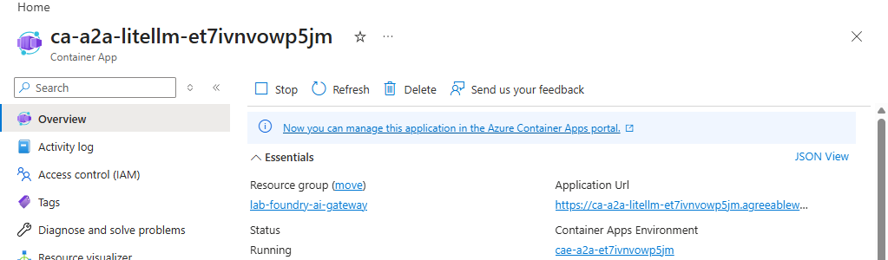

## Inspect the predeployed optional path

The facilitator has already deployed this comparison. Load its non-secret endpoints:

```powershell
$config = Get-Content .\infra\scenario-outputs.json -Raw | ConvertFrom-Json
$config.litellmBaseUrl
$config.litellmModel
$config.litellmMcpUrl
$config.litellmA2aGatewayUrl
$config.litellmA2aShimUrl
```

Inspect the two ownership layers:

1. In Azure portal > **Resource groups** > `lab-foundry-ai-gateway`, open the LiteLLM and A2A shim Container Apps. The canonical Terraform under `litellm-gateway/litellm-azure-private-endpoints` owns the LiteLLM network, identity, database, cache, and private Foundry access.
2. In the Foundry app project > **Management center** > **Connected resources**, find `litellm-gateway`, `app-mcp-via-litellm`, and `app-a2a-via-litellm`. `infra/litellm-foundry-connections.bicep` owns those control-plane connections and the shim resource.

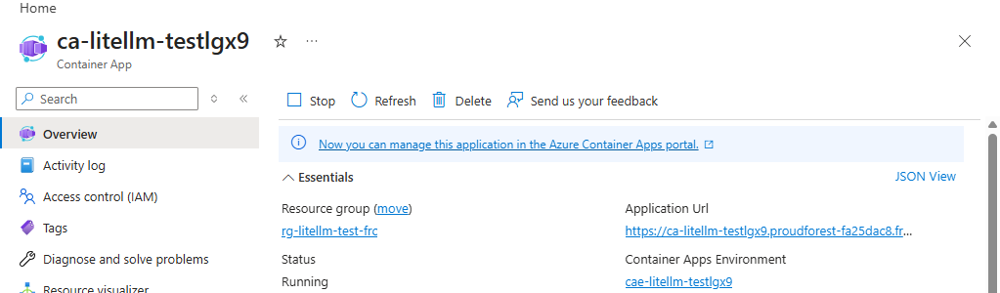

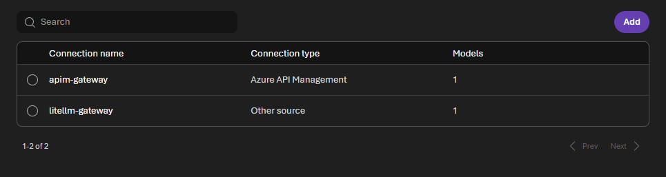

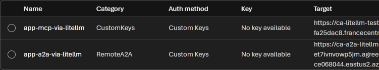

`infra/deploy-litellm-scenario.ps1` is facilitator glue: it uses the administrator key only for LiteLLM control-plane operations, creates or reuses a budgeted virtual key scoped to the configured model, the `mslearn` MCP server, and the registered `dummy-specialist` A2A agent, and deploys that scoped key to the Foundry connections and A2A shim. It stores the facilitator copy with Windows DPAPI outside the repository and writes only non-secret URLs and resource IDs to `infra/scenario-outputs.json`.

> [!WARNING]
> The facilitator supplies the scoped LiteLLM virtual key through an approved secret channel. Do not use the administrator key as an application credential. The workshop key has a budget and allowlists exactly one model, the `mslearn` MCP server, and the registered `dummy-specialist` A2A agent; configure OAuth 2.0 when supported by your LiteLLM deployment and Foundry connection contract.

## Run both consumers

```powershell
$env:LITELLM_API_KEY = "<facilitator-issued-scoped-key>"
try {
  .\src\test\run-litellm-scenario.ps1
} finally {
  Remove-Item Env:LITELLM_API_KEY -ErrorAction SilentlyContinue
}
```

Learners do not need Terraform state. A maintainer who is validating the deployment locally can omit `LITELLM_API_KEY` and pass `-UseTerraformAdminKey` explicitly.

The runner preserves caller-owned environment variables and restores its temporary state in a `finally` block. The outer `finally` removes the scoped key even if setup fails before the runner starts its child processes. It executes:

- `scenario6_maf_litellm.py`: local MAF model, MCP, and native A2A calls.
- `scenario6_foundry_litellm.py`: Foundry `ModelGateway`, `MCPTool`, and `A2APreviewTool` calls.
- `scenario6_litellm_security.py`: missing and invalid bearer requests against all three edges.

A successful run ends with:

```text
Optional LiteLLM two-consumer scenario passed.
```

The owning infrastructure is `infra/litellm-foundry-connections.bicep`. Re-running its deployment script reapplies the existing Foundry connections so credential rotations reach all three surfaces. The source hash tracks shim code changes, and each deployment supplies a fresh credential revision value; either template change creates a Container Apps revision that reloads the mounted code and secret. The facilitator can run `infra/copy-litellm-workshop-key.ps1` to copy the DPAPI-protected key without printing it.

## Source documentation

- [Choose `ApiManagement` or `ModelGateway` for a Foundry connected model](https://learn.microsoft.com/azure/foundry/agents/how-to/ai-gateway#create-a-model-connection)
- [Connect Foundry agents to MCP servers](https://learn.microsoft.com/azure/foundry/agents/how-to/tools/model-context-protocol)
- [Connect Foundry agents to A2A endpoints](https://learn.microsoft.com/azure/foundry/agents/how-to/tools/agent-to-agent)
- [LiteLLM proxy server](https://docs.litellm.ai/docs/simple_proxy)
- [LiteLLM virtual keys](https://docs.litellm.ai/docs/proxy/virtual_keys)

---

# Security, limits, and cleanup


## Run the negative authorization tests

```powershell
& $python .\src\test\scenario_security_boundaries.py
```

The script sends two invalid requests to each of the model, raw MCP, Toolbox, and A2A surfaces:

- No token.
- A valid Azure Resource Manager token with the wrong audience.

All eight requests must return HTTP 401. A different status fails the script.

## Run everything end to end

```powershell
.\src\test\run-two-consumer-scenarios.ps1
```

The runner creates a new Toolbox version, executes all ten positive consumer scenarios, runs the eight negative requests, and stops at the first nonzero exit code. Its final line should be:

```text
All two-consumer scenarios passed.
```

Use `-KeepAgents` when you want to inspect the generated prompt-agent versions in the Foundry portal:

```powershell
.\src\test\run-two-consumer-scenarios.ps1 -KeepAgents
```

Scenario 6 remains optional and has its own runner so it cannot change the keyless APIM validation result:

```powershell
.\src\test\run-litellm-scenario.ps1 -KeepAgents
```

## Identity matrix

<div style="max-width: 100%; overflow-x: auto;">

| Hop | Presented identity | APIM action | Backend identity |
|---|---|---|---|
| Local MAF to any APIM API | Signed-in user or workload identity | Validate tenant, audience, and `oid` | Depends on surface |
| Foundry app to any APIM API | App project managed identity | Validate tenant, audience, and `oid` | Depends on surface |
| Toolbox egress to raw MCP APIM | Toolbox project managed identity | Validate tenant, audience, and `oid` | No credential to public MCP |
| APIM to Foundry models | APIM system identity | Replace caller authorization | Cognitive Services User |
| APIM to Foundry Toolbox | APIM system identity | Replace caller authorization | Foundry project user role |
| APIM to Foundry A2A | APIM system identity | Backend credential | Foundry Agent Consumer |

</div>

## Verified limitations

- Toolbox and A2A integrations use preview APIs and SDK types.
- The connected APIM model plus Toolbox combination currently returns HTTP 500 in Agent Service; Scenarios 3b and 5b use the native driver and keep every tool call behind APIM.
- `setup_foundry_toolbox.py` creates a new immutable Toolbox version on every run and promotes it. Delete old versions manually if you run the suite frequently.
- The sample enables public network access. For production, add private connectivity, DNS, diagnostics, policy fragments, and a dedicated application audience.
- The deployment allowlists the signed-in developer object ID. For CI/CD, pass `-LocalCallerObjectId <workload-object-id>` to the APIM extension scripts.
- APIM always has a built-in all-access subscription, but none of the four workshop APIs requires it and the lab never reads or distributes its keys.
- The optional `ModelGateway` path uses a stored LiteLLM bearer credential at the client edge. This is a deliberate contrast with the project-managed-identity `ApiManagement` path, not a keyless claim.

## Facilitator cleanup

The resource group contains billable APIM and model deployments. Learners should not delete it during a shared workshop. When the session is over, the facilitator removes it with:

```powershell
.\infra\cleanup.ps1
```

Deletion runs asynchronously. APIM soft deletion can retain the service name temporarily.

## Source documentation

- [Validate Microsoft Entra tokens in API Management](https://learn.microsoft.com/azure/api-management/validate-azure-ad-token-policy)
- [Authenticate APIM backends with managed identity](https://learn.microsoft.com/azure/api-management/authentication-managed-identity-policy)
- [APIM security baseline](https://learn.microsoft.com/security/benchmark/azure/baselines/api-management-security-baseline)
- [Azure resource group deletion](https://learn.microsoft.com/azure/azure-resource-manager/management/delete-resource-group)
