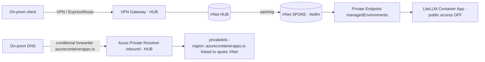

# LiteLLM on Azure with Private Endpoints — from-scratch Terraform (private backends, public→private ingress)

Creates the **full LiteLLM stack** in the existing subscription/RG and **plugs into the existing
network + shared private DNS zones**. **Postgres, Foundries and Key Vault are always PRIVATE**
(private endpoints); only the **LiteLLM ingress** flips from public (for testing) to internal.
Intended for a **fresh** deploy (delete the old app resources first).

## What it creates

- User-assigned **managed identity** (keyless)
- **2 × Azure OpenAI** Foundries + `gpt-5.1` (**DataZoneStandard**), France Central + Sweden Central,
  identity granted **Cognitive Services User** on each — **private** (public access off + private endpoint)
- **PostgreSQL Flexible Server** (**private**: public access off + private endpoint) + a `litellm` DB
- **Key Vault** (RBAC, **private**: selected-networks + private endpoint) + `litellm-master-key` /
  `litellm-salt-key` / `database-url`
- **Log Analytics** + **Container Apps environment** (**always VNet-integrated** on `snet-appintegration`)
- **LiteLLM Container App** (keyless MI, config mounted, `STORE_MODEL_IN_DB` configurable, port 4000)

> **This app never creates DNS zones.** All private DNS zones live in a **dedicated DNS resource
> group** owned by the platform/network team and deployed by the separate
> [`../private-dns-zones`](../private-dns-zones/) module. This app only **consumes zone IDs** via the
> `private_dns_zone_id_*` variables and (by default) writes its own PE A-records into them.

## Partner adoption — plugging into YOUR network & DNS

Everything the module *consumes* (network + DNS) is passed as a **variable** (an ID), so you never
edit `.tf` code — you only supply a `*.tfvars.json`. The module *creates* the workload
(identity, Foundries, Postgres, Key Vault, ACA env, the app) inside the RG you name.

**Subnets — point at your existing ones (via vars):**

| Variable | Your existing subnet |
|---|---|
| `aca_infrastructure_subnet_id` | subnet delegated to `Microsoft.App/environments` (the ACA env lives here) |
| `private_endpoint_subnet_id` | subnet that holds the private endpoints (Foundry / Key Vault / Postgres) |

**Existing DNS zones — reuse them, do NOT delete/recreate.** Point the module at your zones by ID:

| Variable | Zone |
|---|---|
| `private_dns_zone_id_openai` | `privatelink.openai.azure.com` |
| `private_dns_zone_id_cognitiveservices` | `privatelink.cognitiveservices.azure.com` |
| `private_dns_zone_id_services_ai` | `privatelink.services.ai.azure.com` |
| `private_dns_zone_id_vault` | `privatelink.vaultcore.azure.net` |
| `private_dns_zone_id_postgres` | `privatelink.postgres.database.azure.com` |
| `private_dns_zone_id_aca` | `privatelink.<region>.azurecontainerapps.io` |

If you're **missing some** of these six zones (e.g. you already have `postgres` + `azurecontainerapps.io`
but not the three Foundry zones or `vaultcore`), **don't delete anything** — just **create the
missing ones** and link them to your VNet. The cleanest way is to run the sibling
[`../private-dns-zones`](../private-dns-zones/) module, which is idempotent: `terraform import`
the zones you already have (or list only the missing ones in its input) so it **adds** the gaps and
**links** them all to your VNet, then feed its `zone_ids` output into the variables above. You can
equally create the missing zones by hand / your own IaC — the module only needs the resulting IDs.

Two ways the private-endpoint **A-records** get written into those zones:
- **`manage_pe_dns = true`** (default) — Terraform attaches a DNS zone group to each PE and writes
  the record itself (needs write access on the zones' RG).
- **`manage_pe_dns = false`** — PEs are created *without* a zone group; your landing-zone **Azure
  Policy (DINE)** registers the records. Use this when the network team owns DNS registration.

Minimal partner `terraform.tfvars.json`:

```jsonc
{
  "subscription_id": "<your-sub>",
  "resource_group_name": "<your-app-rg>",
  "location": "<your-region>",
  "name_suffix": "<short-unique>",
  "aca_infrastructure_subnet_id": "/subscriptions/.../subnets/<aca-subnet>",
  "private_endpoint_subnet_id":  "/subscriptions/.../subnets/<pe-subnet>",
  "private_dns_zone_id_openai":            "/subscriptions/.../privateDnsZones/privatelink.openai.azure.com",
  "private_dns_zone_id_cognitiveservices": "/subscriptions/.../privateDnsZones/privatelink.cognitiveservices.azure.com",
  "private_dns_zone_id_services_ai":       "/subscriptions/.../privateDnsZones/privatelink.services.ai.azure.com",
  "private_dns_zone_id_vault":             "/subscriptions/.../privateDnsZones/privatelink.vaultcore.azure.net",
  "private_dns_zone_id_postgres":          "/subscriptions/.../privateDnsZones/privatelink.postgres.database.azure.com",
  "private_dns_zone_id_aca":               "/subscriptions/.../privateDnsZones/privatelink.<region>.azurecontainerapps.io"
}
```

> The `default` values in [variables.tf](variables.tf) are just the original example env — every one
> is meant to be overridden by your tfvars.

## Networking model

Everything the gateway depends on is **private and reached over the VNet**. The ACA environment is
**always VNet-integrated**, so even the public-ingress test talks to the private backends. The only
switch is `private_ingress`.

| Component | Networking |
|---|---|
| PostgreSQL | 🔒 always private (public access off + private endpoint in `snet-private-endpoints` + `privatelink.postgres`) |
| Foundries | 🔒 always private (public access off + private endpoints + `privatelink.openai`/`cognitiveservices`/`services.ai`) |
| Key Vault | 🔒 always private (selected-networks + private endpoint + `privatelink.vaultcore`) |
| ACA env | always VNet-integrated (`snet-appintegration`) |
| **LiteLLM ingress** | `private_ingress = false` → **public** (test) · `private_ingress = true` → **internal** · `private_endpoint_enabled = true` → **Private Endpoint** (see below) |

**Key Vault + Terraform:** the vault denies by default, but this run **allow-lists the deployer's
egress IP** (auto-detected, or set `key_vault_allowed_ip`) so it can write the secrets. The app reads
them over the **private endpoint**. To go fully private later, run Terraform from inside the VNet.

## Private DNS zones (owned by the platform, in a dedicated RG)

The app requires **6 private DNS zones**, all pre-created in the **dedicated DNS resource group** by
the [`../private-dns-zones`](../private-dns-zones/) module and **linked to the spoke VNet**. Pass
their resource IDs into this app via the matching variables:

| Private DNS zone | For | Variable |
|---|---|---|
| `privatelink.openai.azure.com` | Foundry (LiteLLM `api_base`) | `private_dns_zone_id_openai` |
| `privatelink.cognitiveservices.azure.com` | Foundry (account endpoint) | `private_dns_zone_id_cognitiveservices` |
| `privatelink.services.ai.azure.com` | Foundry (AIServices) | `private_dns_zone_id_services_ai` |
| `privatelink.vaultcore.azure.net` | Key Vault | `private_dns_zone_id_vault` |
| `privatelink.postgres.database.azure.com` | PostgreSQL Flexible Server | `private_dns_zone_id_postgres` |
| `privatelink.francecentral.azurecontainerapps.io` | Container Apps env | `private_dns_zone_id_aca` |

> The three Foundry zones are all required because the account is kind **AIServices**: the PE
> `account` subresource registers records across `openai` + `cognitiveservices` + `services.ai`.

### How PE A-records get written into those zones — two mechanisms

1. **Via code (default, `manage_pe_dns = true`).** Each private endpoint gets a
   `private_dns_zone_group` and **Terraform writes the A-record** straight into the platform zone.
   Simple and self-contained; the deployer needs write access on the zones (or the zones' RG).
2. **Via Azure Policy (`manage_pe_dns = false`).** The PEs are created **without** a DNS zone group;
   a landing-zone **DINE policy** ("Deploy private DNS zone group for …") then registers the records
   asynchronously. Use this when the network team owns record registration and the app identity
   isn't granted write on the zones.

## Existing infra it references (defaults point at the real ones)

- Subnets in `vnet-miroki-dev-frc-01`: `snet-appintegration` (ACA env), `snet-private-endpoints`
  (all private endpoints).
- The **6 private DNS zones** above, pre-created by the platform in the dedicated DNS RG and linked
  to the VNet — consumed here by ID (this app creates none of them).

## Deploy — public ingress test (private backends)

```powershell
cd litellm-gateway\litellm-azure-private-endpoints
az login
terraform init
terraform apply           # private_ingress = false by default
```
Then hit it from the internet:
```powershell
$u = terraform output -raw litellm_url
$k = terraform output -raw litellm_master_key
curl "$u/v1/chat/completions" -H "Authorization: Bearer $k" -H "Content-Type: application/json" `
  -d '{\"model\":\"gpt-5.1\",\"messages\":[{\"role\":\"user\",\"content\":\"hi\"}]}'
```

## Make the ingress private later

```powershell
terraform apply -var="private_ingress=true"
```
(Flipping the ACA env between external/internal recreates the env. Once internal, resolve the gateway
via `privatelink.francecentral.azurecontainerapps.io` from inside the VNet.)

## Private access via Private Endpoint (recommended for on-prem over VPN)

This is the **recommended way to lock LiteLLM down** while keeping it reachable from on-premises in a
**hub-and-spoke** topology (VPN/ExpressRoute in the hub, this workload in a spoke). Instead of flipping
the ingress to internal, you keep the environment's external load balancer but **disable its public
network access** and front it with a **Private Endpoint**. The app keeps the **same FQDN**
(`ca-litellm-<suffix>.<region>.azurecontainerapps.io`); that FQDN now resolves to the PE's **private
IP** through the shared `privatelink.<region>.azurecontainerapps.io` zone.

Enable it (PE only — do **not** also set `private_ingress = true`; the module blocks that combination):

```powershell
terraform apply -var="private_endpoint_enabled=true"
```

or in `terraform.tfvars.json` (see [`terraform.tfvars.private-endpoint.example.json`](terraform.tfvars.private-endpoint.example.json)):

```jsonc
{
  "private_endpoint_enabled": true,   // public access OFF + PE on the ACA env
  "private_ingress": false,           // keep the external LB; PE fronts it
  "manage_pe_dns": true               // write the A-record into the privatelink zone
}
```

What Terraform does when `private_endpoint_enabled = true`:
- sets `public_network_access = "Disabled"` on the Container Apps environment (updatable in place, **no env recreation**),
- creates an `azurerm_private_endpoint` (subresource **`managedEnvironments`**) in `snet-private-endpoints`,
- with `manage_pe_dns = true`, writes the wildcard A-record into `privatelink.<region>.azurecontainerapps.io`.

Outputs: `litellm_private_endpoint_ip` (the private IP the FQDN resolves to) and `private_endpoint_enabled`.

### Topology (hub-and-spoke)



### What the platform/network team must set up for on-prem connectivity

This module creates the PE and (optionally) the A-record. **Everything else is landing-zone plumbing**
the partner owns on their environment:

1. **Network routing (VPN → PE).** The VPN Gateway is in the **hub**; the PE is in the **spoke**
   (`snet-private-endpoints`).
   - Peer hub↔spoke with `allowForwardedTraffic` + hub `allowGatewayTransit` and spoke `useRemoteGateways`.
   - Advertise/propagate the spoke PE subnet prefix to on-prem (BGP or static routes on the VPN).
   - Allow inbound **443** from the on-prem ranges on the PE subnet NSG.
2. **DNS (the critical part).**
   - Link `privatelink.<region>.azurecontainerapps.io` to the **VNet that holds the PE** (private DNS zone → VNet link).
   - Deploy an **Azure Private DNS Resolver** (inbound endpoint in the hub) — or a DNS forwarder VM pointing at `168.63.129.16`.
   - On the **on-prem DNS**, add a **conditional forwarder** for `azurecontainerapps.io`
     (or `<region>.azurecontainerapps.io`) → the resolver inbound endpoint IP in the hub.
3. **Verify from on-prem.**
   ```powershell
   nslookup ca-litellm-<suffix>.<region>.azurecontainerapps.io   # must return the private IP (10.x)
   curl https://ca-litellm-<suffix>.<region>.azurecontainerapps.io/health -H "Authorization: Bearer <key>"
   ```

> **Cost note:** a Container Apps Private Endpoint bills the Private Link **plus** a **Dedicated Plan
> Management** charge (applies even on the Consumption profile).

> **PE vs internal ingress:** `private_endpoint_enabled` keeps the external env and just turns off
> public access (no env recreation, reuses the existing `privatelink.<region>.azurecontainerapps.io`
> zone). `private_ingress = true` instead switches the env to an internal load balancer (recreates the
> env) and needs a DNS zone named after the env **default domain** with a wildcard record. For on-prem
> over VPN, **Private Endpoint is the simpler, common mechanism** (same DNS pattern as your other
> private resources).

## Prerequisites / gotchas

- `snet-appintegration` must be **free** (delete the old ACA env first) and delegated to
  `Microsoft.App/environments`.
- The deployer needs rights to **create role assignments** (Owner / User Access Administrator), and
  its egress IP must be able to reach Key Vault (or set `key_vault_allowed_ip`). With
  `manage_pe_dns = true` it also needs write access on the platform DNS zones' RG.
- The **6 private DNS zones must already exist** in the dedicated DNS RG (deploy
  [`../private-dns-zones`](../private-dns-zones/) first) and be linked to the VNet.
- Names use a random suffix; override `name_suffix` if a global name (KV / Foundry subdomain) collides.
- Image pulls from `ghcr.io` — push LiteLLM to an internal registry if egress is blocked.

## Logging, observability & data retention

- **Logging:** container stdout/stderr and ACA system logs ship to the **Log Analytics** workspace
  this module creates (30-day retention). **Application Insights is intentionally not included** —
  LiteLLM isn't auto-instrumented for it, so it adds cost for little value here. Add it later only if
  you wire LiteLLM's OpenTelemetry callbacks.
- **Conversations are NOT stored by default.** LiteLLM does **not** persist prompt/response *content*.
  It writes only **usage metadata** to the `LiteLLM_SpendLogs` table in PostgreSQL — model, token
  counts, cost, virtual-key/team, and timestamp — used for budgets and spend reporting.
- **Opt-in content logging:** storing actual prompts/responses requires explicitly enabling
  `store_prompts_in_spend_logs` — left **off** here for privacy. Don't enable it unless required.
- **Retention:** set `spend_logs_retention` (e.g. `"30d"`, `"90d"`) to auto-purge the SpendLogs after
  a window (maps to LiteLLM's `maximum_spend_logs_retention_period`). Default `""` = no auto-purge.
  To disable usage logging entirely, that's a separate LiteLLM setting (`disable_spend_logs`).

## Persistence — what survives a restart

A container restart or a new revision comes back with the **same routable setup and all durable
state**. Because `store_model_in_db = false`, the model list is always loaded from the mounted config
file, so the gateway never depends on DB state to know its models.

| What | Where it lives | Survives restart? |
|---|---|---|
| Model list, router weights, region priority, all `litellm_settings` | Mounted config file (ACA secret `litellm-config`) | ✅ Yes |
| Virtual keys, teams, **budgets, spend/usage** | PostgreSQL | ✅ Yes (durable) |
| Master key, salt key, database URL | Key Vault (referenced as secrets) | ✅ Yes |
| In-memory cooldowns / rate-limit counters | Process memory only | ❌ Reset on restart (rebuild automatically — harmless) |

> A **config change** rolls a new revision automatically (the container carries a `LITELLM_CONFIG_SHA`
> env hash of the config, so ACA re-deploys when it changes). A **plain restart** re-mounts the exact
> same config. So configuration is both persistent and correctly versioned.

## Keep-warm (optional, off by default)

`enable_keep_warm` (default **false**) turns on LiteLLM **background health checks**: every
`health_check_interval` seconds (default 240) LiteLLM sends a small chat request to each Foundry
deployment, keeping the backends warm so the **first request after an idle gap** is fast.

- **Cost:** negligible — 2 deployments × ~360 pings/day ≈ well under **$0.50/month** at the default
  interval. (It's a small request, not strictly one token — gpt-5.1 may emit a few tokens.)
- **When to enable:** bursty / sporadic traffic where you care about the first call being snappy.
- **When to leave off (default):** steady traffic keeps the backends warm on its own, and off keeps
  usage/cost dashboards clean.
- **What it does NOT do:** it can't prevent the brief cold start right after a **container restart**
  (that's LiteLLM's own process startup, not the backend). It also was **not** the fix for the
  earlier latency spikes — those were the container-Redis path (see `enable_redis`).

```hcl
enable_keep_warm      = true   # opt in
health_check_interval = 240    # seconds between pings
```

