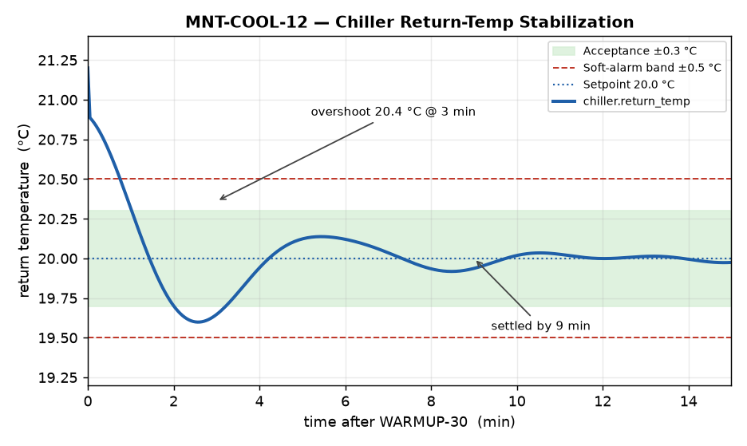

# MNT-COOL-12 — FPX-2000 Spindle Chiller Calibration Procedure

## Purpose
Maintain spindle and structure temperature stability so the FPX-2000 holds its
±0.004 mm positioning accuracy. Perform every 2,000 spindle hours or after any
chiller component replacement.

## Required tools
- Calibrated reference thermometer (±0.1 °C)
- 10 mm hex driver
- OpenControl 7 service laptop with Fabrikam Service Tool 7.3+

## Safety
Lock out / tag out the main disconnect before opening the chiller enclosure.
Coolant may be hot; allow the unit to cool below 30 °C. Refer to SDS-COOL-09 for
coolant handling.

## Procedure
1. Run the spindle warm-up cycle `WARMUP-30` for 30 minutes.
2. In the Service Tool, open **Thermal > Chiller Loop**.
3. Insert the reference thermometer into the test port T1 on the coolant return
   line.
4. Compare the reference reading to the controller value `chiller.return_temp`.
5. If the deviation exceeds 0.5 °C, enter the offset in
   **Thermal > Calibration > return_offset**.
6. Set the target return temperature to 20.0 °C (±2 °C of ambient).
7. Run the loop for 15 minutes and confirm stability within ±0.3 °C.

## Acceptance criteria
- Return temperature stable at 20.0 ± 0.3 °C for 15 minutes.
- Positioning test program `CAL-GRID-9` shows no axis drift beyond ±0.003 mm.

## Stabilization trend
A typical return-temperature trend after the WARMUP-30 cycle is shown below,
including the acceptance band and the soft-alarm limits used by the controller.

## Troubleshooting
If the chiller cannot hold setpoint, check the refrigerant pressure and the
coolant filter (replace per MNT-COOL-13). Persistent thermal drift after
calibration may indicate ambient instability outside the 5–40 °C spec; verify the
room is held to ±2 °C.
