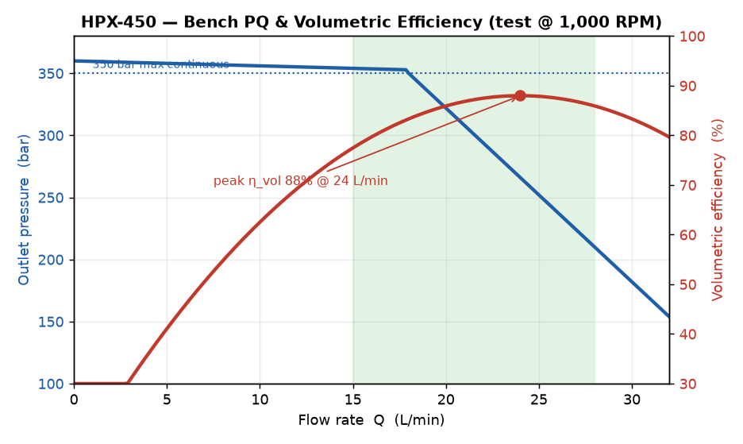

# HPX-450 Variable-Displacement Hydraulic Pump — Datasheet

## Description
The HPX-450 is an axial-piston, variable-displacement pump for industrial
hydraulic power units. Electronic swash-plate control allows closed-loop pressure
and flow regulation, reducing energy use in injection-molding and press
applications.

## Performance
| Parameter | Value |
| --- | --- |
| Max displacement | 45 cc/rev |
| Max continuous pressure | 350 bar |
| Peak pressure | 420 bar |
| Max speed | 2,800 RPM |
| Volumetric efficiency | 96% at rated load |
| Nominal flow @ 1,500 RPM | 67.5 L/min |

## Performance curve
The bench pressure–flow (PQ) and volumetric-efficiency characteristic below was
measured on the production test rig at a fixed 1,000 RPM. Use it to pick the
efficient operating window and to read the part-load efficiency that the summary
table above does not list.

## Control
- Control type: proportional electronic (PQ controller)
- Command signal: 4–20 mA or 0–10 V
- Response time: < 60 ms full stroke
- Fieldbus: CANopen, optional EtherCAT

## Fluid requirements
Use mineral-based hydraulic oil ISO VG 32 to VG 68, cleanliness ISO 4406
18/16/13 or better. Fluid temperature range -20 °C to +80 °C. Water-glycol fluids
require the -WG seal option; see safety datasheet SDS-HYD-07 before changing fluid
families.

## Mounting and ports
SAE J744 flange, splined shaft. Pressure port SAE 1", suction port SAE 1-1/4".
Maximum inlet pressure 2 bar absolute; minimum 0.8 bar to avoid cavitation. See
maintenance SOP MNT-PUMP-21 for cavitation troubleshooting.
