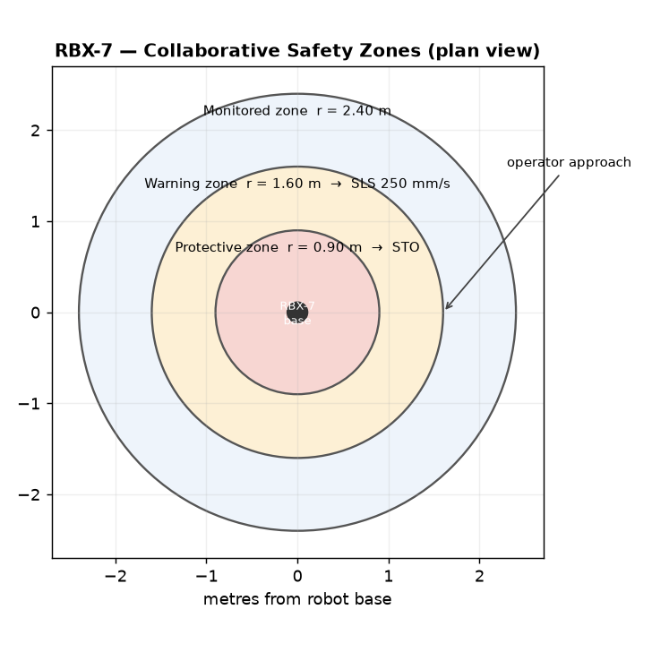

# SDS-ROB-03 — RBX-7 Collaborative Operation & Safety Limits

## Scope
Defines the safety requirements for operating the RBX-7 in a collaborative
(power-and-force-limited and speed-and-separation-monitoring) configuration under
ISO 10218-1/-2 and ISO/TS 15066.

## Risk assessment
Collaborative operation is only permitted after a documented risk assessment of
the specific application, tool, and workpiece. The integrator is responsible for
the assessment.

## Speed and separation monitoring
- A certified safety area scanner (Cat. 3 PL d) must define warning and protective
  zones.
- When a person enters the warning zone, the RBX-7 reduces to safe-limited-speed
  (SLS) of 250 mm/s tool-center-point.
- When a person enters the protective zone, safe-torque-off (STO) is triggered.

## Zone layout
The plan view below shows the certified scanner zones around the RBX-7 base and the
safety reaction triggered in each. The radii and reactions are defined by the figure.

## Power and force limits
For power-and-force-limited operation, transient contact forces must not exceed
the ISO/TS 15066 body-region limits. The RBX-7 payload must be reduced to ≤ 3 kg
and end-effector edges must be rounded and padded.

## Required safety functions
- Safe-torque-off (STO): mandatory, dual channel.
- Safe-limited-speed (SLS): enabled in collaborative zones.
- Emergency stop: category 1 stop, reachable from each operator station.

## Maintenance and verification
Validate safety functions at commissioning and after any change to the safety
configuration, and at least annually. Greasing and mechanical maintenance per
MNT-ROB-30 must not alter the safety-rated parameters. Record all validations in
the machine safety logbook.
