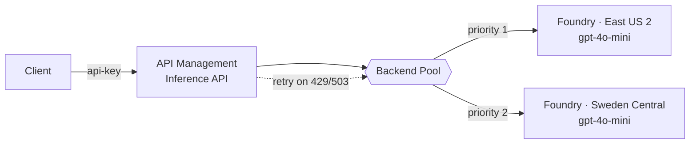
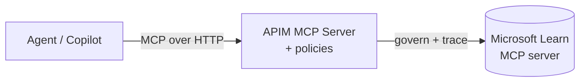
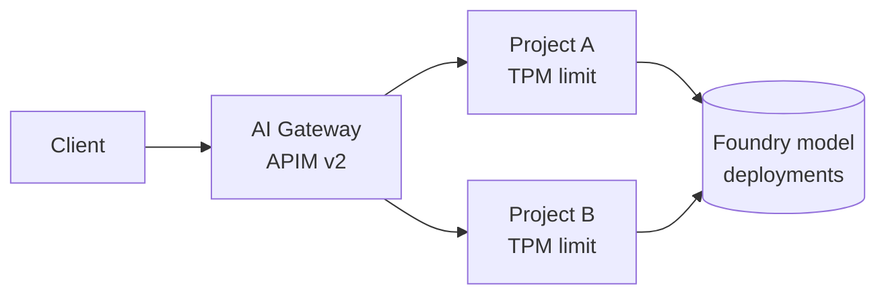

# APIM ❤️ Azure AI Foundry — Building an AI Gateway

As organizations adopt generative AI, a single model endpoint quickly becomes a bottleneck for **resilience**, **cost control**, and **governance**. An *AI gateway* sits between your applications and your AI models to add load balancing, retries, token limits, observability, and policy enforcement — without changing client code.

This workshop walks through **four complementary patterns** for building an AI gateway in front of [Azure AI Foundry](https://learn.microsoft.com/azure/ai-foundry/):

1. **APIM as an AI gateway** — load balance a model across **two Foundry regions** using an Azure API Management backend pool with priority/weight routing and automatic 429 failover.
2. **MCP governance** — expose and govern the **Microsoft Learn MCP server** through APIM so agents consume tools through your gateway.
3. **Foundry's native AI Gateway** — the built-in portal experience that attaches an APIM v2 instance to a Foundry resource for per-project token limits.
4. **Bring your own gateway** — a proof-of-concept deploying the open-source **LiteLLM** proxy in front of Foundry, and what it can (and cannot) do.

<div class="info" data-title="What you will build">

> 
>
> A load-balanced inference API in front of two Foundry regions, an MCP server governed by APIM, and a comparison of three gateway approaches.

</div>

By the end you will understand the trade-offs between using **Azure-native AI Gateway capabilities** and a **third-party gateway**, and you will have working infrastructure to demonstrate each.

---

# Prerequisites

To complete the hands-on parts you need:

- An **Azure subscription** with **Owner** (or **Contributor** + **Role Based Access Control Administrator**) on a resource group. The lab creates role assignments, so plain Contributor is not enough.
- **Azure CLI** installed and signed in: `az login`.
- **Python 3.10+** for the test scripts.
- *(Part 4 only)* **Docker** to run the LiteLLM container.
- Quota for the **`gpt-4o-mini`** model (GlobalStandard) in **two regions** — this lab uses `eastus2` and `swedencentral`. Check the [model availability by region](https://learn.microsoft.com/azure/ai-services/openai/concepts/models).

<div class="warning" data-title="Cost & SKU">

> This lab deploys **Azure API Management Standard v2**. v2 tiers provision in minutes (versus ~40 min for classic tiers) and are **required** for the native Foundry AI Gateway integration in Part 3. APIM and the Foundry deployments incur charges — run the [clean-up](#clean-up) when finished.

</div>

The lab assets are organized as:

```
foundry-ai-gateway/
├── workshop.md              # this file
├── infra/
│   ├── main.bicep           # APIM v2 + 2 Foundry accounts + backend pool + inference API
│   ├── policy.xml           # load-balancing + retry policy
│   ├── deploy.ps1           # one-command deploy
│   └── cleanup.ps1          # tear down
└── src/
    ├── test/                # Python test scripts
    └── litellm/             # BYO gateway (Part 4)
```

---

# Part 1 — Load balance Foundry models with APIM

## The pattern

A **typical prioritized fallback scenario**: a priority-1 backend (for example, your Provisioned Throughput deployment) absorbs traffic until it is exhausted, then requests gracefully fall back to one or more priority-2 backends (for example, pay-as-you-go in other regions).



Key mechanics implemented in [infra/main.bicep](infra/main.bicep) and [infra/policy.xml](infra/policy.xml):

- **Backend pool** — APIM's built-in `Pool` backend type spreads traffic across backends using `priority` (lower = higher) and `weight` (share within a priority). Round-robin is the default within equal priority/weight.
- **Circuit breaker** — each backend trips for 1 minute after a 429, honoring `Retry-After`.
- **Retry policy** — the `retry` policy re-sends to the pool on HTTP 429/503 (`first-fast-retry`), so the caller never sees the throttle. If no backend is viable, a generic 503 is returned.
- **Managed identity auth** — APIM authenticates to Foundry with its system-assigned identity (granted the **Cognitive Services User** role), so no API keys are stored in policy.

<div class="info" data-title="Why capacity is set low">

> `modelsConfig.capacity` is intentionally set to **8** (8K tokens/min) to make it easy to trigger throttling and observe failover during the lab. Raise it for real workloads.

</div>

## Deploy

From the `infra` folder:

```powershell
# If az is not on PATH, point to it first, e.g.:
# $env:AZ_CMD = "C:\Program Files\Microsoft SDKs\Azure\CLI2\wbin\az.cmd"

az login
az account set --subscription "<your-subscription-id>"

./deploy.ps1
```

`deploy.ps1` creates the resource group `lab-foundry-ai-gateway`, deploys the Bicep, and prints the **APIM gateway URL**, a **subscription key**, and the two Foundry endpoints.

<details>
<summary>What the Bicep deploys</summary>

- 1 × API Management (Standard v2) with system-assigned identity
- 2 × Azure AI Foundry (`AIServices`) accounts in `eastus2` and `swedencentral`, each with a project and a `gpt-4o-mini` deployment
- `Cognitive Services User` role assignment for the APIM identity on each account
- 2 × APIM backends + 1 × load-balancing backend pool (priority 1 / priority 2)
- 1 × Inference API (`/inference/openai`) with the retry + load-balancing policy
- 1 × APIM subscription (the `api-key` clients use)

</details>

## Test the load balancer

Install dependencies and run the test, which fires 20 requests and reports the **region** that served each (from the `x-ms-region` response header):

```powershell
pip install -r ../src/test/requirements.txt

$env:APIM_GATEWAY_URL = "<apimResourceGatewayURL from outputs>"
$env:APIM_API_KEY      = "<subscription key from outputs>"
python ../src/test/test_load_balancing.py
```

With 20 small, spaced-out requests you will likely see **all traffic stay on the priority-1 region** — the load is well under the 8K-TPM cap, so there is nothing to fail over from. That confirms routing and managed-identity auth work, but to *see the failover* you need to exhaust priority 1.

## Force a failover (burst test)

[src/test/test_burst.py](src/test/test_burst.py) fires **concurrent** requests with a larger prompt to blow past the priority-1 TPM cap:

```powershell
$env:TOTAL = "60"; $env:CONCURRENCY = "15"
python ../src/test/test_burst.py
```

<div class="tip" data-title="Real result from this lab">

> Running 60 concurrent requests against the deployed gateway produced **60 × HTTP 200** (zero visible 429s — the retry policy absorbed them) with this region distribution:
>
> ```
> Status distribution:  { "200": 60 }
> Region distribution:  { "East US 2": 39, "Sweden Central": 21 }
> ```
>
> The first ~39 requests were served by **East US 2** (priority 1). Once it hit the 8K-TPM cap and started returning 429s, the circuit breaker tripped and the remaining **21** requests transparently failed over to **Sweden Central** (priority 2) — exactly the prioritized-fallback behavior.

</div>

<div class="task" data-title="Try it">

> 1. Add a third Foundry region to `aiServicesConfig` in `main.bicep` with `priority: 2, weight: 50` and redeploy. Observe the 50/50 split across the two priority-2 backends.
> 2. Use the [APIM tracing tool](https://learn.microsoft.com/azure/api-management/api-management-howto-api-inspector) to watch the backend selection per request.
> 3. Lower `modelsConfig.capacity` to `1` and rerun the burst test — failover triggers even sooner.

</div>

---

# Part 2 — Govern the Microsoft Learn MCP server

The [Model Context Protocol (MCP)](https://modelcontextprotocol.io/) lets agents call **tools**. The **Microsoft Learn MCP server** is a free, public, remote MCP server (streamable HTTP) that grounds agents in official Microsoft documentation:

```
https://learn.microsoft.com/api/mcp
```

It exposes tools to **search docs**, **fetch a full article**, and **search code samples**. In an enterprise you rarely want agents talking to external tool servers directly — you want them to go **through your gateway** for authentication, rate limiting, and tracing.

Azure API Management's AI gateway can **expose and govern an existing MCP server**. APIM places your policies (rate limits, auth, tracing) in front of the Learn MCP tools.



## Expose the Learn MCP server through APIM

1. In the [Azure portal](https://portal.azure.com/), open the API Management instance the lab deployed.
2. Under **APIs**, select **MCP Servers** > **Create MCP server** > **Expose an existing MCP server**.
3. Enter the backend MCP endpoint: `https://learn.microsoft.com/api/mcp` (transport: **streamable HTTP**).
4. Give it a name (e.g. `learn-mcp`) and create it. APIM shows a **Server URL** like:
   `https://<apim-name>.azure-api.net/learn-mcp/mcp`
5. Under **MCP** > **Policies**, add governance. For example, rate-limit and trace the caller:

   ```xml
   <inbound>
       <base />
       <rate-limit-by-key calls="5" renewal-period="30"
           counter-key="@(context.Request.IpAddress)" />
       <trace source="Learn MCP" severity="information">
           <message>MCP tool invoked via APIM gateway</message>
       </trace>
   </inbound>
   ```

<div class="warning" data-title="Streaming & logging">

> MCP uses streaming transport. If you enabled Application Insights/Azure Monitor diagnostics at the **All APIs** scope, set **Frontend Response → Number of payload bytes to log = 0**, and never read `context.Response.Body` in MCP policies — buffering breaks the MCP transport.

</div>

## Use the governed MCP server

Add it to VS Code (Command Palette → **MCP: Add Server** → **HTTP**) using the APIM **Server URL**, then in GitHub Copilot **Agent mode** select the tools and ask a documentation question. Traffic now flows through your APIM gateway where your policies apply.

<div class="info" data-title="Two MCP directions in APIM">

> APIM can both **expose a managed REST API as an MCP server** (turn your APIs into agent tools) and **govern an existing MCP server** (like Learn MCP). This lab uses the second. APIM currently supports MCP **tools** (not resources or prompts).

</div>

---

# Part 3 — Foundry native AI Gateway

Parts 1–2 build a gateway *you* assemble in APIM. Foundry also offers a **built-in, portal-driven AI Gateway** that attaches an APIM v2 instance to a Foundry resource and enforces **per-project token limits and quotas** — no Bicep required.



## Enable it

1. Sign in to [Microsoft Foundry](https://ai.azure.com/) (ensure **New Foundry** is on).
2. Go to **Operate** > **Admin console** > **AI Gateway** tab.
3. Select **Add AI Gateway**, choose your Foundry resource, then either:
   - **Create new** — provisions a **Basic v2** APIM, or
   - **Use existing** — select the **Standard v2** APIM from Part 1 (it appears only if it is in the **same tenant and subscription**, is a **v2 tier**, you have **API Management Service Contributor**, and it is not already linked to another gateway).
4. Name the gateway and select **Add**. Wait until status is **Enabled**.
5. New projects are gateway-enabled by default; for existing projects choose **Add project to gateway** and set **token limits**.

## Verify

In the APIM instance, open **Monitoring** > **Metrics** → **Requests**, make a model call in an enabled project, and confirm the count increments. Use **Monitoring** > **Logs** with the `GatewayLogs` table to inspect `200`s. If you set a token limit, a request that exceeds it returns **429 Too Many Requests**.

<div class="info" data-title="When to use which">

> - **Native AI Gateway** = fastest path to **governance** (token limits, quotas, per-project containment, custom agent registration) with minimal setup.
> - **APIM you build (Part 1)** = full control over **routing, load balancing, retries, transformations, and custom policies**.
> - You can combine them: use an existing Standard v2 APIM for both.

</div>

---

# Part 4 — Bring your own gateway (LiteLLM)

Can you put a **third-party** gateway in front of Foundry instead of APIM? This part is a POC with the popular open-source [**LiteLLM**](https://docs.litellm.ai/) proxy, which exposes an **OpenAI-compatible** endpoint and routes to many providers — including Azure AI Foundry via its **`azure_ai/`** provider.

The configuration in [src/litellm/config.yaml](src/litellm/config.yaml) reuses the **same two Foundry regions** and load-balances across them with LiteLLM's router (retries, cooldowns, fallbacks) — mirroring Part 1, but client-side.

## Run it

```powershell
cd ../src/litellm
cp .env.example .env   # then fill FOUNDRY1/2_API_BASE + keys from the infra outputs
docker compose up
```

Get the values:

```powershell
# api_base is the account endpoint + /models, e.g. https://foundry1-xxxx.services.ai.azure.com/models
az cognitiveservices account keys list -g lab-foundry-ai-gateway -n <foundry-account-name>
```

## Test models *and* tools

```powershell
pip install -r ../test/requirements.txt
$env:LITELLM_BASE_URL  = "http://localhost:4000"
$env:LITELLM_MASTER_KEY = "sk-litellm-local-poc"
python ../test/test_litellm_tools.py
```

The script runs a **plain chat completion** and a **function-calling** request.

## Findings: models, tools, and agents

<div class="important" data-title="POC conclusion">

> - ✅ **Models** — LiteLLM proxies Foundry chat/completions and embeddings via `azure_ai/`, and can **load balance and fail over** across regions just like the APIM backend pool.
> - ✅ **Tools (function calling)** — LiteLLM passes `tools`/`tool_choice` through to the model and returns `tool_calls`. **Client-side** tool orchestration works. The model returns *which* tool to call; **your application still executes the tool** (LiteLLM does not host the tools).
> - ⚠️ **Agents** — LiteLLM is a **model gateway**, not an agent runtime. It can serve as the **model backend** for an agent framework (Semantic Kernel, LangChain, etc. pointed at the OpenAI-compatible endpoint), but it does **not** replace the **Foundry Agent Service** (server-side hosted agents, threads, hosted tools) nor the **native Foundry AI Gateway** governance plane (per-project token limits, custom agent registration, MCP/A2A tool governance from Part 3).
> - 🔒 **Native integration** — Foundry's **Admin console AI Gateway only attaches Azure API Management (v2)**. A third-party gateway like LiteLLM cannot register there; it sits in front as an independent proxy and is **not** discoverable/governable by Foundry's control plane.

</div>

**Bottom line:** Bring-your-own LiteLLM is a great **model + tool (function-calling) gateway** and is portable across clouds/providers. If you need **Foundry-native governance** (per-project quotas, agent/tool governance, control-plane registration), use **Azure API Management** — either the one you build (Parts 1–2) or the native AI Gateway (Part 3).

| Capability | APIM (Parts 1–3) | LiteLLM (BYO) |
|---|---|---|
| Load balance Foundry models across regions | ✅ Backend pool | ✅ Router |
| Retry / failover on 429 | ✅ Policy + circuit breaker | ✅ num_retries / cooldown |
| Managed-identity auth to Foundry (no keys) | ✅ | ❌ (uses keys/AAD token) |
| Function-calling (tools) pass-through | ✅ | ✅ |
| Govern external MCP tool servers | ✅ | ❌ |
| Per-project token limits / quotas | ✅ (native AI Gateway) | ⚠️ virtual-key budgets only |
| Registered in Foundry control plane | ✅ | ❌ |
| Multi-provider / portable | ⚠️ Azure-centric | ✅ |

---

# Clean up

Stop charges by deleting everything the lab created:

```powershell
cd infra
./cleanup.ps1
# or: az group delete --name lab-foundry-ai-gateway --yes --no-wait
```

For Part 4, stop the container with `docker compose down`. If you enabled the native AI Gateway (Part 3), first **remove projects from the gateway** and **delete the AI Gateway** in the Foundry Admin console, then delete the APIM instance.

<div class="tip" data-title="What you learned">

> - Built an **APIM AI gateway** that load balances a Foundry model across regions with priority routing, circuit breakers, and transparent retries.
> - **Governed an MCP server** (Microsoft Learn) through APIM policies.
> - Enabled **Foundry's native AI Gateway** for per-project token governance.
> - POC'd a **bring-your-own LiteLLM** gateway and mapped exactly where it fits — models and tools, but not Foundry-native agent governance.

</div>

## References

- [Backend pool load balancing lab (AI-Gateway)](https://github.com/Azure-Samples/AI-Gateway/blob/main/labs/backend-pool-load-balancing/backend-pool-load-balancing.ipynb)
- [AI gateway capabilities in Azure API Management](https://learn.microsoft.com/azure/api-management/genai-gateway-capabilities)
- [Configure AI Gateway in your Foundry resources](https://learn.microsoft.com/azure/foundry/configuration/enable-ai-api-management-gateway-portal)
- [Expose an existing MCP server in APIM](https://learn.microsoft.com/azure/api-management/expose-existing-mcp-server)
- [Microsoft Learn MCP server](https://learn.microsoft.com/training/support/mcp)
- [LiteLLM — Azure AI provider](https://docs.litellm.ai/docs/providers/azure_ai)
